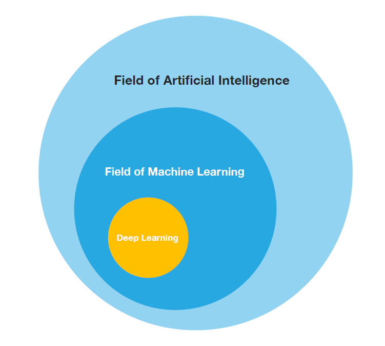

# 什么是机器学习

机器学习(Machine Learning, ML)是一门多领域交叉学科，涉及概率论、统计学、逼近论、凸分析、算法复杂度理论等多门学科。专门研究计算机怎样模拟或实现人类的学习行为，以获取新的知识或技能，重新组织已有的知识结构使之不断改善自身的性能。机器学习是从人工智能中产生的一个重要学科分支，是实现智能化的关键。机器学习与人工智能和深度学习的关系如下图所示，可以看出时下最热门的深度学习也只是机器学习的一个子领域,也就是说深度学习是一种实现机器学习的技术。

目前，机器学习已经无处不在。比如无人驾驶、人脸识别、垃圾邮件识别、产品推荐、欺诈侦测、医学分析等。

# 为什么用机器学习

思考一下，你会如何使用传统的编程技术写一个垃圾邮件过滤器（图 1-1）：

1.  你先观察下垃圾邮件一般都是什么样子。你可能注意到一些词或短语（比如 4U、credit card、free、amazing）在邮件主题中频繁出现，也许还注意到发件人名字、邮件正文的格式，等等。
    
2.  你为观察到的规律写了一个检测算法，如果检测到了这些规律，程序就会标记邮件为垃圾邮件。
    
3.  测试程序，重复第1步和第2步，直到满足要求。
    

图 1-1 传统方法

这个问题并不简单，你的程序很可能会变成一长串复杂的规则—— 这样就会很难维护。

相反的，基于机器学习技术的垃圾邮件过滤器会自动学习哪个词和短语是垃圾邮件的预测值，通过与普通邮件比较，检测垃圾邮件中反常频次的词语格式（图 1-2）。这个程序短得多，更易维护，也更精确。

图 1-2 机器学习方法

进而，如果发送垃圾邮件的人发现所有包含“4U”的邮件都被屏蔽了，可能会转而使用“For U”。使用传统方法的垃圾邮件过滤器需要更新以标记“For U”。如果发送垃圾邮件的人持续更改，你就需要被动地不停地写入新规则。

相反的，基于机器学习的垃圾邮件过滤器会自动注意到“For U”在用户手动标记垃圾邮件中的反常频繁性，然后就能自动标记垃圾邮件而无需干预了（图1-3）。

图 1-3 自动适应改变

机器学习的另一个优点是善于处理对于传统方法太复杂或是没有已知算法的问题。例如，对于语言识别：假如想写一个可以识别“one”和“two”的简单程序。你可能注意到“two”起始是一个高音（“T”），所以可以写一个可以测量高音强度的算法，用它区分 one 和 two。很明显，这个方法不能推广到嘈杂环境下的数百万人的数千词汇、数十种语言。（现在）最佳的方法是根据大量单词的录音，写一个可以自我学习的算法。

最后，机器学习可以帮助人类进行学习（图 1-4）：可以检查机器学习算法已经掌握了什么（尽管对于某些算法，这样做会有点麻烦）。例如，当垃圾邮件过滤器被训练了足够多的垃圾邮件，就可以用它列出垃圾邮件预测值的单词和单词组合列表。有时，可能会发现不引人关注的关联或新趋势，有助于对问题更好的理解。

图 1-4 机器学习可以帮助人类学习

使用机器学习方法挖掘大量数据，可以发现并不显著的规律。这称作数据挖掘。

总结一下，机器学习善于：

*  需要进行大量手工调整或需要拥有长串规则才能解决的问题：机器学习算法通常可以简化代码、提高性能。
    
*   问题复杂，传统方法难以解决：最好的机器学习方法可以找到解决方案。
    
*   环境有波动：机器学习算法可以适应新数据。
    
*   洞察复杂问题和大量数据。

# 机器学习类型 

机器学习有多种类型，可以根据是否在监督下训练进行分为4类：

1 监督学习

2 非监督学习

3 半监督学习

4 强化学习

## 监督学习

在监督学习中，用来训练算法的训练数据包含了答案，称为标签（图 1-5）。

图 1-5 用于监督学习（比如垃圾邮件分类）的加了标签的训练集

一个典型的监督学习任务是分类。垃圾邮件过滤器就是一个很好的例子：用许多带有归类（垃圾邮件或普通邮件）的邮件样本进行训练，过滤器必须还能对新邮件进行分类。

另一个典型任务是预测目标数值，例如给出一些特征（里程数、车龄、品牌等等）称作预测值，来预测一辆汽车的价格。这类任务称作回归（图 1-6）。要训练这个系统，你需要给出大量汽车样本，包括它们的预测值和标签（即，它们的价格）。

> 注解：在机器学习中，一个属性就是一个数据类型（例如，“里程数”），取决于具体问题一个特征会有多个含义，但通常是属性加上它的值（例如，“里程数`=15000`”）。许多人是不区分地使用属性和特征。

图 1-6 回归

注意，一些回归算法也可以用来进行分类，反之亦然。例如，逻辑回归通常用来进行分类，它可以生成一个归属某一类的可能性的值（例如，20% 几率为垃圾邮件）。

下面是一些重要的监督学习算法（本书都有介绍）：

*   K近邻算法
*   线性回归
*   逻辑回归
*   支持向量机（SVM）
*   决策树和随机森林  
*   神经网络

## 非监督学习

在非监督学习中，你可能猜到了，训练数据是没有加标签的（图 1-7）。系统在没有老师的条件下进行学习。

图 1-7 非监督学习的一个不加标签的训练集

下面是一些最重要的非监督学习算法（我们会在第 8 章介绍降维）：

*   聚类  
    K 均值  
    层次聚类分析（Hierarchical Cluster Analysis，HCA）  
    期望最大值
*   可视化和降维  
    主成分分析（Principal Component Analysis，PCA）  
    核主成分分析  
    局部线性嵌入（Locally-Linear Embedding，LLE）  
    t-分布邻域嵌入算法（t-distributed Stochastic Neighbor Embedding，t-SNE）
*   关联性规则学习  
    Apriori 算法  
    Eclat 算法

例如，假设你有一份关于你的博客访客的大量数据。你想运行一个聚类算法，检测相似访客的分组（图 1-8）。你不会告诉算法某个访客属于哪一类：它会自己找出关系，无需帮助。例如，算法可能注意到 40% 的访客是喜欢漫画书的男性，通常是晚上访问，20% 是科幻爱好者，他们是在周末访问等等。如果你使用层次聚类分析，它可能还会细分每个分组为更小的组。这可以帮助你为每个分组定位博文。

图 1-8 聚类

可视化算法也是极佳的非监督学习案例：给算法大量复杂的且不加标签的数据，算法输出数据的2D或3D图像（图 1-9）。算法会试图保留数据的结构（即尝试保留输入的独立聚类，避免在图像中重叠），这样就可以明白数据是如何组织起来的，也许还能发现隐藏的规律。

图 1-9 t-SNE 可视化案例，突出了聚类（注：注意动物是与汽车分开的，马和鹿很近、与鸟距离远，以此类推）

与此有关联的任务是降维，降维的目的是简化数据、但是不能失去大部分信息。做法之一是合并若干相关的特征。例如，汽车的里程数与车龄高度相关，降维算法就会将它们合并成一个，表示汽车的磨损。这叫做特征提取。

> 提示：在用训练集训练机器学习算法（比如监督学习算法）时，最好对训练集进行降维。这样可以运行的更快，占用的硬盘和内存空间更少，有些情况下性能也更好。

另一个重要的非监督任务是异常检测（anomaly detection） —— 例如，检测异常的信用卡转账以防欺诈，检测制造缺陷，或者在训练之前自动从训练数据集去除异常值。异常检测的系统使用正常值训练的，当它碰到一个新实例，它可以判断这个新实例是像正常值还是异常值（图 1-10）。

图 1-10 异常检测

最后，另一个常见的非监督任务是关联规则学习，它的目标是挖掘大量数据以发现属性间有趣的关系。例如，假设你拥有一个超市。在销售日志上运行关联规则，可能发现买了烧烤酱和薯片的人也会买牛排。因此，你可以将这些商品放在一起。

## 半监督学习

一些算法可以处理部分带标签的训练数据，通常是大量不带标签数据加上小部分带标签数据。这称作半监督学习（图 1-11）。

一些图片存储服务，比如 Google Photos，是半监督学习的好例子。一旦你上传了所有家庭相片，它就能自动识别相同的人 A 出现了相片 1、5、11 中，另一个人 B 出现在了相片 2、5、7 中。这是算法的非监督部分（聚类）。现在系统需要的就是你告诉这两个人是谁。只要给每个人一个标签，算法就可以命名每张照片中的每个人，特别适合搜索照片。

图 1-11 半监督学习

多数半监督学习算法是非监督和监督算法的结合。例如，深度信念网络（deep belief networks）是基于被称为互相叠加的受限玻尔兹曼机（restricted Boltzmann machines，RBM）的非监督组件。RBM 是先用非监督方法进行训练，再用监督学习方法进行整个系统微调。

## 强化学习

强化学习非常不同。学习系统在这里被称为智能体（agent），可以对环境进行观察，选择和执行动作，获得奖励（负奖励是惩罚，见图 1-12）。然后它必须自己学习哪个是最佳方法（称为策略，policy），以得到长久的最大奖励。策略决定了智能体在给定情况下应该采取的行动。

图 1-12 强化学习

例如，许多机器人运行强化学习算法以学习如何行走。DeepMind 的 AlphaGo 也是强化学习的例子：它在 2016 年三月击败了世界围棋冠军李世石（译者注：2017 年五月，AlphaGo 又击败了世界排名第一的柯洁）。它是通过分析数百万盘棋局学习制胜策略，然后自己和自己下棋。要注意，在比赛中机器学习是关闭的；AlphaGo 只是使用它学会的策略。