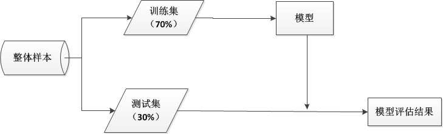
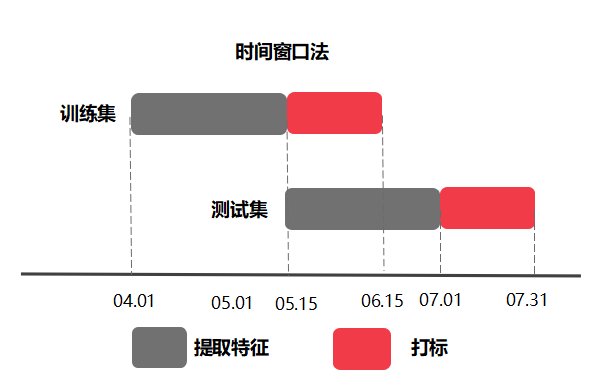
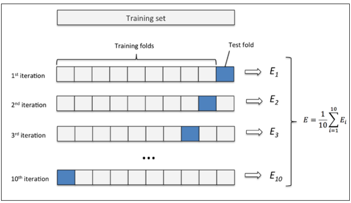

# 回归模型的评价

## MSE 

均方误差(Mean Squared Error,MSE),是我们最常用的模型评价指标，其计算公式为：
$$MSE = \frac{1}{n}\sum_{i=1}^{n}(f(x_i)-y_i)^2$$

可以得出，均方误差实际上就是求模型预测与实际值的偏差平方和，因此模型的均方误差越小，模型的效果就越好。这是也线性回归模型中，采用最小二乘法求解模型参数的方法。


## RMSE 

均方根误差（Root Mean Squared Error，RMSE），也是常用来评价模型的常用指标，其计算公式为：

$$RMSE = \sqrt{\frac{1}{n}\sum_{i=1}^{n}(f(x_i)-y_i)^2}$$
从公式可以看出，均方根误差其实就是均方误差的算术平方根

## MAE

平均绝对误差（Mean Absolute Error，MAE），也叫做L1范数损失，其计算公式：
$$MAE = \frac{1}{n}\sum_{i=1}^{n}|f(x_i)-y_i|$$


##  MAPE 

平均绝对百分比误差(Mean Absolute Percentage Error ,MAPE),其计算公式为：
$$MAPE = \frac{1}{n}\sum_{i=1}^{n}|\frac {(f(x_i)-y_i)}{y_i}|$$

MAPE可以看作是对MAE的一种补充，MAE只能看到绝对误差，而MAPE可以得出相对误差，从而可以更加直观的评价模型。例如MAE = 50，我们并不能直接得出该模型是好还是坏，假如实际的平均值为5000，那么MAPE = 1%,可以认为该模型相当优秀了；反之，假如实际平均值只有50，那么MAPE = 100%,可以认为该模型效果仍有待提高。

## SMAPE 

对称平均绝对百分比误差(Symmetric mean absolute percentage error,SMAPE),是对MAPE的一种补充和修正，其计算公式为

$$MAPE = \frac{1}{n}\sum_{i=1}^{n}|{\frac {(f(x_i)-y_i)}{(|f(x_i)|+|y_i|)/2}}|$$


##  R-Squared

 R-Squared也叫作R决定系数，常用在线性回归模型中，用来判断模型的优劣，其计算公式为：
 
 $$ R^2 = \frac{SSR}{SST} = \frac {\sum_{i}^n(\hat y_i -\bar y)^2}{\sum_{i}^n( y_i -\bar y)^2}$$
在整个分解式中，回归平方和（SSR）反映的是能够通过自变量x解释的部分，因此非常直观地，我们可以认定回归平方和所占的比重越大，则残差平方和越小，就越能证明回归的效果越好。
决定系数的范围同样在[0,1]区间内，决定系数越大，说明回归效果越好；

##  实例

```{r}

evaluate = function(pred,y,type = NULL){
  if (type=='mse') result = mean((pred - y)^2)
  if (type=='rmse') result = sqrt(mean((pred - y)^2))
  if (type=='mae')  result = mean(abs(pred - y))
  if (type=='mape') result = mean(abs((pred - y)/y))
  if (type=='smape') result = mean((pred - y)/(abs(pred)+abs(y))/2)

  return(result)
}

y_pred = c(10,13,15,18,20,21,35,27,30,25)
y_true = c(13,12,14,19,18,22,30,25,28,23)
library(ggplot2)
ggplot(NULL,aes(x = y_true,y = y_pred)) + 
  geom_point() + geom_abline(color = 'blue')

for( i in c('mse','rmse','mae','mape','smape')){
  result = evaluate(pred = y_pred,y = y_true,type = i)
  result = round(result,4)
  print(paste0(i,':',result))
}

```

下面以xgboost为模型，MAPE作为损失函数为例（grad、hess分别对应损失函数一阶导、二阶导）。

```python 
def mapeobj(preds,dtrain):
    gaps = dtrain.get_label()
    grad = np.sign(preds-gaps)/gaps
    hess = 1/gaps
    grad[(gaps==0)] = 0
    hess[(gaps==0)] = 0
    return grad,hess  

def evalmape(preds, dtrain):
    gaps = dtrain.get_label()
    err = abs(gaps-preds)/gaps
    err[(gaps==0)] = 0
    err = np.mean(err)
    return 'error',err  
```


# 二分类模型的评价 

## 混淆矩阵 

### 基本概念 
 
混淆矩阵其实是把模型实际值和模型的预测值进行列联表分析。假如实际样本中正例的样本标签为1，称为正样本；负例的样本标签为0，称为负样本。我们一般也把正样本称为阳性，负样本称为阴性。那么，混淆矩阵表如下：


||| 预测值
---|---|---|---
|| | 1 | 0
|**实际值**| 1| TP |FN
||0|FP|TN

混淆矩阵中各个数据的含义：


||含义
---|---
TP|模型预测值为正，并且实际样本值也为正的样本数目
FP|模型预测值为负，并且实际样本值为正的样本数目
FN|模型预测值为正，并且实际样本值为负的样本数目
TN|模型预测值为负，并且实际样本值也为负的样本数目
||

使用混淆矩阵定义模型的性能

模型的评价指标主要有准确率、错误率、精确度、召回率、特异性、F1得分

### 准确率与错误率 

准确率(accuracy),表示模型预测正确的样本数目占总体样本数目的比例,其计算公式：
$$accuracy = \frac{TP+TN}{TP+TN+FN+FP}$$

准确率 =  ，因此正确率表示模型预测正确的样本数目占总体样本数目的比例。

错误率(error rate),表示模型不能正确预测的比例，等于1 - 准确率，其计算公式：

$$error = \frac{FP+FN}{TP+TN+FN+FP}$$


  
### 灵敏度与特异性

灵敏度 (sensitivity)，定义为模型预测为正且实际样本为正的数目占预测为正的样本数目的比例，其计算公式为：

$$sensitivity = \frac{TP}{TP+FP}$$

特异性(specificity) ，定义为模型预测为负且实际样本为负的数目占实际样本为负的样本数目的比例，其计算公式

 $$specificity = \frac{TN}{TN+FP}$$
R中提供了现成的R包来计算这些指标：

```r
library(caret)
sensitivity
sepcificity
```


###  精确度与召回率


精确度(precision)，定义为模型预测为正且实际样本为正的数目占预测为正的样本数目的比例，其计算公式为：

$$precision = \frac{TP}{TP+FP}$$

召回率(recall)，定义为模型预测为正且实际样本为正的数目占实际样本为正的样本数目的比例,其计算公式为：

 $$recall = \frac{TP}{TP+FN}$$
由公式可以得出，召回率实际上就等于灵敏度。

###  F1得分


F1得分(F1 score) ，是将精确度和召回度合并称为一个单一的模型性能的评价指标就是F1得分，其计算公式为：
$$F1 = \frac{2*precision*recall}{precision+recall}$$

由公式可以看出实际上F1得分就是模型精确度和召回度的调和平均数。

##  ROC-AUC


ROC(Receiver Operating Characteristics)曲线常常用来找出真阳性和避免假阳性之间的权衡。典型的ROC曲线如下图所示，横轴表示假阳性的比例，即预测为正实际为负的数目占实际为负的比例，也等于1 - 特异性。
纵坐标为灵敏度，所以该图形也叫做灵敏度/特异性图。

```{r, message=FALSE, warning=FALSE}
library(pROC)
data(aSAH)
roccurve = roc(aSAH$outcome, aSAH$s100b,
    levels=c("Good", "Poor"))
roccurve

```

ROC曲线下的面积叫作AUC,一般认为AUC的值越大，模型的效果越好。

```{r, echo=FALSE, message=FALSE, warning=FALSE}
plot(roccurve,legacy.axes =T)
```

## RP曲线

在正负样本分布得极不均匀(highly skewed datasets)的情况下，PR曲线比ROC能更有效地反应分类器的好坏。

PR曲线会面临一个问题，当需要获得更高recall时，model需要输出更多的样本，precision可能会伴随出现下降/不变/升高，得到的曲线会出现浮动差异（出现锯齿），无法像ROC一样保证单调性。
```{r, message=FALSE, warning=FALSE}
library(ROCR)
data(ROCR.simple)
pred <- prediction(ROCR.simple$predictions,ROCR.simple$labels)
perf <- performance(pred,"prec","rec")
plot(perf)
```

## 提升度曲线

## 多分类模型的评价 

## 模型选择

### 留出法hold-out

将数据划分为训练集和测试集，训练集用来生成模型，测试集用来对生成的模型作评估。比价典型的做法是，大约70%的样本用来训练模型，30%的样本用来测试模型。为了保证训练数据和测试数据没有系统误差，样本要被随机的分成两组。



### 时间窗口划分法

在实际问题中，我们的做法一般是根据历史数据去预测未来某段时间发生的事情，在这种情况下，基于时间窗口的训练集测试集划分方案就很有用。我们根据线上线下一致性原则，将用户的历史数据按照时间窗口划分，例如选取4月到5月的数据为训练集，5月到6月的数据为测试集。一般在划分时分为标签窗口用于对待考察样本打标签，特征提取窗口用于对待考察样本提取特征。时间窗口划分法中的两个主要概念为窗口时间粒度的大小和窗口滑动的范围，粒度大小指包含了多少天，滑动的范围指从哪一天到哪一天




###  K折交叉验证 
将原始数据集通过分层抽样划分为k个大小一致的互斥子集。然后，每次利用k-1各子集合的并集作为训练集，剩下的那个做测试集。这样就可以得到k个训练集/测试集的组合，从而可以进行k次训练和测试，最终返回的结果为k次测试结果的均值。



```{r, message=FALSE, warning=FALSE}
library(caret)
folds = createFolds(iris$Species,k = 5)
str(folds)
```
# 参考文献

[ https://en.wikipedia.org/wiki/Symmetric_mean_absolute_percentage_error ]
