#   线性回归

## 问题定义与引入

我们先从一个例子来直观的感受一下：加入你想用一个简单的的模型预测房屋的价格与房屋面积之间的关系，如下图

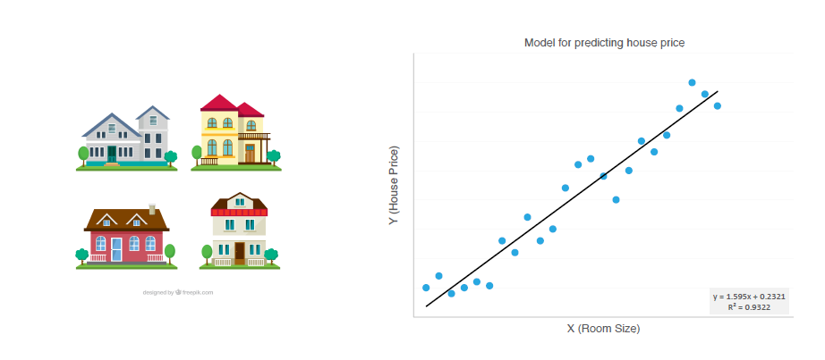

假设数据集如下：

|房屋面积(x)|房屋售价(y)|
---|---|
50|252
70|350
90|600
85|545
...|..
62|?

线性回归遇到的问题一般是这样的。我们有m个样本，每个样本对应于n维特征和一个结果输出，如下：
$$(x_1^{(1)}, x_2^{(1)}, ...x_n^{(1)}, y_1), (x_1^{(2)}, x_2^{(2)}, ...x_n^{(2)},y_2), ... (x_1^{(m)}, x_2^{(m)}, ...x_n^{(m)}, y_m)$$

我们的问题是，对于一个新的$(x_1^{(x)}, x_2^{(x)}, ...x_n^{(x)})$ 他所对应的$y_x$是多少呢？ 如果这个问题里面的y是连续的，则是一个回归问题，否则是一个分类问题。

线性回归的模型表达式：

$$y(x, \theta) = \theta_0 + \theta_1 x_1 + \cdots + \theta_n x_n $$
<h6>
 >  关于参数$\theta$有如下解释：
  （1）在物理上可以这样解释：在自变量（特征）之间相互独立的前提下，$\theta$反映自变量$x$对因变量影响程度，$\theta$越大，说明$x$对结果$y$的影响越大；
 （2）通过每个自变量（特征）前面的参数，可以很直观的看出哪些特征分量对结果的影响比较大；
 （3） 在统计中，$\theta_1,\theta_2,\cdots,\theta_n$ 称为偏回归系数，$\theta_0$称为截距。

</h6>


这个公式中有$n+1$个参数和$n$个变量，为了使得公式能够简化一些，引入$x_{0}=1$，则公式转化为：$h_{\theta} \left( x \right)={\theta_{0}}{x_{0}}+{\theta_{1}}{x_{1}}+{\theta_{2}}{x_{2}}+...+{\theta_{n}}{x_{n}}$

此时模型中的参数是一个$n+1$维的向量，任何一个训练实例也都是$n+1$维的向量，特征矩阵X的维度是 $m*(n+1)$。 因此公式可以简化为：$h_{\theta} \left( x \right)={\theta^{T}}X$，其中上标T代表矩阵转置。


## 损失函数与目标函数

这是我们需要引入一个函数用来衡量$h_\theta$表示真实值$y$好坏的程度，该函数称为损失函数（loss function）。数学表示如下：
$$ \begin{align}   & J(\theta) = \frac{1}{2m} \sum_{i=1}^{m} \left(h_{\theta}(x^{(i)}) - y^{(i)} \right)^2 \\\   & \min_{\theta} \quad J(\theta)   \end{align}  $$


## 最小二乘法
如下求参数$\theta$使得目标函数$J(\theta)$最小呢？最常用的方法就是最小二乘法。最小二乘法的直观解释如下：

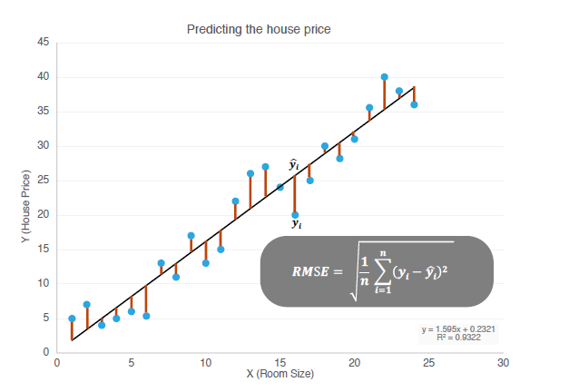

最小二乘法是一种完全数学描述的方法，直接给出闭式解结果。它用$X$表示观测数据中的特征矩阵，结果表示成$Y$向量，目标函数仍是，那么$\theta$可直接用下面公式表示：
$\theta ={{\left( {X^{T}}X \right)}^{-1}}{X^{T}}y$ 

推导过程：

$J\left( \theta  \right)=\frac{1}{2m}\sum\limits_{i=1}^{m}{{{\left( {h_{\theta}}\left( {x^{(i)}} \right)-{y^{(i)}} \right)}^{2}}}$
其中：${h_{\theta}}\left( x \right)={\theta^{T}}X={\theta_{0}}{x_{0}}+{\theta_{1}}{x_{1}}+{\theta_{2}}{x_{2}}+...+{\theta_{n}}{x_{n}}$

将向量表达形式转为矩阵表达形式，则有$J(\theta )=\frac{1}{2}{{\left( X\theta -y\right)}^{2}}$ ，其中$X$为$m$行$n$列的矩阵（$m$为样本个数，$n$为特征个数），$\theta$为$n$行1列的矩阵，$y$为$m$行1列的矩阵，对$J(\theta )$进行如下变换

$J(\theta )=\frac{1}{2}{{\left( X\theta -y\right)}^{T}}\left( X\theta -y \right)$

$=\frac{1}{2}\left( {{\theta }^{T}}{{X}^{T}}-{{y}^{T}} \right)\left(X\theta -y \right)$

$=\frac{1}{2}\left( {{\theta }^{T}}{{X}^{T}}X\theta -{{\theta}^{T}}{{X}^{T}}y-{{y}^{T}}X\theta -{{y}^{T}}y \right)$

接下来对$J(\theta )$偏导，需要用到以下几个矩阵的求导法则:

$\frac{dAB}{dB}={{A}^{T}}$ 

$\frac{d{{X}^{T}}AX}{dX}=2AX$                            

所以有:

$\frac{\partial J\left( \theta  \right)}{\partial \theta }=\frac{1}{2}\left(2{{X}^{T}}X\theta -{{X}^{T}}y -{{X}^{T}}y -0 \right)$

$={{X}^{T}}X\theta -{{X}^{T}}y$

令$\frac{\partial J\left( \theta  \right)}{\partial \theta }=0$,

则有$\theta ={{\left( {X^{T}}X \right)}^{-1}}{X^{T}}y$


##  极大似然估计 


一般地，机器学习中不同的模型会有相应的目标函数。而回归模型（尤其是线性回归类）的目标函数通常用平方损失函数作为优化的目标函数（即真实值与预测值之差的平方和）。为什么要选用误差平方和作为目标函数呢？答案可以从统计学找到。


假设给定一个输入样例$x_i$根据公式得到预测值$\theta^Tx_i$与真实值$y_i$之间存在误差，即为$\epsilon^{(i)}$。那么，它们之间的关系表示如下：

$$y^{(i)} = \theta^T x^{(i)} + \epsilon^{(i)} \qquad (ml.1.1.5)$$
而这里假设误差$\epsilon^{(i)}$服从标准高斯分布,即
$$\epsilon^{(i)} = y^{(i)} - \theta^T x^{(i)} \rightarrow \mathcal{N}(0,\sigma^2) \qquad(n.ml.1.1.3)$$
那么，
$$ y^{(i)} = \theta^T x^{(i)} + \epsilon^{(i)} \rightarrow  \mathcal{N}(\theta^T x^{(i)},\sigma^2) $$
则x和y的条件概率可表示为：

$$p(y^{(i)} | x^{(i)}; \theta) = \frac{1}{\sqrt{2\pi} \sigma} \exp {\left(- \frac{(y^{(i)} - \theta^T x^{(i)})^2}{2 \sigma^2}\right)}     $$

根据公式(ml.1.1.6)估计得到一条样本的结果概率，模型的最终目标是希望在全部样本上预测最准，也就是概率乘积最大，这个概率乘积就是似然函数。优化的目标的函数即为似然函数，表示如下：

$\max_{\theta} \quad L(\theta) = \prod_{i=1}^{m} \frac{1}{\sqrt{2\pi} \sigma} \exp \left(- \frac{(y^{(i)} - \theta^T x^{(i)})^2} {2 \sigma^2}\right) \qquad(ml.1.1.7)$

对L(x)取对数，可得：

$\max_{\theta} \; \mathcal{l}(\theta) = -m \cdot \log \sqrt{2\pi} \sigma - \frac{1}{2\sigma^2} \sum_{i=1}^{m} \left(y^{(i)} - \theta^T x^{(i)}\right)^2  \qquad(ml.1.1.8)$

由于$n$,$\sigma$变量为常数，因此公式(ml.1.1.8)等价于：

$\min_{\theta} \; \frac{1}{2} \sum_{i=1}^{m} \left(y^{(i)} - \theta^T x^{(i)}\right)^2 \qquad(ml.1.1.9)$

我们可以发现，经过最大似然估计推导出来的待优化的目标函数(ml.1.1.9)与平方损失函数(ml.1.1.3)是等价的。因此，可以得出结论**线性回归误差平方损失极小化与极大似然估计等价**


## 梯度下降 

在求解机器学习算法的模型参数，即无约束优化问题时，除了最小二乘法，梯度下降（Gradient Descent）是最常采用的方法之一。
　

###  梯度


在求解机器学习算法的模型参数，即无约束优化问题时，梯度下降（Gradient Descent）是最常采用的方法之一.

在微积分里面，对多元函数的参数求∂偏导数，把求得的各个参数的偏导数以向量的形式写出来，就是梯度。比如函数$f(x,y)$, 分别对$x,y$求偏导数，求得的梯度向量就是(∂f/∂x, ∂f/∂y)T,简称grad f(x,y)或者▽f(x,y)。对于在点(x0,y0)的具体梯度向量就是(∂f/∂x0, ∂f/∂y0)T.或者▽f(x0,y0)，如果是3个参数的向量梯度，就是(∂f/∂x, ∂f/∂y，∂f/∂z)T,以此类推。

那么这个梯度向量求出来有什么意义呢？他的意义从几何意义上讲，就是函数变化增加最快的地方。具体来说，对于函数f(x,y),在点$(x_0,y_0)$，沿着梯度向量的方向就是(∂f/∂x0, ∂f/∂y0)T的方向是f(x,y)增加最快的地方。或者说，沿着梯度向量的方向，更加容易找到函数的最大值。反过来说，沿着梯度向量相反的方向，也就是 -(∂f/∂x0, ∂f/∂y0)T的方向，梯度减少最快，也就是更加容易找到函数的最小值。

### 梯度下降与梯度上升

在机器学习算法中，在最小化损失函数时，可以通过梯度下降法来一步步的迭代求解，得到最小化的损失函数，和模型参数值。反过来，如果我们需要求解损失函数的最大值，这时就需要用梯度上升法来迭代了。

　梯度下降法和梯度上升法是可以互相转化的。比如我们需要求解损失函数f(θ)的最小值，这时我们需要用梯度下降法来迭代求解。但是实际上，我们可以反过来求解损失函数 -f(θ)的最大值。


###  梯度下降法算法详解 


 + 梯度下降的直观解释


首先来看看梯度下降的一个直观的解释。比如我们在一座大山上的某处位置，由于我们不知道怎么下山，于是决定走一步算一步，也就是在每走到一个位置的时候，求解当前位置的梯度，沿着梯度的负方向，也就是当前最陡峭的位置向下走一步，然后继续求解当前位置梯度，向这一步所在位置沿着最陡峭最易下山的位置走一步。这样一步步的走下去，一直走到觉得我们已经到了山脚。当然这样走下去，有可能我们不能走到山脚，而是到了某一个局部的山峰低处。

　从上面的解释可以看出，梯度下降不一定能够找到全局的最优解，有可能是一个局部最优解。当然，如果损失函数是凸函数，梯度下降法得到的解就一定是全局最优解。

+ 梯度下降的详细算法

　梯度下降法的算法可以有代数法和矩阵法（也称向量法）两种表示，如果对矩阵分析不熟悉，则代数法更加容易理解。不过矩阵法更加的简洁，且由于使用了矩阵，实现逻辑更加的一目了然。这里先介绍代数法，后介绍矩阵法。

<p>　　　　1. 先决条件： 确认优化模型的假设函数和损失函数。</p>
<p>　　　　比如对于线性回归，假设函数表示为$h_\theta(x_1, x_2, ...x_n) = \theta_0 + \theta_{1}x_1 + ... + \theta_{n}x_{n}$, 其中\(\theta_i \) (i = 0,1,2... n)为模型参数，\(x_i \) (i = 0,1,2... n)为每个样本的n个特征值。这个表示可以简化，我们增加一个特征\(x_0 = 1 \) ，这样\(h_\theta(x_0, x_1, ...x_n) = \sum\limits_{i=0}^{n}\theta_{i}x_{i}\)。</p>
<p>　　　　同样是线性回归，对应于上面的假设函数，损失函数为：</p>
$$J(\theta_0, \theta_1..., \theta_n) = \frac{1}{2m}\sum\limits_{i=0}^{m}(h_\theta(x_0, x_1, ...x_n) - y_i)^2$$

<p>　　　　2. 算法相关参数初始化：主要是初始化\(\theta_0, \theta_1..., \theta_n\),算法终止距离\(\varepsilon\)以及步长\(\alpha\)。在没有任何先验知识的时候，我喜欢将所有的\(\theta\)初始化为0， 将步长初始化为1。在调优的时候再 优化。</p>
<p>　　　　3. 算法过程：</p>
<p>　　　　　　1）确定当前位置的损失函数的梯度，对于\(\theta_i\),其梯度表达式如下：</p>
<p>　　　　　　　　\(\frac{\partial}{\partial\theta_i}J(\theta_0, \theta_1..., \theta_n)\)</p>
<p>　　　　　　2）用步长乘以损失函数的梯度，得到当前位置下降的距离，即\(\alpha\frac{\partial}{\partial\theta_i}J(\theta_0, \theta_1..., \theta_n)\)对应于前面登山例子中的某一步。</p>
<p>　　　　　　3）确定是否所有的\(\theta_i\),梯度下降的距离都小于\(\varepsilon\)，如果小于\(\varepsilon\)则算法终止，当前所有的\(\theta_i\)(i=0,1,...n)即为最终结果。否则进入步骤4.</p>
<p>　　　　　　4）更新所有的\(\theta\)，对于\(\theta_i\)，其更新表达式如下。更新完毕后继续转入步骤1.</p>

$$\theta_i = \theta_i - \alpha\frac{\partial}{\partial\theta_i}J(\theta_0, \theta_1..., \theta_n)$$ 

>  下面用线性回归的例子来具体描述梯度下降。假设我们的样本是$(x_1^{(0)}, x_2^{(0)}, ...x_n^{(0)}, y_0),(x_1^{(1)}, x_2^{(1)}, ...x_n^{(1)},y_1), ...,(x_1^{(m)}, x_2^{(m)}, ...x_n^{(m)}, y_m)$ 损失函数如前面先决条件所述：
$$J(\theta_0, \theta_1..., \theta_n) = \frac{1}{2m}\sum\limits_{i=0}^{m}(h_\theta(x_0, x_1, ...x_n) - y_i)^2$$ 
则在算法过程步骤1中对于$\theta_i$ 的偏导数计算如下： 
$$\frac{\partial}{\partial\theta_i}J(\theta_0, \theta_1..., \theta_n)= \frac{1}{m}\sum\limits_{j=0}^{m}(h_\theta(x_0^{j}, x_1^{j}, ...x_n^{j}) - y_j)x_i^{j}$$
步骤4中$\theta_i$的更新表达式如下：
$\theta_i = \theta_i - \alpha\frac{1}{m}\sum\limits_{j=0}^{m}(h_\theta(x_0^{j}, x_1^{j}, ...x_n^{j}) - y_j)x_i^{j}$

　　从这个例子可以看出当前点的梯度方向是由所有的样本决定的，加1m1m 是为了好理解。由于步长也为常数，他们的乘机也为常数，所以这里α1mα1m可以用一个常数表示。
　
　　
### 梯度下降法的矩阵方式描述


这一部分主要讲解梯度下降法的矩阵方式表述，相对于的代数法，要求有一定的矩阵分析的基础知识，尤其是矩阵求导的知识。

<p>　　　　1. 先决条件： 和3.3.1类似， 需要确认优化模型的假设函数和损失函数。对于线性回归，假设函数$h_\theta(x_1, x_2, ...x_n) = \theta_0 + \theta_{1}x_1 + ... + \theta_{n}x_{n}$, 的矩阵表达方式为：</p>
<p>　　　　　$h_\mathbf{\theta}(\mathbf{x}) =\mathbf{X\theta}$ ，其中， 假设函数\(h_\mathbf{\theta}(\mathbf{X})\)为mx1的向量,\(\mathbf{\theta}\)为nx1的向量，里面有n个代数法的模型参数。\(\mathbf{X}\)为mxn维的矩阵。m代表样本的个数，n代表样本的特征数。</p>
<p>&nbsp; &nbsp; &nbsp; &nbsp; &nbsp; &nbsp; &nbsp;损失函数的表达式为：

$$J(\mathbf\theta) = \frac{1}{2}(\mathbf{X\theta} -\mathbf{Y})^T(\mathbf{X\theta} -\mathbf{Y})$$

, 其中\(\mathbf{Y}\)是样本的输出向量，维度为mx1.</p>
<p>　　　　2.&nbsp;算法相关参数初始化: \(\theta\)向量可以初始化为默认值，或者调优后的值。算法终止距离\(\varepsilon\)，步长\(\alpha\)和3.3.1比没有变化。</p>
<p>　　　　3.&nbsp;算法过程：</p>
<p>　　　　　　1）确定当前位置的损失函数的梯度，对于\(\theta\)向量,其梯度表达式如下：</p>
<p>　　　　　　　　\(\frac{\partial}{\partial\mathbf\theta}J(\mathbf\theta)\)</p>
<p>　　　　　　2）用步长乘以损失函数的梯度，得到当前位置下降的距离，即\(\alpha\frac{\partial}{\partial\theta}J(\theta)\)对应于前面登山例子中的某一步。</p>
<p>　　　　　　3）确定\(\mathbf\theta\)向量里面的每个值,梯度下降的距离都小于\(\varepsilon\)，如果小于\(\varepsilon\)则算法终止，当前\(\mathbf\theta\)向量即为最终结果。否则进入步骤4.</p>
<p>　　　　　　4）更新\(\theta\)向量，其更新表达式如下。更新完毕后继续转入步骤1.</p>
<p>　　　　　　　　\(\mathbf\theta=\mathbf\theta -\alpha\frac{\partial}{\partial\theta}J(\mathbf\theta)\)</p>　　

> 还是用线性回归的例子来描述具体的算法过程。
损失函数对于\(\theta\)向量的偏导数计算如下：
$\frac{\partial}{\partial\mathbf\theta}J(\mathbf\theta) = \mathbf{X}^T(\mathbf{X\theta} -\mathbf{Y}$
<p>步骤4中\(\theta\)向量的更新表达式如下：\(\mathbf\theta=\mathbf\theta -\alpha\mathbf{X}^T(\mathbf{X\theta} -\mathbf{Y})\)</p>
对于3.3.1的代数法，可以看到矩阵法要简洁很多。这里面用到了矩阵求导链式法则，和两个矩阵求导的公式。
<p>公式1：\(\frac{\partial}{\partial\mathbf{X}}(\mathbf{XX^T}) =2\mathbf{X}\)</p
<p>公式2：\(\frac{\partial}{\partial\mathbf\theta}(\mathbf{X\theta}) =\mathbf{X^T}\)</p>


## 矩阵向量求导法则


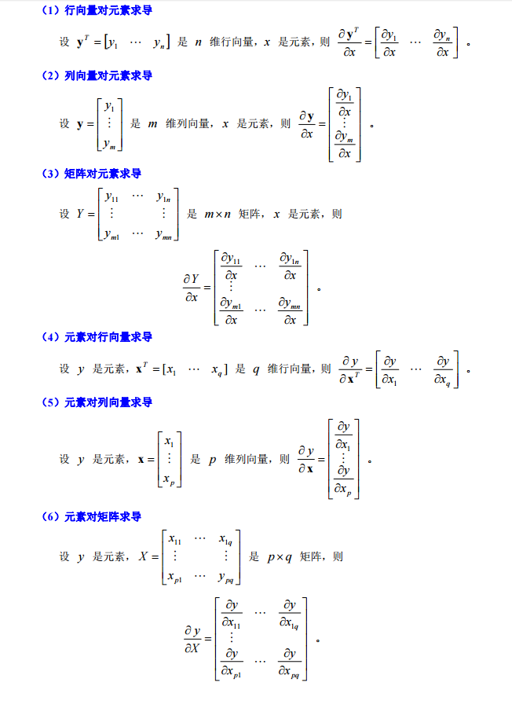
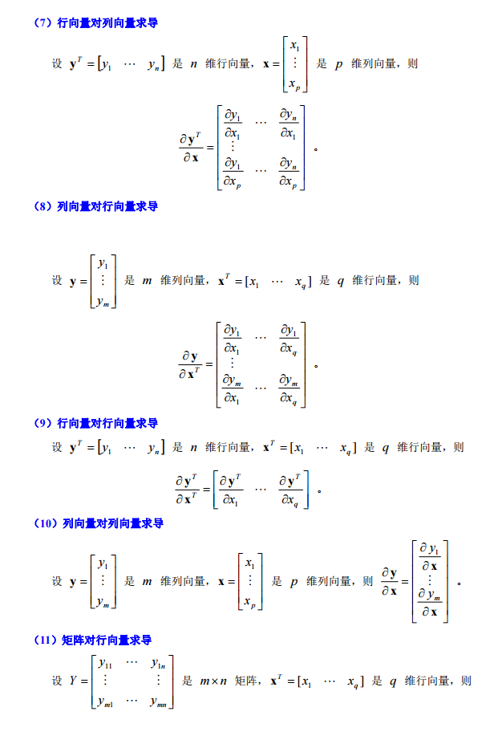
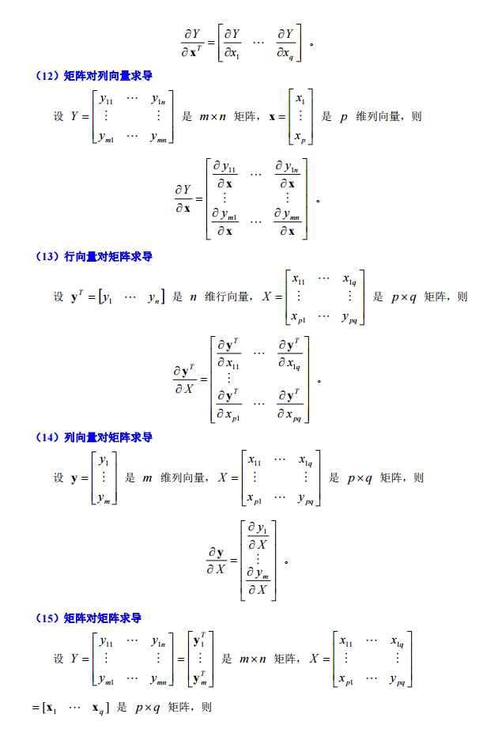
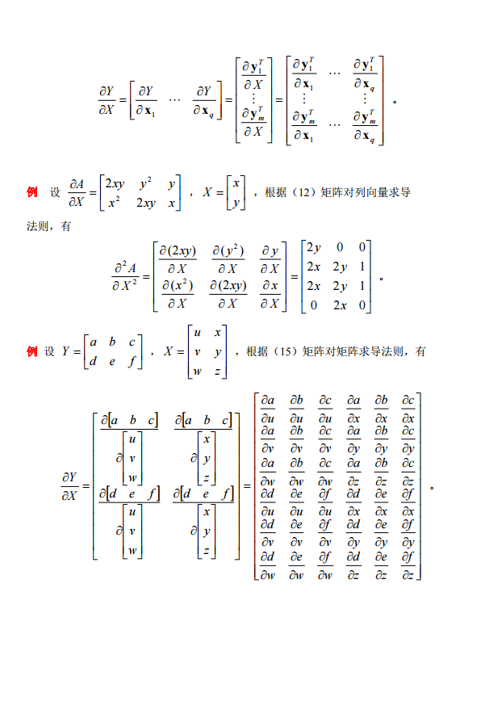


**快速矩阵向量求导**


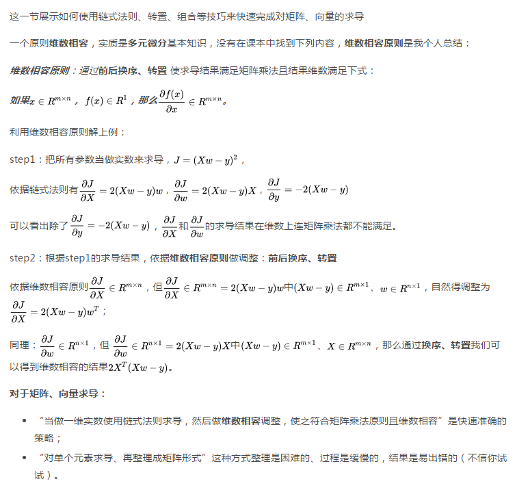

## 最优化总结 

随机优化算法（Stochastic Optimization）是指每次随机采样一个或少量几个（Mini-batch）训练样本对模型更新的优化方法。因其有内存消耗低、单次迭代计算复杂度低等优点，被广泛应用于大规模机器学习模型训练中，包括绝大多数深度学习模型的训练。

本章要介绍的优化器（Optimizer）涵盖了大规模机器学习和深度学习最常用的优化算法。大致可将其分为以下3类：

+ 一阶随机优化。如SGD，AdaGrad，RMSProp，AdaDelta，Adam，FTRL，FTML等；

+ 二阶随机优化。如LBFGS等；

+ 非凸随机优化。

此外，针对机器学习中的无监督学习，很多无法转化为非优化问题，需要应用概率推理算法求解，比如MCMC，EM等

**随机优化算法**

Gradient Descent

梯度下降算法（简称GD）是求解机器学习问题（尤其是凸优化问题）最常用的求解算法。其中，随机梯度下降和批量梯度下降时两种常见的迭代优化思路。
假如优化目标是平方损失函数

$$\min_{w} \quad J(w) = \frac{1}{2m} \sum_{i=1}^{m} \left(h_{w}(x^{(i)}) - y^{(i)} \right)^2$$

### Batch Gradient Descent 

参数的每一轮迭代是基于所有数据集，对目标函数J(w)求偏导，得到每个wi对应的梯度：


$$\nabla_{w_j} = \frac{\partial{J(w)}}{\partial{w_j}} = \frac{1}{m} \sum_{i=1}^{m} \left(h_w(x^{(i)}) - y^{(i)}\right) \cdot x_{j}^{(i)}$$

+ 优点：在于每次更新都会朝着正确的方向进行，最后能够保证收敛于极值点
凸函数收敛于全局极值点，非凸函数可能会收敛于局部极值点

+ 缺点：在于每次学习时间过长，并且如果训练集很大以至于需要消耗大量的内存，并且全量梯度下降不能用于Online模型参数更新。

### Stochastic Gradient Descent

区别于批量梯度下降，这里损失函数对应的训练集中每个样本的粒度，每个样本的损失函数如下：

$$J\left(w; (x^{(i)}, y^{(i)})\right) = \frac{1}{2} \left(y^{(i)} - h_w(x^{(i)}) \right)^2$$

求每个参数wjwj的梯度：

$$\nabla_{w_j} = \frac{\partial J(w; (x^{(i)}, y^{(i)}))} {\partial w_j} = \left(h_w(x^{(i)}) - y^{(i)}\right) \cdot x_j^{(i)}$$

### Mini-Batch Gradient Descent


BGD的参数更新方式计算复杂度要比SGD高很多，大规模机器学习任务一般不采用BGD来训练模型（主要原因是效率低，以我们的CTR预估模型来说，每次训练时的样本量在10亿级别）；而SGD求解时带来的波动较大。这里的mini-batch方式综合了BGD和SGD之间的优点，在参数更新速度和更新次数之间取一个tradeoff。

这里假设每个mini-batch有b个样本，训练集被划分为KK个batch数据。对应的梯度计算公式与BGD相同，只是样本集有变化，即


$$\nabla_{w_j} = \frac{\partial J(w)}{\partial w} = \frac{1}{b} \sum_{i=1}^{b} \left(h_w(x^{(i)}) - y^{(i)}\right) \cdot x_j^{(i)}$$ 


相对于随机梯度下降，mini-batch梯度下降降低了收敛波动性，即降低了参数更新的方差，使得更新更加稳定。相对于全量梯度下降，其提高了每次学习的速度。不用担心内存瓶颈从而可以利用矩阵运算进行高效计算。

### Online Gradient Descent 


Online GD是把梯度下降算法应用到了在线学习（Online Learning）领域。互联网很多应用场景都是实时的，以我们的推荐广告业务系统来说，首先request和response是实时的，过程中不断的产生新数据。而Online Learning要解决的就是充分利用实时数据来更新模型，进而捕捉实时行为用于实时反馈，这也是Online Learning的优势。

Online Learning是实时更新模型，因此训练数据只用一次，然后就丢弃。并且他与基于批量数据集训练模型不同，它不需要样本满足独立同分布（IID）的假设。
Online GD参数更新方式与SGD相同，不再赘述。


GD参数更新
不管是BGD、BGD、mini-batch GD还是Online GD，最小化优化目标，都需要按照每个参数的梯度负方向来更新参数，即：
$$w_j \leftarrow w_j - \Delta{w_j}; \qquad  \Delta{w_j} = \eta \cdot \nabla_{w_j}$$
其中η为学习率（又称步长）

**GD问题与挑战**

虽然梯度下降算法效果很好，并且应用广告，但同时也存在一些问题待解决：

+ 如何选择一个比较合理的学习率？如果学习速率过小，则会导致收敛速度很慢。如果学习速率过大，那么其会阻碍收敛，即在极值点附近会振荡。

+ 如何调整学习率？ 可以尝试在每次更新过程中，改变学习速率。这种一般需要使用某种事先设定的策略抑或在每次迭代中衰减一个较小的阈值。无论如何调整，都需要事先进行固定设置，这边便无法自适应每次学习的数据集特点。

+ 所有模型参数每次更新都是使用相同的学习率。如果数据特征是稀疏的或者每个特征的分布或统计特征有差异，那么就不能在更新时每个参数使用相同的学习速率，对于很少出现的特征应该使用一个相对较大的学习速率。

+ 如何避免在求解非凸优化问题时，容易陷入到次优的局部极值点？ 比如深度神经网路优化问题。


### Adaptive Gradient Descent


自适应梯度下降算法，简称AdaGrad。与GD不同的是，AdaGrad在更新参数时，学习率不在设定为固定值。每次迭代过程中，每个参数更新时使用不同的学习率。

假设在第kk轮迭代，$\nabla_{k,w_j}$示目标函数对参数wj的梯度。普通的GD算法，对于所有的wj使用相同的学习率，因此在第kk次迭代时，参数wjwj的变化过程如上述公式GD参数更新.

而AdaGrad更新参数的规则，学习率ηη会随着迭代过程并根据历史梯度的变化而变化。如下所示：
$$
w_{j} \leftarrow w_j - \frac{\eta}{\sqrt{n_{k,w_j} + \epsilon}} \cdot \nabla_{k, w_j}$$

$n_{k,w_j} = \sum_{i=1}^{k} \nabla_{i,w_j}$表示参数wj在1到第k次梯度平方的累加和。ϵ用于平滑，保证分母不为0，一般取较小值（如1e-8）。
AdaGrad算法总结如下：

 +  开始时$\sqrt{n_{k,w_j}}$较小，学习率较大，相当于放大梯度，加快寻找最优解的步伐；后期$\sqrt{n_{k,w_j}}$越来越大，学习率越来越小，能够约束梯度。

+  仍然需要依赖于人工设置的一个全局学习率ηη用于初始化。ηη如果初始过大，会使整个学习率变大，对梯度的调节也大；

+  随着迭代进行，分母上梯度平方累加和将会越来越大，使wjwj的更新量→0→0，导致学习率急剧下降，训练提前结束。

+  更新wjwj时，左右两边的单位不同一。 


### Adadelta 

Adadelta是对Adagrad的扩展，，由Matthew D. Zeiler在2012年的论文ADADELTA: An Adaptive Learning Rate Method中提出，最初方案依然是对学习率进行自适应约束，但是进行了计算上的简化。 Adagrad会累加之前所有的梯度平方，而Adadelta只累加固定大小的项，并且也不直接存储这些项，仅仅是近似计算对应的平均值。即：

$$ n_{k,w_j} = \rho \cdot n_{k-1,w_j} + (1 - \rho) \cdot \nabla_{k, w_j} \cdot \nabla_{k,w_j} $$

在此处Adadelta其实还是依赖于全局学习率的，但是作者做了一定处理，经过近似牛顿迭代法之后：可以看出Adadelta已经不用依赖于全局学习率了


### RMSProp

均方根传播算法（Root Mean Square Propagationd，简称RMSProp）是由Hinton在2012年的文章《RmsProp: divide the gradient by a running average of its recent magnitude》中提出。他是针对AdaGrad算法在迭代后期学习率下降过快给出的改进版本。RMSProp通过引入一个衰减系数γγ（又称遗忘因子，forgetting factor），每次计算的梯度平方都按照γγ衰减一定比例来计算梯度累计量nn。

$$ n_{k,w_j} = \gamma \cdot n_{k-1,w_j} + (1 - \gamma) \cdot \nabla_{k, w_j} \cdot \nabla_{k,w_j} $$
参数的更新方式与AdaGrad算法相同。

RMSProp算法总结如下：

+ 相比AdaGrad，该算法很好的解决了模型训练过早结束的问题（尤其在深度学习模型中较常见）；
引入了新的超参数：衰减稀疏γ(默认值可设置为0.95，但本人试验发现接近于1效果更好，比如0.99)；

+ 算法依然依赖于全局学习率；


**各优化方法比较**

 


 + 从上图可以看出， Adagrad、Adadelta与RMSprop在损失曲面上能够立即转移到正确的移动方向上达到快速的收敛。而Momentum 与NAG会导致偏离(off-track)。同时NAG能够在偏离之后快速修正其路线，因为其根据梯度修正来提高响应性。
 
+  从上图可以看出，在鞍点（saddle points）处(即某些维度上梯度为零，某些维度上梯度不为零)，SGD、Momentum与NAG一直在鞍点梯度为零的方向上振荡，很难打破鞍点位置的对称性；Adagrad、RMSprop与Adadelta能够很快地向梯度不为零的方向上转移。

## 线性回归R语言实践

在了解了线性回归的背景知识之后，现在我们可以动手实现它了，尽管在R中有现成的函数可以实现，但是如果过于依赖，我们则很难理解背后的原理。因此，本节讲介绍如何自己动手实现线性回归的训练。

### 生成数据集
设训练数据集样本数为1000，输入个数（特征数）为2。给定随机生成的批量样本特征$\boldsymbol{X} \in \mathbb{R}^{1000 \times 2}$ ,们使用线性回归模型真实权重$\boldsymbol{w} = [2, -3.4]^\top$和偏差$b = 4.2$，以及一个随机噪声项$\epsilon$来生成标签：

$$\boldsymbol{y} = \boldsymbol{X}\boldsymbol{w} + b + \epsilon, $$
其中，$\epsilon$服从均值为0和标准差为0.1的正态分布，下面生成数据集。
```{r}
num_feature = 2
num_examples = 1000
true_theta = c(1,3,-1.5)
true_b = 4.2
x1 = rnorm(1000,3,1)
x2 = rnorm(1000,1,1)
feature = as.matrix(data.frame(x0 = true_b,x1,x2),nrow = num_examples)
epsilon = rnorm(1000,0,0.1)
true_y = true_theta[2]*feature[,2] + true_theta[3]*feature[,3]+
  true_theta[1]*feature[,1] + epsilon
true_y = as.matrix(true_y,ncol = 1)
print(feature[1,])
print(true_y[1,])
```

通过散点图来观察特征$x1$与标签$y$之间的关系

```{r, message=FALSE, warning=FALSE}
library(ggplot2)
ggplot(data = NULL,aes(x = feature[,2],y = true_y))+geom_point()

```

### 初始化模型参数

```{r}
theta = as.matrix(c(0,0,0),ncol = 1 )
```

### 定义损失函数

使用平方损失来定义线性回归的损失函数。

```{r, echo=TRUE, message=FALSE, warning=FALSE}

lr_cost = function(theta, x, y){
  m = nrow(x)
  inner = x%*%theta - y  # R(m*1)，X @ theta等价于X.dot(theta)
  # 1*m @ m*1 = 1*1 in matrix multiplication
  # but you know numpy didn't do transpose in 1d array, so here is just a
  # vector inner product to itselves
  square_sum = t(inner)%*% inner
  cost = square_sum / (2 * m)
  return(cost)
  
} 

lr_cost(theta,feature,true_y)
```

### 定义优化算法

采用梯度梯度下降法

```{r, echo=TRUE, message=FALSE, warning=FALSE}
gradient = function(theta, x, y){
  m = nrow(x) #
  inner = t(x)%*%(x%*%theta -y)
  return(inner/m)
}

gradient(theta,feature,true_y)

```


### 训练模型

现在我们可以开始训练模型了

```{r, echo=TRUE, message=FALSE, warning=FALSE}
# epoch 超参数，表示迭代次数
# alphe 超参数，表示学习率

batch_gradient_decent = function(theta,x,y,alpah = 0.01,epoch){
  
  cost_data = lr_cost(theta,x,y)
  theta_copy = theta
  for(i in 1:epoch){
    theta_copy = theta_copy - alpah*gradient(theta_copy,x,y)
    cost_mid = lr_cost(theta_copy,x,y)
    cost_data = rbind(cost_data,cost_mid)
  }
  return(list(theta_copy,cost_data))
}

final_data = batch_gradient_decent(theta,x = feature,y = true_y,alpah = 0.01,epoch = 500)

final_theta = final_data[[1]]
final_cost = final_data[[2]]
print(final_theta)
lm_pred = X=feature%*%final_theta

ts.plot(ts(final_cost[1:500]))

ggplot(data = NULL,aes(x = true_y,y = lm_pred))+
  geom_line()+xlab('实际值')+ylab('预测值')
 
```

### 调用lm函数
```{r}
summary(lm(true_y ~ feature[,2]+feature[,3] ))
```


#  逻辑回归

## 逻辑回归的引入
 
大家在日常的工作和学习中或许有这样的疑问：邮箱是如何自动区分正常邮件和垃圾邮件的呢？银行是如何判断是否通过你的贷款申请的呢？经常收到某种商品的推荐信息，商家又是如何知道你对这个商品感兴趣的呢？

为了回答上述疑问，这一期给大家介绍逻辑回归算法。逻辑回归，也称Logistic Regression,主要区别于一般的线性回归模型。我们知道，一般的线性回归模型都是处理因变量是连续变量的问题，如果因变量是分类变量，一般线性回归模型就不再适用。逻辑回归算法因其原理的相对简单，可解释性强等优点已成为互联网领域最常用也最有影响力的分类算法之一，同时它还可以作为众多集成算法以及深度学习的基本组成单位，所以学好逻辑回归尤其重要。
 
我们知道，一般的线性回归模型都是处理因变量是连续变量的问题，如果因变量是定性变量，一般线性回归模型就不再适用了。
 
或许有人会有疑问，为什么对于分类问题，逻辑回归行而一般的线性回归模型却不行呢？二者的区别又是什么呢？下面将从现实意义和数学理论上给出解释。
 
### 定性因变量回归方程的意义
 
设因变量y是只取0,1两个值，考虑简单线性回归模 $y=\theta_{0}+\theta_{1}x_{i} +\varepsilon$ 
在这种y只取0和1两个值的情况下，因变量均值  $E(y_{i})=\theta_{0}+\theta_{1}x_{i}$  有着特殊的意义。 
由于$y$是0-1型随机变量，得到如下概率分布
 $$ P(y = 1)= p$$
 $$ P(y = 0)= 1-p $$ 
根据离散型随机变量期望值的定义，可得
$$ E(y)=1( p )+0(1-p)= p $$
所以，作为由回归函数给定的因变量均值，$E(y)=\theta_{0}+\theta_{1}x$是自变量水平为$x$时$y=1$的概率。
 
###  逻辑回归模型的特别之处
 
对于一般的线性模型

$$y=\theta_{0}+\theta_{1}x +\varepsilon$$

误差项有大三假定条件：
 
（1）误差项$\varepsilon$是一个期望为0的随机变量，即$E(\varepsilon)=0$
 
（2）对于所有的$x$，$\varepsilon$的方差都相同，这意味着对于一个特定的x值，y的方差也都等于$\sigma^2$。
 
（3）误差项$\varepsilon$是一个服从正态分布的随机变量，且相互独立，即$\varepsilon\sim N(0,\sigma^2)$。
 
而在因变量y只能取0和1的逻辑回归模型，误差项  $\varepsilon=y-(\theta_{0}+\theta_{1}x)$ 显然是两点型的离散分布，不满足误差项正态分布的基本假定；同时误差项的方差 $Var(\varepsilon_{i})=Var(y_{i})=(\theta_{0}+\theta_{1}x_{i})(1-\theta_{0}-\theta_{1}x_{i})$,可以看出误差项随着$x$的不同水平而变化，是异方差，不满足线性回归的基本假定；当因变量为0和1时，回归方程代表的是概率分布，所以因变量的均值受到如下限制$0\leq E(y_{i})\leq1$,一般的线性回归方程不会有这种限制。而逻辑回归却利用一些数学变化巧妙的解决了这些的问题，请看下面一节。
 
##  从一般线性回归到逻辑回归
 
当被解释变量$y$为0和1的二分类变量时，虽然无法采用一般的线性回归模型建模，但是可以借鉴其理论基础：
 
第一，一般线性模型$p(y=1|x)=\theta_{0}+\theta_{1}x_{1}+\dots+\theta_{n}x_{n}$，方程左侧的概率$p$的取值范围为[0,1]，方程右边的额取值范围在$-\infty\sim +\infty$之间。如果对概率p做合理的变换，使其的取值范围与右侧吻合，则左侧和右侧可以通过等号连接起来。
 
第二，一般线性模型$p(y=1|x)=\theta_{0}+\theta_{1}x_{1}+\dots+\theta_{n}x_{n}$，方程中的概率$p$与解释变量之间的关系是线性的。但在实际的应用中，它们之间的关系往往是非线性的。例如通过银行贷款申请的概率通常不会随着年收入（或者年龄等）的增长而线性增长。于是对概率$p$的变换应该是采用非线性变换。

基于以上的分析，可采取一下两步变换：
 
第一步，将概率$p$转换成$\Omega:\Omega=\frac{p}{1-p}$。其中，$\Omega$称为优势，是事件发生的概率与不发生的概率之比。这种变换是非线性的，且$\Omega$是$p$的单调函数，保证了$\Omega$和$p$增长的一致性，是模型易于理解。优势的取值范围在0和无穷大之间。
 
第二步，将$\Omega$换成$ln\Omega:ln\Omega=ln\frac{p}{1-p}$。其中，$ln\Omega$称为$logit P$. 
 
上述的两步变换称为logit变换。经过logit变换，$logit P$的取值范围范围$-\infty\sim+\infty$，与一般线性回归模型右侧的取值范围吻合。同时$logitP$与$p$之间保持单调一致性。
 
至此，用等号将$logitP$和一般线性模型的右侧连接起来，得到$logit P=\theta_{0}+\theta_{1}x_{1}+\dots+\theta_{n}x_{n}$,即为逻辑回归模型。这样我们就完成从一般线性模型到逻辑回归模型的演变。
 
或许有人还会质疑logit变换的合理性，那么我们就继续往下扒。
从以上的推导和变换我们得到，$$ln\frac{p}{1-p}=\theta_{0}+\theta_1 x_{1}+\theta_2 x_{i}+\cdots +\theta_n x_{n}$$
故有 $p=\frac{1}{1+e^{-(\theta_{0}+\theta_1 x_{1}+\theta_2 x_{2}+\cdots +\theta_n x_{n})}}$，其为(0,1)型的Sigmoid函数，如下图所示。这是一个非线性函数，很好的体现了概率$p$与解释变量之间的非线性关系。

```{r}
x = seq(from = -5,to = 5,by = 0.5)
y = 1/(1 + exp(-x))
plot(x,y)
```
  
### 逻辑回归模型的解读
 
逻辑回归方程的右侧与一般线性回归方程的形式一致，可用类似的方法解释逻辑回归方程系数的含义，即当其他自变量保持不变时，自变量$x_i$每增加一个单位，$logitP$平均增加（或减少）$\theta_{i}$个单位。
 
在实际应用中，人们更关心自变量为优势$\Omega$带来的变化，其中优势$\Omega=\frac{p}{1-p}$，表示某一事件的发生概率与不发生概率之比。同时我们还会通过优势比来进行不同组别之间风险的对比分析。
 
在逻辑回归方程中，$\Omega=e^{(\theta_{0}+\theta_1 x_{1}+\theta_2 x_{2}+\cdots +\theta_n x_{n})}$，当其他自变量不变时，$x_{i}$每增加一个单位，优势变为原来优势的$e^{\theta_i}$倍，优势比即为$e^{\theta_i}$。


### 逻辑回归模型的参数估计
 
设y是0-1型变量，$x_{1},x_{2},\cdots ,x_{n}$是与y相关的确定性变量，m组观测数据为$(x_{i1},x_{i2},\cdots ,x_{in};y_{i})(i=1,2,\cdots,m)$,其中，$y_{1},y_{2},\cdots ,y_{m}$是取值0或1的随机变量，$y_{i}$与$x_{i1},x_{i2},\cdots ,x_{in}$的关系如下：
 
$$E(y_{i})=p_{i}=f(\theta_{0}+\theta_1 x_{i1}+\theta_2 x_{i2}+\cdots +\theta_n x_{in})$$
 
其中，函数f(x)是值域在[0,1]区间内的单调增函数。对于逻辑回归
 
$$f(x)=\frac{1}{1+e^{-x}}$$
 
于是$y_{i}$是均值为$p_{i}=f(\theta_{0}+\theta_1 x_{i1}+\theta_2 x_{i2}+\cdots +\theta_p x_{ip})$的0-1分布，概率函数为
 
$$P(y_{i}=1)=p_{i}$$
$$P(y_{i}=0)=1-p_{i}$$

可以把$y_{i}$的概率函数合写为
 
$$P(y_{i})=p_{i}^{y_{i}}(1-p_{i})^{1-y_{i}},y_{i}=0,1;i=1,2,\cdots,n$$
 
于是，$y_{1},y_{2},\cdots ,y_{n}$的似然函数为
 
$$L=\prod_{i=1}^{n}P(y_{i})=\prod_{i=1}^{m}p_{i}^{y_{i}}(1-p_i)^{1-y_i}$$
 
对似然函数取自然对数，得
 
$$lnL=\sum_{i=1}^{m}[y_i lnp_i+(1-y_i)ln(1-p_i)]\\
   =\sum_{i=1}^{m}[y_i ln\frac{p_i}{(1-p_i)}+ln(1-p_i)]$$
   
对于logistic回归，将
 
$$p_i=\frac{1}{1+e^{-(\theta_{0}+\theta_1 x_{i1}+\theta_2 x_{i2}+\cdots +\theta_n x_{in})}}$$
 
代入得
 
$$lnL=\sum_{i=1}^{n}[y_i (\theta {0}+\theta_1 x_{i1}+\theta_2 x_{i2}+\cdots +\theta_n x_{in})-ln(1+e^{(\theta_{0}+\theta_1 x_{i1}+\theta_2 x_{i2}+\cdots +\theta_n x_{in})})]$$
 
最大似然估计就是选取$\theta_{0},\theta_1,\theta_2,\cdots ,\theta_p$的估计值$\hat{\theta}_0,\hat{\theta}_1,\hat{\theta}_2,\cdots,\hat{\theta}_n$，使上式最大。同时，作为一个最优化问题，可以采用梯度下降法和牛顿法等最优化算法。
 

令$h_{\theta}(x) = \frac{1}{1+e^{-\theta^T x}}$ 

似然函数的代数表达式为：$$lnL=\sum_{i=1}^{m}[y_i log(h_{\theta}(x^{(i)}))+(1-y_i)ln(1-log(h_{\theta}(x^{(i)})))]$$

对似然函数对数化取反的表达式，即损失函数表达式为：

$$J(\theta) = -\frac{1}{m} lnL(\theta) = -\frac{1}{m} \sum\limits_{i=1}^{m}(y^{(i)}log(h_{\theta}(x^{(i)}))+ (1-y^{(i)})log(1-h_{\theta}(x^{(i)})))$$

在得到这样一个代价函数以后，我们便可以用梯度下降算法来求得能使代价函数最小的参数了。

$$ \theta_j: = \theta_j -\alpha\frac{1}{m}\sum\limits_{i=1}^m \left( h_{\theta}(x^{(i)}) -y^{(i)}  \right)\cdot x^{(i)}_{j} $$
具体推导过程为：

$$\begin{align} \frac{\partial}{\partial \theta_j} J(\theta) & = -\frac{1}{m}\sum\limits_{i=1}^{m}\left( y^{(i)} \frac{1}{h_{\theta}(x^{(i)})} - (1-y^{(i)}) \frac{1}{1-h_{\theta}(x^{(i)})}\right) \frac{\partial}{\partial \theta_j} h_{\theta}(x^{(i)}) \\\ & = -\frac{1}{m} \sum\limits_{i=1}^{m}\left( \frac{y^{(i)}-h_{\theta}(x^{(i)})}{h_{\theta}(x^{(i)}) \cdot (1 - h_{\theta}(x^{(i)}))}\right) \cdot h_{\theta}(x^{(i)}) (1 - h_{\theta}(x^{(i)})) \cdot \frac{\partial}{\partial \theta_j} \theta^T x^{(i)} \\\ & = -\frac{1}{m} \sum\limits_{i=1}^{m}\left( y^{(i)}-h_{\theta}(x^{(i)}) \right) \cdot \frac{\partial}{\partial \theta_j} \theta^T x^{(i)} \\\ & = \frac{1}{m} \sum\limits_{i=1}^{m}\left( h_{\theta}(x^{(i)}) -y^{(i)} \right) \cdot x^{(i)}_{j} \end{align}  $$
向量表达式： 
$$
\frac{\partial}{\partial \theta} J(\theta) = \frac{1}{m}X^T(h(X
\theta) - Y)
$$

## 逻辑回归R语言实践

### 生成训练数据

```{r}
num_feature = 2
num_examples = 1000
true_theta = c(1,2,-1.5)
true_b = 0.5
x1 = rnorm(1000,1.5,1)
x2 = rnorm(1000,2,1)
feature = as.matrix(data.frame(x0 = true_b,x1,x2),nrow = num_examples)
epsilon = rnorm(1000,0,0.1)

true_y = true_theta[2]*feature[,2] + true_theta[3]*feature[,3]+
  true_theta[1]*feature[,1] + epsilon
true_y = as.matrix(sigmoid(true_y),ncol = 1)
true_y[,1] = ifelse(true_y[,1]>0.5,1,0)
print(feature[1,])
print(table(true_y))
```

### 初始化模型参数

```{r}
theta = as.matrix(c(0,0,0),ncol = 1 )
```

### 定义损失函数

使用对数损失来定义逻辑回归的损失函数。

```{r, echo=TRUE, message=FALSE, warning=FALSE}

log_cost = function(theta, x, y){
  m = nrow(x)
  inner =  sigmoid(x%*%theta)   # R(m*1)，X @ theta等价于X.dot(theta)
  # 1*m @ m*1 = 1*1 in matrix multiplication
  # but you know numpy didn't do transpose in 1d array, so here is just a
  # vector inner product to itselves
  log_sum = t(log(inner))%*% y + t(log(1- inner))%*% (1-y)
  cost = log_sum / ( m)
  return(cost)
  
} 

log_cost(theta,feature,true_y)
```

### 定义优化算法

采用梯度梯度下降法

```{r, echo=TRUE, message=FALSE, warning=FALSE}

log_gradient = function(theta, x, y){
  m = nrow(x) #
  inner = t(x)%*%( sigmoid(x%*%theta) - y)
  return(inner/m)
}

log_gradient(theta,feature,true_y)

```


### 训练模型

现在我们可以开始训练模型了

```{r, echo=TRUE, message=FALSE, warning=FALSE}
# epoch 超参数，表示迭代次数
# alphe 超参数，表示学习率

batch_gradient_decent = function(theta,x,y,alpah = 0.01,epoch){
  
  cost_data = log_cost(theta,x,y)
  theta_copy = theta
  for(i in 1:epoch){
    theta_copy = theta_copy - alpah*log_gradient(theta_copy,x,y)
    cost_mid = log_cost(theta_copy,x,y)
    cost_data = rbind(cost_data,cost_mid)
  }
  return(list(theta_copy,cost_data))
}

final_data = batch_gradient_decent(theta,x = feature,y = true_y,alpah = 0.01,epoch = 1050)

final_theta = final_data[[1]]
final_cost = final_data[[2]]
print(final_theta)

log_pred =  sigmoid(feature%*%final_theta)
log_pred = ifelse(log_pred>0.5,1,0)
table(pred = log_pred,true_y)

```

### R语言glm函数
```{r}
summary(glm(true_y ~ feature[,c(2,3)] ),family = 'binomial')
```


```python
import numpy as np

def cost(theta, X, y):
    
  theta = np.matrix(theta)
  X = np.matrix(X)
  y = np.matrix(y)
  first = np.multiply(-y, np.log(sigmoid(X* theta.T)))
  second = np.multiply((1 - y), np.log(1 - sigmoid(X* theta.T)))
  return np.sum(first - second) / (len(X))
```

#  softmax回归

## 简介
Softmax 回归（或者叫做多项逻辑回归）是逻辑回归在多分类问题上的推广。在逻辑回归中，我们假设标签是二元的：$y^{(i)}\in\\{0,1\\}$。我们使用一个这样的分类器来对两种手写数字进行区分。Softmax 回归则让我们可以处理 $y^{(i)}\in \\{1,\cdots,K\\}$，其中 $K$ 是类的编号。

一起来回顾一下逻辑回归。我们有一个训练集 $\{(x^{(1)},y^{(1)}),\cdots,(x^{(m)},y^{(m)})\}$，包含 $m$ 个已经分好类的样本，其中输入特征是 $x^{(i)}\in\mathcal{R}^n$。在逻辑回归中，我们的设定是只有两个的类，因此类的标签是 $y^{(i)}\in\\{0,1\\}$。我们的假设函数是如下的形式：
$$
\begin{align}
h\_\theta(x) = \frac{1}{1+\exp(-\theta^\top x)},
\end{align}
$$
然后最小化下面的代价函数，以获得模型的参数 $\theta$ 
$$
\begin{align}
J(\theta) = -\left[ \sum_{i=1}^m y^{(i)} \log h_\theta(x^{(i)}) + (1-y^{(i)}) \log (1-h_\theta(x^{(i)})) \right]
\end{align}
$$
Softmax 回归则是针对多分类问题（而不是二分类），因此标签 $y$ 可以有 $K$ 个不同值。因此，在我们的训练集 $\{ (x^{(1)}, y^{(1)}), \ldots, (x^{(m)}, y^{(m)}) \}$ 中，有 $y^{(i)} \in \\{1, 2, \ldots, K\\}$。（请注意，在这里我们约定索引从 $1$ 开始，而不是 $0$）例如，在 MNIST 数字识别任务中，我们有 $K=10$ 中不同的类别。

给定一个输入 $x$，我们想要我们的假设函数对每个 $k=1,\cdots,K$ 来估计相应的概率 $P(y=k|x)$，来确定它所属的类别。因此，我们的假设函数将会输出一个 $K$ 维的向量（其中的元素和为 $1$），来告诉我们的 $K$ 个估计的概率。具体来说，我们的假设函数 $h\_\theta(x)$ 是如下的形式：
$$
\begin{align}
h_\theta(x) =
\begin{bmatrix}
P(y = 1 | x; \theta) \newline
P(y = 2 | x; \theta) \newline
\vdots \newline
P(y = K | x; \theta)
\end{bmatrix}
=
\frac{1}{ \sum_{j=1}^{K}{\exp(\theta^{(j)\top} x) }}
\begin{bmatrix}
\exp(\theta^{(1)\top} x ) \newline
\exp(\theta^{(2)\top} x ) \newline
\vdots \newline
\exp(\theta^{(K)\top} x ) \newline
\end{bmatrix}
\end{align}
$$
在这里 $\theta^{(1)}, \theta^{(2)}, \ldots, \theta^{(K)} \in \mathcal{R}^{n}$ 是我们模型的参数，$1/\left(\sum\_{j=1}^{K}{\exp(\theta^{(j)\top} x)}\right)$ 对概率分布进行了归一化，使得和为 $1$。

为了方便，我们使用 $\theta$ 来表示我们模型中的所有参数。当你实现 softmax 回归时，你会发现用 $\theta$ 来表示一个 $n\times K$ 会非常方便，该矩阵将 $\theta^{(1)},\theta^{(2)},\cdots,\theta^{(K)}$ 串联起来：

$$
\theta = \left[\begin{array}{cccc}| & | & | & | \newline
\theta^{(1)} & \theta^{(2)} & \cdots & \theta^{(K)} \newline
| & | & | & |
\end{array}\right].
$$


###  代价函数


我们现在描述 softmax 回归的代价函数。在下面的等式中，$1\{\cdot\}$ 是“指示函数”，也就是有 $1\{$一个正确的表达式$\}=1$ 和 $1\{$一个错误的表达式$\}=0$。例如，$1\{2+2=4\}$ 的值是 $1$；而 $1\{1+1=5\}$ 的值是 $0$。于是，代价函数如下：

$$
\begin{align}
J(\theta) =-\left[\sum_{i=1}^{m} \sum_{k=1}^{K} 1\left\{y^{(i)} = k\right\} \log \frac{\exp(\theta^{(k)\top} x^{(i)})}{\sum_{j=1}^K \exp(\theta^{(j)\top} x^{(i)})}\right]
\end{align}
$$

请注意，这个也可以用来表示逻辑回归的代价函数：
$$
\begin{align}
J(\theta) &= - \left[ \sum_{i=1}^m   (1-y^{(i)}) \log (1-h_\theta(x^{(i)})) + y^{(i)} \log h_\theta(x^{(i)}) \right] \newline
&= - \left[ \sum_{i=1}^{m} \sum_{k=0}^{1} 1\left\{y^{(i)} = k\right\} \log P(y^{(i)} = k | x^{(i)} ; \theta) \right]
\end{align} $$

softmax 回归的代价函数在形式上与这个非常相似，只是对类标签 $K$ 个可能值进行了累加。那么在 softmax 回归中，我们有

$$
P(y^{(i)} = k | x^{(i)} ; \theta) = \frac{\exp(\theta^{(k)\top} x^{(i)})}{\sum\_{j=1}^K \exp(\theta^{(j)\top} x^{(i)}) }
$$

我们无法直接求解 $J(\theta)$ 的最小值，因此我们采取一个迭代优化算法（也就是梯度下降）。经过求导，梯度如下：
$$
\begin{align}
\nabla_{\theta^{(k)}} J(\theta) = - \sum_{i=1}^{m}{ \left[ x^{(i)} \left( 1\{ y^{(i)} = k\}  - P(y^{(i)} = k | x^{(i)}; \theta) \right) \right]  }
\end{align} $$

让我们回顾一下“$\nabla\_{\theta^{(k)}}$”的含义。特别地，$\nabla\_{\theta^{(k)}} J(\theta)$ 本身是一个向量，因此它的第 $j$ 项是 $J(\theta)$ 在第 $j$ 项 $\theta^{(k)}$ 处的偏导 $\frac{\partial J(\theta)}{\partial \theta_{lk}}$。

有了导数的计算公式，我们就可以用一个标准的优化库来最小化 $J(\theta)$ 了。

### Softmax 回归参数的特点

Softmax 回归有一个独特的特点，它有一堆“冗余”的参数。为了解释这个，我们对每个参数向量 $\theta^{(j)}$ 减去一个固定的向量 $\psi$，因此每个 $\theta^{(j)}$ 现在被 $\theta^{(j)}-\psi$ 代替。现在，不同类标签的概率为：

$$\begin{align}
P(y^{(i)} = k | x^{(i)} ; \theta)
&= \frac{\exp((\theta^{(k)}-\psi)^\top x^{(i)})}{\sum_{j=1}^K \exp( (\theta^{(j)}-\psi)^\top x^{(i)})}  \newline
&= \frac{\exp(\theta^{(k)\top} x^{(i)}) \exp(-\psi^\top x^{(i)})}{\sum_{j=1}^K \exp(\theta^{(j)\top} x^{(i)}) \exp(-\psi^\top x^{(i)})} \newline
&= \frac{\exp(\theta^{(k)\top} x^{(i)})}{\sum_{j=1}^K \exp(\theta^{(j)\top} x^{(i)})}.
\end{align} $$

也就是，从每个 $\theta^{(j)}$ 中减去 $\psi$ 根本不影响假设函数！这表明 softmax 回归的参数是“冗余的”。更正式一点，我们说我们的 softmax 模型是“过度参数化的”，这意味着对于任意拟合数据的假设函数，都可以求出多组参数值，而这些参数对应的却又是同一个假设函数 $h_{\theta}$。

进一步，如果代价函数 $J(\theta)$ 在参数 $(\theta^{(1)}, \theta^{(2)},\ldots, \theta^{(K)})$ 处取极小值，那么对于任意的 $\psi$，$J(\theta)$ 在 $(\theta^{(1)}-\psi,\theta^{(2)}-\psi,\ldots,\theta^{(K)}-\psi)$ 处也取极小值。因此，$J(\theta)$ 的极小值的解不是唯一的。（有趣的是，$J(\theta)$ 仍是凸的，因此梯度下降不会陷入局部极值。但是它的 Hessian 矩阵是不可逆的，这就导致无法运用牛顿法求解）

值得注意的是，令 $\psi=\theta^{(K)}$，我们就可以用 $\theta^{(K)}-\psi=\vec{0}$（一个全是零的向量） 来代替 $\theta^{(K)}$，而不会影响假设函数。因此，我们可以“去掉”参数向量 $\theta^{(K)}$（或者其他任意的 $\theta^{(k)}$），而不会影响我们假设函数的表示能力。实际上，我们可以令 $\theta^{(K)}=\vec{0}$ 然后仅优化其余的参数，而不是对所有的参数进行优化。见 [softmax回归](http://deeplearning.stanford.edu/wiki/index.php/Softmax_Regression)。


### 与逻辑回归的关系

当 $K=2$ 时，softmax 回归就变成了逻辑回归。这个表明 softmax 回归是逻辑回归的一般形式。具体来说，当 $K=2$，softmax 回归的假设函数如下：
	
$$\begin{align}
h_\theta(x) &=
\frac{1}{ \exp(\theta^{(1)\top}x)  + \exp( \theta^{(2)\top} x^{(i)})}
\begin{bmatrix}
\exp( \theta^{(1)\top} x ) \newline
\exp( \theta^{(2)\top} x )
\end{bmatrix}
\end{align}$$

利用假设函数的过度参数化，并假设 $\psi=\theta^{(2)}$，并从这两个参数中减去 $\theta^{(2)}$，我们得到

$$\begin{align}
h(x) &=
\frac{1}{ \exp( (\theta^{(1)}-\theta^{(2)})^\top x^{(i)} ) + \exp(\vec{0}^\top x) }
\begin{bmatrix}
\exp( (\theta^{(1)}-\theta^{(2)})^\top x )
\exp( \vec{0}^\top x ) \newline
\end{bmatrix} \newline
&=
\begin{bmatrix}
\frac{1}{ 1 + \exp( (\theta^{(1)}-\theta^{(2)})^\top x^{(i)} ) } \newline
\frac{\exp( (\theta^{(1)}-\theta^{(2)})^\top x )}{ 1 + \exp( (\theta^{(1)}-\theta^{(2)})^\top x^{(i)} ) }
\end{bmatrix} \newline
&=
\begin{bmatrix}
\frac{1}{ 1  + \exp( (\theta^{(1)}-\theta^{(2)})^\top x^{(i)} ) } \newline
1 - \frac{1}{ 1  + \exp( (\theta^{(1)}-\theta^{(2)})^\top x^{(i)} ) } \newline
\end{bmatrix}
\end{align} $$

因此，使用向量 $\theta'$ 代替 $\theta^{(2)}-\theta^{(1)}$，我们就能得到 softmax 回归中一个类别的概率为 $\frac{1}{ 1  + \exp(- (\theta')^\top x^{(i)} ) }$，另一个类别的概率为 $1 - \frac{1}{ 1 + \exp(- (\theta')^\top x^{(i)} ) }$。这和逻辑回归的形式一样。

## softmax回归R语言实践 

### 生成训练数据集 

利用著名的鸢尾花数据集(iris)
```{r}
head(iris)
feature = as.matrix(cbind(x0 = 1, iris[,1:4]))
true_y = model.matrix(~Species - 1,data = iris)
print(head(feature))
print(head(true_y))
```

### 初始化模型参数

```{r}
num_feature = ncol(feature)
num_y = ncol(true_y)
theta_1 = theta_2 = theta_3 =  matrix(rnorm(num_feature,0,0.1),ncol = 1 )
theta = cbind(theta_1,theta_2,theta_3)


```

### 定义损失函数

采用交叉熵损失函数。

```{r, echo=TRUE, message=FALSE, warning=FALSE}
softmax = function(x){
  exp = exp(x)
  return(exp/rowSums(exp))
}


cross_cost = function(theta, x, y){
  m = nrow(x)
  inner =  softmax(x%*%theta)   # R(m*1)，X @ theta等价于X.dot(theta)
  log_sum = log(inner)*y 
  cost = - sum(log_sum) / ( m)
  return(cost)
  
} 

head(softmax(feature%*%theta))*head(true_y)


cross_cost(theta,feature,true_y)
```

### 定义优化算法

采用梯度梯度下降法

```{r, echo=TRUE, message=FALSE, warning=FALSE}

cross_gradient = function(theta, x, y){
  m = nrow(x) #
  inner = t(x)%*%( sigmoid(x%*%theta) - y)
  return(inner/m)
}

cross_gradient(theta,feature,true_y)

```

### 训练模型

现在我们可以开始训练模型了

```{r, echo=TRUE, message=FALSE, warning=FALSE}
# epoch 超参数，表示迭代次数
# alphe 超参数，表示学习率

batch_gradient_decent = function(theta,x,y,alpah = 0.01,epoch){
  
  cost_data = cross_cost(theta,x,y)
  theta_copy = theta
  for(i in 1:epoch){
    theta_copy = theta_copy - alpah*cross_gradient(theta_copy,x,y)
    cost_mid = cross_cost(theta_copy,x,y)
    cost_data = rbind(cost_data,cost_mid)
  }
  return(list(theta_copy,cost_data))
}

final_data = batch_gradient_decent(theta,x = feature,y = true_y,alpah = 0.01,epoch = 1000)

final_theta = final_data[[1]]
final_cost = final_data[[2]]
ts.plot(ts(final_cost[1:1000]))

log_pred =  softmax(feature%*%final_theta)

argmax = function(pred){
  
  apply(pred,1,which.max)
  
}

log_pred = argmax(log_pred)
table(pred = log_pred,iris$Species)

```


# 过拟合与正则化

## l1与l2正则的理解

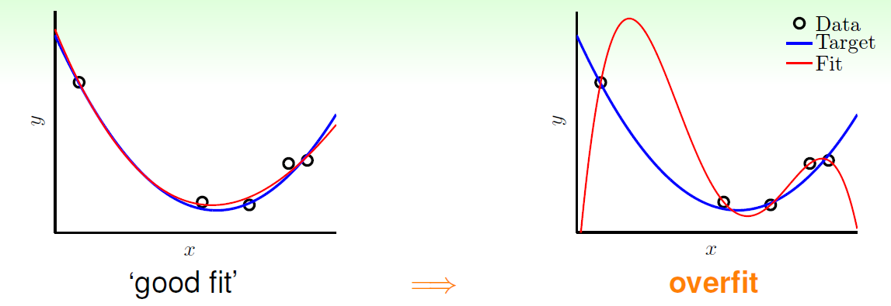

以一维的回归分析为例，如上图，如果用高阶多项式去拟合数据的话，可以使得训练误差EinEin很小，但是在测试集上的误差就可能很大。

造成这种现象的原因就是因为我们使用的模型过于复杂，根据VC维理论：VC维很高的时候，就容易发生Ein（Bias）很低，但Eout(Variance)1很高的情形。

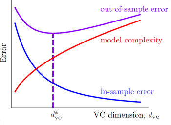


解决 overfitting 最常用的办法就是 regularization，我们常用的有：L1正则，L2正则等。

通常我们知道L1正则会使得参数稀疏化，L2正则可以起到平滑的作用，关于这方面的讲解已经很多2

+ L2 正则

$$
J\left( \theta  \right)=\frac{1}{2m}[\sum\limits_{i=1}^{m}{{{({h_\theta}({{x}^{(i)}})-{{y}^{(i)}})}^{2}}+\lambda \sum\limits_{j=1}^{n}{\theta_{j}^{2}}]}
$$


+ L1 正则

$$
J\left( \theta  \right)=\frac{1}{2m}[\sum\limits_{i=1}^{m}{{{({h_\theta}({{x}^{(i)}})-{{y}^{(i)}})}^{2}}+\lambda \sum\limits_{j=1}^{n}|{\theta_{j}}|]}
$$


###  数值分析法


###  几何分析法

L2正则

假设只有两个参数$\beta_{1},\beta_{2) $,

蓝色的圆形表示L2范数空间，设为$\beta_{1}^2 + \beta_{2}^2 = r^2$,r即圆的半径。红色的线表示不加正则项时原代价函数的函数解空间，即 $
\frac{1}{2m} [\sum\limits_{i=1}^{m}{{{ (y^{(i)} - (\beta_{1}{x}^{(i)}_{1}+ \beta_{2}{x}^{(i)}_{2}) )}^{2}}]
$。当不存在正则项的时候，表示解空间没有任何约束，通过样本集训练，不容易直接收敛到最优的$\beta$;然而在增加了正则项之后，随着不断增加r，原始解空间会被不断压缩，如果选择合适的$\lambda$，则可以将最优解压缩到$\hat\beta$,如图就是L2范数可以避免过拟合。


$$
J\left( \theta  \right)=\frac{1}{2m}[\sum\limits_{i=1}^{m}{{{ (y^{(i)} - (\beta_{1}{x}^{(i)}_{1}+ \beta_{2}{x}^{(i)}_{2}) )}^{2}}+\lambda \sum\limits_{j=1}^{n}{\beta_{j}^{2}}]}
$$


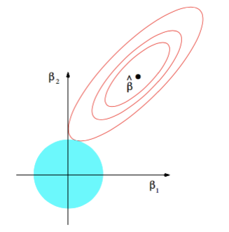

L1正则 

L1范数对解空间的压缩与L2几乎一致，不同的是L2范数与原代价函数的交点处所得到的参数$\beta$可以无限缩小，但是一定不会为0,；然而，L1范数与原代价函数的交点一般在坐标轴上，从而使得一些$\beta$为0，从而得到稀疏解。

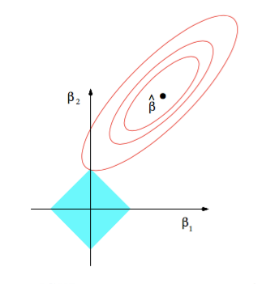


###  贝叶斯分析法

先引入一些先验知识：

1 高斯分布 

若随机变量X服从一个位置参数为 μ（数学期望） 、尺度参数为 σ（标准差）的概率分布，记为：X~(μ, σ2)。其概率密度函数为：

$$f(x\mid\mu,\sigma^2) = \frac{1}{\sqrt{2\pi\sigma^2}} \exp-\frac{(x-\mu)^2}{2\sigma^2}  $$


高斯分布曲线如下：

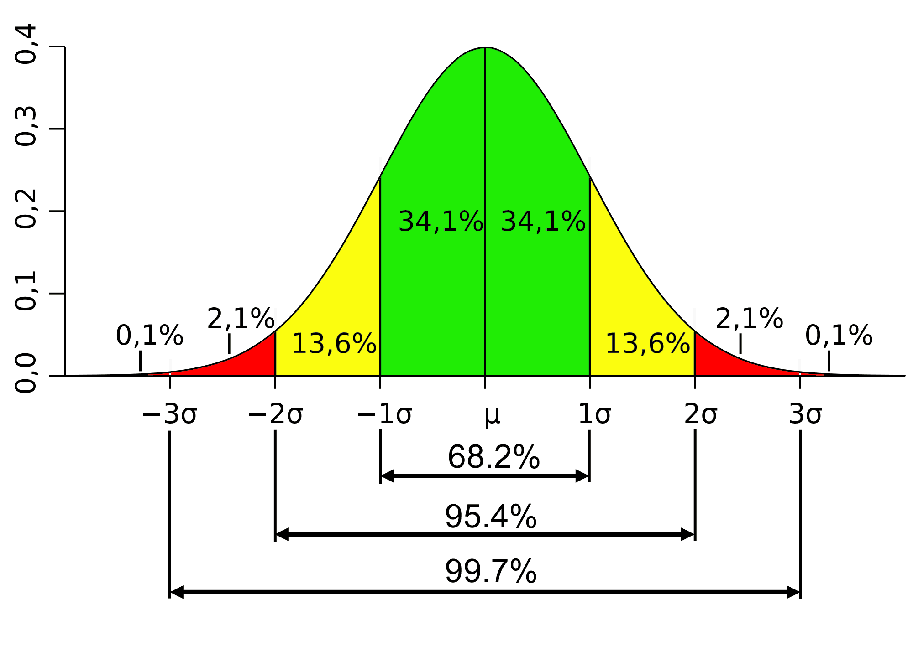


2 拉普拉斯分布（Laplace distribution）


可以看作是两个不同位置的指数分布背靠背拼接在一起，所以它也叫作双指数分布。其中，μ 是位置参数，b > 0 是尺度参数

$$f(x\mid\mu,b) = \frac{1}{2b} \exp \left( -\frac{|x-\mu|}{b} \right) \,\! $$


拉普拉斯密度曲线：


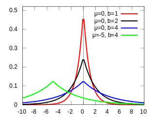

### 最大后验估计 

首先需要了解的一点就是，最大后验估计和最大似然估计联系非常密切，对最大似然估计引入先颜概率估计即转化为最大后验估计，最大后验概率估计可以看作是规则话的最大似然估计
最大似然估计属于频率学派，其认为参数$\theta$是一个固定不变的常量，只是我们现在还不知道它的值。可以通过随机产生的样本去估计这个参数。最大后验估计属于贝叶斯学派，其认为一切皆变量，服从某一个分布，认为参数$\theta$是一个未知的随机变量。我们可以参数$\theta$分布情况的先验概率，然后基于贝叶斯定理估计模型。

根于贝叶斯公式，后验概率的计算公式为：
$$ 
P( \theta|X) = \frac{p(X|\theta)P(\theta)}{p(X)}
=\frac{\prod_{i=1}^{m}p(x_i;\theta)p(\theta) }{p(x_i;\theta)p(\theta)d(\theta)}
$$

由于分母的计算非常困难，而我们的目的是求最大后验概率，故分母不进行计算，只考虑分子：

$$arg max \prod_{i=1}^{m}p(x_i;\theta)p(\theta)$$

仔细观察MLE和MAP的形式，可以很容易发现：最大后验估计就是在极大似然估计函数上乘上了先验分布而已。

+ 岭回归


由于引入了先验分布，我们用最大后验估计(MAP)5：

$$
\begin{align*}
L(w) & = p(\vec{y}|X;w)p(w)\\
& = \prod_{i=1}^{m} p(y^{(i)}|x^{(i)};\theta)p(w)\\
& = \prod_{i=1}^{m} \frac{1}{\sqrt{2\pi}\delta}exp\left( -\frac{(y^{(i)} - w^Tx^{(i)})^2}{2\delta^2}  \right)\prod_{j=1}^{n}\frac{1}{\sqrt{2\pi\alpha}}exp\left( -\frac{(w^{(j)})^2}{2\alpha}  \right)\\
& = \prod_{i=1}^{m} \frac{1}{\sqrt{2\pi}\delta}exp\left( -\frac{(y^{(i)} - w^Tx^{(i)})^2}{2\delta^2}  \right)\frac{1}{\sqrt{2\pi\alpha}}exp\left( -\frac{w^Tw}{2\alpha}  \right)
\end{align*} $$

取对数：

$$
\begin{align*}
l(w) & = \log L(w)\\
& = m \log \frac{1}{\sqrt{2\pi}\delta}+ n \log \frac{1}{\sqrt{2\pi\alpha}} - \frac{1}{\delta^2}\cdot \frac{1}{2} \sum_{i=1}^{m} (y^{(i)} - w^Tx^{(i)})^2 - \frac{1}{\alpha}\cdot \frac{1}{2} w^Tw\\
 \Rightarrow & w_{MAP_{Guassian}} = \arg \underset{w}{\min} \left( \frac{1}{\delta^2}\cdot \frac{1}{2} \sum_{i=1}^{m} (y^{(i)} - w^Tx^{(i)})^2 + \frac{1}{\alpha}\cdot \frac{1}{2} w^Tw \right) \tag{2}
\end{align*} $$

等价于：

$$
J_R(w) = \frac{1}{n}\lVert y- w^TX \rVert_2 + \lambda \lVert w \rVert_2 $$

+ lasso回归

上面我们对 ww 引入了高斯分布，那么拉普拉斯分布(Laplace distribution)呢


同理可得：


$$
w_{MAP_{Laplace}} = \arg \underset{w}{\min} \left( \frac{1}{\delta^2}\cdot \frac{1}{2} \sum_{i=1}^{m} (y^{(i)} - w^Tx^{(i)})^2 + \frac{1}{b^2}\cdot \frac{1}{2} \lVert w \rVert_1 \right) 
$$

整个最优化问题从贝叶斯观点来看是一种贝叶斯最大后验估计，

其中正则化项<-->先验信息，

损失函数<-->似然函数，

两者的乘积<-->贝叶斯最大后验估计，

贝叶斯最大后验估计的形式取对数<-->损失函数+正则化项的最优化问题形式。


### 正则化R语言实战 


```{r, echo=FALSE, message=FALSE, warning=FALSE}
library(glmnet)
library(DT)
```

**1 弹性网**

岭回归和LASSO回归都是带有参数惩罚的广义线性模型，二者同属于Elastic Net的广义线性模型家族。这一家族的模型除了相同作用的参数λ之外，还有另一个参数α来控制应对高相关性(highly correlated)数据时模型的性状。LASSO回归$\alpha = 1$，Ridge回归$\alpha = 0$，一般Elastic Net模型$0<\alpha < 1$ ，弹性网模型主要解决的问题如下：

$$
\min_{\beta_0,\beta} \frac{1}{N} \sum_{i=1}^{N} w_i l(y_i,\beta_0+\beta^T x_i) + \lambda\left[(1-\alpha)||\beta||_i^2/2 + \alpha ||\beta||_i\right],
$$


**2 glmnet包**


目前最好用的拟合广义线性模型的R package是glmnet，由LASSO回归的发明人、《The Elements of Statistical Learning》作者、斯坦福统计学家Trevor Hastie领衔开发。它的特点是对一系列不同λ值进行拟合，每次拟合都用到上一个λ值拟合的结果，从而大大提高了运算效率，此外它还包括了并行计算的功能。下面结合glmnet包主要介绍LASSO回归模型，岭回归模型类似，只需要令 $\alpha = 0$即可。


**2.1 回归模型 **


首先加载glmnet包和数据集
```{r}
data(QuickStartExample)
datatable(head(x))
```
之后我们会得到一个100×20的矩阵x作为输入自变量，100×1的矩阵y作为目标因变量,下面用自变量x和因变量y进行建模：

```{r}
lasso_mod = glmnet(x, y, family="gaussian", nlambda=50, alpha=1)
```
此处的family="gaussian"表示拟合一维连续因变量的广义线性模型，alpha = 1表示拟合LASSO模型。就酱，建模完毕。下面进一步解读模型的参数和输出结果。

参数family规定了回归模型的类型:

+  family="gaussian" 适用于一维连续因变量(univariate)

+  family="mgaussian" 适用于多维连续因变量(multivariate)

+  family="poisson" 适用于poisson回归模型

+  family="binomial" 适用于二分类模型

+  family="multinomial" 适用于多分类模型

参数nlambda=50让算法自动挑选50个不同的λ值，拟合出50个系数不同的模型。alpha=1输入α值，1是它的默认值。 值得注意的是，glmnet只能接受数值矩阵作为模型输入，如果自变量中有离散变量的话，需要把这一列离散变量转化为几列只含有0和1的向量。

如果我们想让模型的变量系数都在同一个数量级上，就需要在拟合前对数据的每一列进行标准化(standardize)。可以通过在glmnet()函数中添加参数standardize=TRUE来实现。

**2.2 模型解读**


查看glmnet详细的拟合结果:

```{r}
print(lasso_mod)
```

每一行代表了一个模型:

+ 列Df是自由度，代表了非零的线性模型拟合系数的个数。

+ 列%Dev代表了由模型解释的残差的比例，对于线性模型来说就是模型拟合的R^2(R-squred)。它在0和1之间，越接近1说明模型的表现越好，如果是0，说明模型的预测结果还不如直接把因变量的均值作为预测值来的有效。

+ 列Lambda当然就是每个模型对应的λ值。

从结果中可以看到，随着λ的变小，即参数的惩罚力度越来越小，越来越多的自变量进来模型，%Dev也越来越大。第31行时，模型包含了所有20个自变量，%Dev也在0.91以上。 nlambda=50，其实我们本应该得到50个不同的模型，但是连续几个%Dev变化很小时glmnet()会自动停止。同时，我们可以看到当Df大于9的时候，%Dev就达到了0.9，而且继续缩小λ，即增加更多的自变量到模型中，也不能显著提高%Dev。所以我们可以认为当λ接近0.1时，得到的包含9个自变量的模型，可以充分的拟合该模型。

 **2.3 模型系数轨迹图**

```{r}
plot(lasso_mod,xvar="lambda", label=TRUE)

```

图中的每一条曲线代表了每一个自变量系数的变化轨迹，纵坐标是系数的值，下横坐标是$loga(\lambda)$，上横坐标是此时模型中非零系数的个数。我们可以看到，黑线代表的自变量1在λ值很大时就有非零的系数，然后随着λ值变小不断变大。


```{r}
plot(lasso_mod,xvar="dev", label=TRUE)
```

切换下横坐标为xvar=“dev”,则下横坐标表示模型的拟合度，纵坐标是依然是系数的值，可以看出随着拟合度的变大，模型中非零系数的个数也在不断变大 。 

**2.4 模型预测**

通过上述分析，可以得出当λ接近0.1时，模型拟合效果不错，下面指定λ=0.1，然后对模型进行预测：

```{r}
predict(lasso_mod, newx=x[1:5,], s=0.1)
```


 **3 并行化交叉验证**

我们可以用上一节介绍的glmnet()函数来拟合模型，然后选取最优的λ值。但是在这种方法下，所有数据都被用来做了一次拟合，这很有可能会造成过拟合的。在这种情况下，当我们把得到的模型用来预测全新收集到的数据时，结果很可能会不尽如人意。所以只要条件允许，我们都会用交叉验证(Cross Validation)拟合进而选取模型，同时对模型的性能有一个更准确的估计。


在cv.glmnet()里我们还可以用nfolds指定fold数，因为每个fold间的计算是独立的，我们可以运用并行计算来提高运算效率，使用parallel=TRUE可以开启这个功能。

```{r, message=FALSE, warning=FALSE}
library(doParallel)
cl <- makeCluster(4)# cpu核数目
registerDoParallel(cl) # 注册并行后端
cvfit = cv.glmnet(x, y, family = "gaussian", nfolds = 5,type.measure = "mse",parallel=TRUE)
stopCluster(cl) 
```
采用mse作为评价函数，绘制5折交叉验证图：

```{r}
plot(cvfit)
```

因为交叉验证，对于每一个λ值，在红点所示目标参量的均值左右，我们可以得到一个目标参量的置信区间，两条虚线分别指示了两个特殊的λ值:

```{r}
c(cvfit$lambda.min, cvfit$lambda.1se)
```

lambda.min是指在所有的λ值中，得到最小目标参量均值的那一个。而lambda.1se是指在lambda.min一个方差范围内得到最简单模型的那一个λ值。因为λ值到达一定大小之后，继续增加模型自变量个数即缩小λ值，并不能很显著的提高模型性能，lambda.1se给出的就是一个具备优良性能但是自变量个数最少的模型。同样的，我们可以指定λ值然后进行预测:

```{r}
coef(cvfit, s = "lambda.min")
predict(cvfit, newx=x[1:5,], s="lambda.min")
```

```{r, eval=FALSE, include=FALSE}
foldid=sample(1:5,size=length(y),replace=TRUE)
cv1=cv.glmnet(x,y,foldid=foldid,alpha=1)
cv.5=cv.glmnet(x,y,foldid=foldid,alpha=.5)
cv0=cv.glmnet(x,y,foldid=foldid,alpha=0)
```

```{r, eval=FALSE, include=FALSE}
par(mfrow=c(2,2))
plot(cv1)
plot(cv.5)
plot(cv0)
plot(log(cv1$lambda),cv1$cvm,pch=19,col="red",xlab="log(Lambda)",ylab=cv1$name)

points(log(cv.5$lambda),cv.5$cvm,pch=19,col="grey")

points(log(cv0$lambda),cv0$cvm,pch=19,col="blue")
legend("topleft",legend=c("alpha= 1","alpha= .5","alpha 0"),pch=19,col=c("red","grey","blue"))
```

**4 LASSO、Ridge、Elastic Net比较**

$\alpha$取值的不同，决定了不同的模型，下面比较几种不同的模型：

```{r, fig.height=12, fig.width=10}
# CV for 11 alpha value
for (i in 0:10) {
assign(paste("cvfit", i, sep=""),
cv.glmnet(x, y, family = "gaussian", nfolds = 5,type.measure = "mse",alpha=i/10))
}
# Plot Solution Paths
par(mfrow=c(3,1))
plot(cvfit10, main="LASSO")
plot(cvfit0, main="Ridge")
plot(cvfit5, main="Elastic Net")
```

通过比较可以看出，Ridge回归得到的模型一直都有20个自变量，而α=0.5时的Elastic Net与LASSO回归效果相当。


# 参考文献 

1 [http://www.52caml.com/head_first_ml/ml-chapter1-regression-family/] (深入浅出regression)

2 [https://mp.weixin.qq.com/s/U2By8E7eje-e15HvY1zSmQ] (王的机器线性回归)

3 [http://blog.csdn.net/Lu597203933/article/details/45032607] (最下二乘与极大似然估计)

4 [http://www.cnblogs.com/pinard/p/5976811.html] 最小二乘法 

5 [https://mp.weixin.qq.com/s?__biz=MzI4MDYzNzg4Mw==&mid=2247485206&idx=1&sn=74897aa01ce9010d913e967eb030f14f&chksm=ebb43fc2dcc3b6d4c18f93a322f3b046309f75e4411132f79cd8c728f5714ada024632f18d73&mpshare=1&scene=1&srcid=0826W9qSvgtIVUIAwEgcLZfb#rd] (矩阵向量求导)

6 [https://mp.weixin.qq.com/s?__biz=MzI3NTA0MzM1OQ==&mid=2651615484&idx=1&sn=70badc8a89c3a7b43b44a6ea3ed5f980&chksm=f0f2158cc7859c9a1d1e91dacb83b59371d7d906223bce7f903b52bc305845f87127d9de2a17&mpshare=1&scene=1&srcid=0720eRW59S1v4JKFxKrc3n0e#rd] (矩阵向量求导)

7 [https://www.52ml.net/20004.html]  (矩阵向量求导)

8 [https://mp.weixin.qq.com/s/pNG8u8V7zp6fLFF9TomEug] (正则化理解)

9 [http://www.cnblogs.com/pinard/p/5970503.html] (梯度下降) 

10 [http://www.52caml.com/openmit/openmit-chapter6-optimizer/] (梯度下降 最优化)

11 [http://deeplearning.stanford.edu/wiki/index.php/Softmax%E5%9B%9E%E5%BD%92] (softmax回归)

12 [http://blog.csdn.net/behamcheung/article/details/71911133] (Softmax函数与交叉熵)

13 [https://zhuanlan.zhihu.com/p/22252270] (最优化)

14 [https://arxiv.org/pdf/1609.04747.pdf] (最优化综述)

15 [http://www.cnblogs.com/pinard/p/6029432.html] (逻辑回归小结)

16 [http://www.superzhang.site/ufldl/softmax-regression/] (softmax回归)

17 (http://charleshm.github.io/2016/03/Regularized-Regression/)  [正则化与贝叶斯]

18 (https://web.stanford.edu/~hastie/glmnet/glmnet_alpha.html ) [glmnet]

19 (http://www4.stat.ncsu.edu/~post/josh/LASSO_Ridge_Elastic_Net_-_Examples.html) [glmnet]