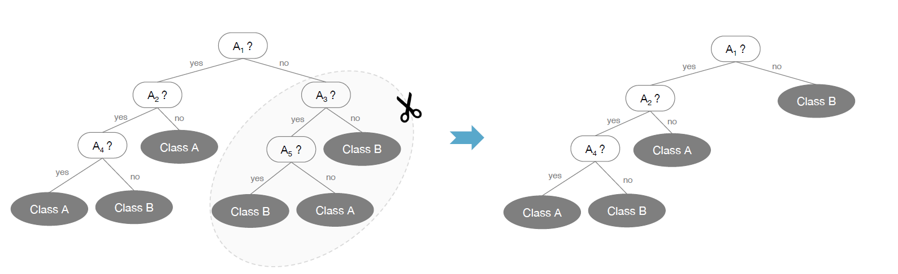

#  概论 
 
 决策树是最经典的数据挖掘算法之一，它以树形结构将决策的过程展现出来，简单直观、可解释性强。根于目标的不同，可以分为分类树和回归树。

通过一个经典的例子，简单说明决策树的流程。假设有一组样本:x1表示年龄，x2表示是否有工作，x3表示是否有房，x4表示信贷情况，y表示是否通过贷款申请。

```{r}
library(DT)
x1 = rep(c("青年","中年","老年"),each=5)
x2 = c("否","否","是","是","否","否","否","是","否","否","否","否","是","是","否")
x3 = c("否","否","否","是","否","否","否","是","是","是","是","是","否","否","否")
x4 = c("一般","好","好","一般","一般","一般","好","好","非常好","非常好","非常好","好", "好","非常好","一般")
y = c("否","否","是","是","否","否","否","是","是","是","是","是","是","是","否")
data_tree = data.frame(x1,x2,x3,x4,y)
datatable(data_tree)
```

```{r}
library(rattle)
library(rpart)
library(rpart.plot)
fit <- rpart(formula = y ~ x1 + x2 + x3 + x4,
              control = rpart.control( minsplit = 1,minbucket = 1,cp = 0),
              data = data_tree)
fancyRpartPlot(fit)
```

# ID3算法

## 信息论

+ 熵与信息熵

熵是描述事物无序性的参数，熵越大则无序性越强,既熵度量了事物的不确定性，越不确定的事物，它的熵就越大。信息熵公式定义：

设一次随机事件（用随机变量X表示），它可能会$x_1, x_2, x_3, \cdots ,x_m$有共m个不同的结果，每个结果出现的概率分别为$p_1, p_2, p_3, \cdots, p_m$
，那么X的不确定度，即信息熵为：
$$
H(X) =\sum_{i=1}^{m} p_i \cdot \log_{2} \frac{1}{p_i} = - \sum_{i=1}^{m} p_i \cdot \log_{2} p_i         
$$
在以上样本中，y的熵为$H(D) = -(\frac{9}{15}log_2\frac{9}{15} + \frac{6}{15}log_2\frac{6}{15}) = 0.971$

R实现：
```{r, message=FALSE, warning=FALSE}
info = function(atrcls){#atrcls 为向量
    l = length(atrcls)
    tatrcls = table(atrcls)
    atrclspvec = as.vector(tatrcls)/l
    logatrclspvec = ifelse(atrclspvec==0,0,log(atrclspvec,2))
    HD = -as.vector(atrclspvec%*%logatrclspvec)
    return(HD)
  }

info_y = info(data_tree$y)
cat('y的信息熵是',info_y)

```


+ 条件熵 

设$X,Y$为两个随机变量，在X发生的前提下，$Y$发生所新带来的熵,定义为$Y$的条件熵（Conditional Entropy),用$H(Y|X)$表示，计算公式如下：

$$

H(Y|X) = - \sum_{x_i,y_j}^{m,n} p(x_i,y_j) \cdot log_2 p(y_j|x_i) 

$$
其物理含义是当变量X已知时，变量Y的平均不确定性是多少。

假设变量X取值有m个，那么$H(Y|X=x_i)$是指变量$X$被固定为值$x_i$时的条件熵；$H(Y|X)$时指变量$X$被固定时的条件熵。那么二者之间的关系时：

$$

\begin{align} H(Y|X) & = p(x_1) \cdot H(Y|X=x_1) +  \cdots + p(x_m) \cdot H(Y|X=x_m) \\ & = \sum_{i=1}^{m} p(x_i) \cdot H(Y|X=x_i) \end{align}  
$$


$$
\begin{align} H(Y|X) & = \sum_{i=1}^{m} p(x_i) \cdot H(Y|X=x_i) \\ & = -\sum_{i=1}^{m} p(x_i) \cdot \left( \sum_{j=i}^{n} p(y_j|x_i) \cdot log_2 p(y_j|x_i) \right) \\ & = -\sum_{i=1}^{m} \sum_{j=1}^{n} p(y_j,x_i) \cdot log_2 p(y_j|x_i) \\ & = - \sum_{x_i,y_j}^{m,n} p(x_i,y_j) \cdot log_2 p(y_j|x_i) \end{align}    
$$

y在特征x1下的条件熵为$$ H(y|x1) = \frac{5}{15}H(D1) + \frac{5}{15}H(D2) + \frac{5}{15}H(D3) =  -\frac{5}{15}(\frac{3}{5}log_2\frac{3}{5} + \frac{2}{5}log_2\frac{2}{5}) - \frac{5}{15}(\frac{2}{5}log_2\frac{2}{5} + \frac{3}{5}log_2\frac{3}{5}) -\frac{5}{15}(\frac{4}{5}log_2\frac{4}{5} + \frac{1}{5}log_2\frac{1}{5}) = 0.888$$


```{r}
Hatr<-function(atrvec = NULL,clsvec = NULL){#输入为特征向量及类别向量
  n = length(atrvec)
  tatr = table(atrvec)
  atrpvec = as.vector(tatr)/n
  txy = table(atrvec,clsvec)
  ptxy = prop.table(txy,1)
  logptxy = ifelse(ptxy==0,0,log(ptxy,2))
  loctab = ptxy*logptxy             #对应位置元素相乘,table
  atr_clspvec = apply(loctab,1,sum) #vector
  hatr = -as.vector(atrpvec%*%atr_clspvec)
  return(hatr)
}

x1_condition_info = Hatr(data_tree$x1,data_tree$y)

cat('x1的条件信息熵为',x1_condition_info)
```


+ 互信息与信息增益 

互信息就是随机事件$Y$的不确定性（即熵$H(Y)$），以及在给定随机变量$X$条件下的不确定性（即条件熵$H(Y|X)$）之间的差异，即

$$
I(Y;X) = H(Y) - H(Y|X) 
$$
在决策树中，互信息也叫作信息增益。ID3算法就是用信息增益来判断当前节点应该用什么特征来构建决策树。信息增益大，则越适合用来分类。

对应的信息增益为 $H(y|x1) - H(y) = 0.083 $

```{r}
infoGain = info_y - x1_condition_info
cat('x1带来的信息增益为:',infoGain)
```

## 算法思路 

输入的是m个样本，样本输出集合为D，每个样本有n个离散特征，特征集合即为A，输出为决策树T。
算法的过程为：


1) 初始化信息增益的阈值$\epsilon$


2) 判断样本是否为同一类输出$D_i$，如果是则返回单节点树$T$。标记类别为$D_i$


3) 判断特征是否为空，如果是则返回单节点树$T$，标记类别为样本中输出类别$D$实例数最多的类别。
　　　
　　　
4) 计算A中的各个特征（一共n个）对输出$D$的信息增益，选择信息增益最大的特征$A_g$
　　
　　　
5) 如果$A_g$的信息增益小于阈值$\epsilon$，则返回单节点树$T$，标记类别为样本中输出类别$D$实例数最多的类别。


6) 否则，按特征$A_g$的不同取值$A_g$将对应的样本输出D分成不同的类别$D_i$。每个类别产生一个子节点。对应特征值为Ag。返回增加了节点的数T。


7)对于所有的子节点，令$D=D_i,  A= A-\{A_g\}$递归调用2-6步，得到子树$T_i$并返回。


## 算法不足 

ID3算法虽然提出了新思路，但是还是有很多值得改进的地方。　　


a)ID3没有考虑连续特征，比如长度，密度都是连续值，无法在ID3运用。这大大限制了ID3的用途。


b)ID3采用信息增益大的特征优先建立决策树的节点。很快就被人发现，在相同条件下，取值比较多的特征比取值少的特征信息增益大。比如一个变量有2个值，各为1/2，另一个变量为3个值，各为1/3，其实他们都是完全不确定的变量，但是取3个值的比取2个值的信息增益大。如果校正这个问题呢？


c) ID3算法对于缺失值的情况没有做考虑


d) 没有考虑过拟合的问题


ID3 算法的作者昆兰基于上述不足，对ID3算法做了改进，这就是C4.5算法，也许你会问，为什么不叫ID4，ID5之类的名字呢?那是因为决策树太火爆，他的ID3一出来，别人二次创新，很快 就占了ID4， ID5，所以他另辟蹊径，取名C4.0算法，后来的进化版为C4.5算法。下面我们就来聊下C4.5算法


# C4.5

上一节我们讲到ID3算法有四个主要的不足，C4.5算法是用于生成决策树的一种经典算法，是ID3算法的一种延伸和优化。C4.5算法对ID3算法主要做了一下几点改进： 

1 通过信息增益率选择分裂属性，克服了ID3算法中通过信息增益倾向于选择拥有多个属性值的属性作为分裂属性的不足； 
2 能够处理离散型和连续型的属性类型，即将连续型的属性进行离散化处理； 

3 能够处理具有缺失属性值的训练数据；

4 构造决策树之后进行剪枝操作； 


## 信息增益率

分裂属性选择的评判标准是决策树算法之间的根本区别。区别于ID3算法通过信息增益选择分裂属性，C4.5算法通过信息增益率选择分裂属性.

特征X对训练集D的信息增益率 $I_R(D,X)$定义为其信息增益$I(X,D)$与训练数据集D关于特征A的值的熵$H_X(D)$之比，即
$$I_R(D,X) = \frac{I(X,D)}{H_X(D)}$$
其中：
$H_X(D) = -\sum\limits_{i=1}^{n}\frac{|D_i|}{|D|}log_2\frac{|D_i|}{|D|}$,n为特征X的类别数。
特征数越多的特征对应的特征熵越大，它作为分母，可以校正信息增益容易偏向于取值较多的特征的问题。

在该样本中，x1对应的信息增益为 $H(y|x_{1}) - H(y) = 0.083 $,x1的信息熵为$H(x_1) = -(\frac{5}{15}log_2\frac{5}{15} + \frac{5}{15}log_2\frac{5}{15}+ \frac{5}{15}log_2\frac{5}{15}) = 1.584963$
,那么x1的信息增益率为$\frac{(H(y|x_{1}) - H(y))}{H(x_1)} = \frac{0.083}{1.584963} = 0.05236715$

```{r}
info_y = info(data_tree$y)
info_x1 = info(data_tree$x1)
x1_condition_info =  Hatr(data_tree$x1,data_tree$y)
infoGain = info_y - x1_condition_info
infoGain_rate = infoGain/info_x1

cat('y的信息熵:',info_y,'\n')
cat('x1的信息熵:',info_x1,'\n')
cat('y在x1条件下的信息熵:',x1_condition_info,'\n')
cat('y在x1条件下的信息增益:',infoGain,'\n')
cat('y在x1条件下的信息增益率:',infoGain_rate)
```

## 连续值处理

具体的思路如下，比如m个样本的连续特征A有m个，从小到大排列为${a_1,a_2,...,a_m}$,则CART算法取相邻两样本值的平均数，一共取得m-1个划分点，其中第i个划分点Ti表示Ti表示为：$T_i = \frac{a_i+a_{i+1}}{2}$。对于这m-1个点，分别计算以该点作为二元分类点时的信息增益。选择信息增益最小的点作为该连续特征的二元离散分类点。比如取到的基尼系数最小的点为$a_t$,则小于$a_t$的值为类别1，大于$a_t$的值为类别2，这样我们就做到了连续特征的离散化。要注意的是，与离散属性不同的是，如果当前节点为连续属性，则该属性后面还可以参与子节点的产生选择过程.


## 缺失值处理

##  剪枝

## 缺点与不足

1)由于决策树算法非常容易过拟合，因此对于生成的决策树必须要进行剪枝。剪枝的算法有非常多，C4.5的剪枝方法有优化的空间。思路主要是两种，一种是预剪枝，即在生成决策树的时候就决定是否剪枝。另一个是后剪枝，即先生成决策树，再通过交叉验证来剪枝。后面在下篇讲CART树的时候我们会专门讲决策树的减枝思路，主要采用的是后剪枝加上交叉验证选择最合适的决策树。


2)C4.5生成的是多叉树，即一个父节点可以有多个节点。很多时候，在计算机中二叉树模型会比多叉树运算效率高。如果采用二叉树，可以提高效率。


3)C4.5只能用于分类，如果能将决策树用于回归的话可以扩大它的使用范围。


4)C4.5由于使用了熵模型，里面有大量的耗时的对数运算,如果是连续值还有大量的排序运算。如果能够加以模型简化可以减少运算强度但又不牺牲太多准确性的话，那就更好了。

# CART

分类与回归树(classification and regression tree,CART)，是应用广泛的决策树算法，即可以用于分类也可以用于回归。

## 基尼指数 

我们知道，在ID3算法中我们使用了信息增益来选择特征，信息增益大的优先选择。在C4.5算法中，采用了信息增益比来选择特征，以减少信息增益容易选择特征值多的特征的问题。但是无论是ID3还是C4.5,都是基于信息论的熵模型的，这里面会涉及大量的对数运算。能不能简化模型同时也不至于完全丢失熵模型的优点呢？有，CART分类树算法使用基尼系数来代替信息增益比，基尼系数代表了模型的不纯度，基尼系数越小，则不纯度越低，特征越好。

具体的，在分类问题中，假设有K个类别，第k个类别的概率为pk, 则基尼系数的表达式为：

$$ 
Gini(p) = \sum\limits_{k=1}^{K}p_k(1-p_k) = 1- \sum\limits_{k=1}^{K}p_k^2
$$


对于个给定的样本D,假设有K个类别, 第k个类别的数量为$C_k$,则样本D的基尼系数表达式为：

$$
Gini(D) = 1-\sum\limits_{k=1}^{K}(\frac{|C_k|}{|D|})^2
$$
如果是二类分类问题，计算就更加简单了，如果属于第一个样本输出的概率是p，则基尼系数的表达式为：

$$Gini(p) = 2p(1-p)$$

特别的，对于样本D,如果根据特征A的某个值a,把D分成$D_1$和$D_2$两部分，则在特征A的条件下，D的基尼系数表达式为：

$$Gini(D,A) = \frac{|D_1|}{|D|}Gini(D_1) + \frac{|D_2|}{|D|}Gini(D_2)$$

基尼指数Gini(D)表示集合D的不确定性，基尼指数Gini(D,A)表示经过A=a分割之后集合D的不确定性。基尼指数越大，样本集合的不确定性就越大，这一点与熵相似。 

在例子中，求特征x1的基尼指数：

```{r}
GpSim<-function(p){#基尼系数
p2<-1-p
gp<-p%*%p2
return(gp)
}

GiniSingle<-function(atrvec=NULL,clsvec=NULL){ #输入的是特征向量与属性向量
  atrvec = data_tree$x1
  clsvec = data_tree$y
  D<-length(clsvec)
  txy<-table(atrvec,clsvec)
  nam<-rownames(txy)
  unqatr<-unique(atrvec)
  lunq<-length(unqatr)
  giniatr<-vector(length = lunq)
  for(i in 1:lunq){
    t1<-txy[i,];st1<-sum(t1)
    t2<-txy[-i,,drop=F];st2<-sum(t2)
    p1<-t1/st1;p2<-apply(t2,2,sum)/st2
    giniatr[i]<-(st1/D)*GpSim(p1)+(st2/D)*GpSim(p2)
}
  names(giniatr)<-nam
  return(giniatr)
}


Gini_x1 = GiniSingle(data_tree[,'x1'],data_tree$y)
Gini_x1
```

## 与C4.5的不同 

在处理连续值和离散值时，CART做了改进。对于CART分类树连续值的处理问题，其思想和C4.5是相同的，都是将连续的特征离散化。唯一的区别在于在选择划分点时的度量方式不同，C4.5使用的是信息增益比，则CART分类树使用的是基尼系数。

对于离散值的处理，CART是对特征值进行二分。在ID3和C4.5，如果某个特征A被选取建立决策树节点，如果它有A1,A2,A3三种类别，我们会在决策树上一下建立一个三叉的节点。这样导致决策树是多叉树。但是CART分类树使用的方法不同，他采用的是不停的二分，还是这个例子，CART分类树会考虑把A分成{A1}和{A2,A3}{A1}和{A2,A3}, {A2}和{A1,A3}{A2}和{A1,A3}, {A3}和{A1,A2}{A3}和{A1,A2}三种情况，找到基尼系数最小的组合，比如{A2}和{A1,A3}{A2}和{A1,A3},然后建立二叉树节点，一个节点是A2对应的样本，另一个节点是{A1,A3}对应的节点。同时，由于这次没有把特征A的取值完全分开，后面我们还有机会在子节点继续选择到特征A来划分A1和A3。这和ID3或者C4.5不同，在ID3或者C4.5的一棵子树中，离散特征只会参与一次节点的建立。


## 算法过程 

算法输入是训练集D，基尼系数的阈值，样本个数阈值。

输出是决策树T。

我们的算法从根节点开始，用训练集递归的建立CART树。

1) 对于当前节点的数据集为D，如果样本个数小于阈值或者没有特征，则返回决策子树，当前节点停止递归。

2) 计算样本集D的基尼系数，如果基尼系数小于阈值，则返回决策树子树，当前节点停止递归。

3) 计算当前节点现有的各个特征的各个特征值对数据集D的基尼系数，对于离散值和连续值的处理方法和基尼系数的计算见第二节。缺失值的处理方法和上篇的C4.5算法里描述的相同。

4) 在计算出来的各个特征的各个特征值对数据集D的基尼系数中，选择基尼系数最小的特征A和对应的特征值a。根据这个最优特征和最优特征值，把数据集划分成两部分$D_1$和$D_2$，同时建立当前节点的左右节点，左节点的数据集D为$D_1$，右节点的数据集D为$D_2$.

5) 对左右的子节点递归的调用1-4步，生成决策树。


## CART剪枝 
决策树通过递归产生决策树，直到叶节点充分的多，所以很容易对训练集过拟合，而导致泛化能力差。但是怎么解决这个问题呢，主要是通过剪枝来减少决策树的复杂度。具体的，剪枝就是从生成的决策树上减掉一些子树或者叶节点。




CART剪枝算法可以概括为两步，

第一步是从原始的决策树的底端剪去一些子树，使决策树变小，直到根节点，形成一个子树序列${T_0,T_1,...,T_n}$；

第二步通过交叉验证选择泛化预测能力最好的剪枝后的数作为最终的CART树。


1  **剪枝，形成一个子树序列 ：**

首先我们看看剪枝的损失函数度量，在剪枝的过程中，对于任意的一刻子树T,其损失函数为：

$$C_{\alpha}(T_t) = C(T_t) + \alpha |T_t| $$

其中，$\alpha$为正则化参数，这和线性回归的正则化一样。$C(T_t)$为训练数据的预测误差，分类树是用基尼系数度量，回归树是均方差度量。$T_t$是子树T的叶子节点的数量。


当$α=0$时，即没有正则化，原始的生成的CART树即为最优子树。当$\alpha = \infty$时，即正则化强度达到最大，此时由原始的生成的CART树的根节点组成的单节点树为最优子树。当然，这是两种极端情况。一般来说，$\alpha$越大，则剪枝剪的越厉害，生成的最优子树相比原生决策树就越偏小。对于固定的α，一定存在使损失函数$C_{\alpha}(T)$最小的唯一子树。


看过剪枝的损失函数度量后，我们再来看看剪枝的思路，对于位于节点t的任意一颗子树$T_t$，如果没有剪枝，它的损失是

$$C_{\alpha}(T_t) = C(T_t) + \alpha |T_t|$$ 

如果将其剪掉，仅仅保留根节点，则损失是:

$$C_{\alpha}(T) = C(T) + \alpha$$
当$\alpha = 0$或者$\alpha$很小时，$C_{\alpha}(T_t) < C_{\alpha}(T)$ , 当α增大到一定的程度时$C_{\alpha}(T_t) = C_{\alpha}(T)$

当$\alpha$继续增大时不等式反向，也就是说，如果满足下式：
$\alpha = \frac{C(T)-C(T_t)}{|T_t|-1}$

　$T_t$和T有相同的损失函数，但是T节点更少，因此可以对子树$T_t$进行剪枝，也就是将它的子节点全部剪掉，变为一个叶子节点T。

最后我们看看CART树的交叉验证策略。上面我们讲到，可以计算出每个子树是否剪枝的阈值$\alpha$，如果我们把所有的节点是否剪枝的值$\alpha$都计算出来，然后分别针对不同的$\alpha$所对应的剪枝后的最优子树做交叉验证。这样就可以选择一个最好的$\alpha$，有了这个$\alpha$，我们就可以用对应的最优子树作为最终结果。


2 ** 在剪枝得到的子树序列${T_0,T_1,...,T_n}$中通过交叉验证，选择最优子树：**

具体地，利用独立的验证数据集，测试子树序列${T_0,T_1,...,T_n}$中各树的平均误差或基尼指数。平方误差或者基尼指数最小的决策树被认为是最优的决策树。在子树序列中，每颗子树${T_0,T_1,...,T_n}$都对应一个参数$\alpha_1,\alpha_2,...,\alpha_n$。所以当最优子树$T_k$确定时，对应的$\alpha_k$也确定了，即得到最优的决策树$T_\alpha$.

CART剪枝算法流程：

输入：CART决策树$T_{0}$ 

输出：最优决策树$T_{\alpha}$

1. 设$k=0, T=T_{0}$

2. 设$\alpha=+\infty$

3. 自下而上地对各内部结点$t$计算$ C\left(T_{t}\right),\left| T_{t} \right|$，以及
$$ \begin{align*} \\ & g\left(t\right) =  \dfrac{C\left( t \right) - C \left(T_{t}\right)} { \left| T_{t} \right| -1 }
\\ & \alpha = \min \left( \alpha, g\left( t \right) \right) \end{align*}$$

其中，$T_{t}$表示以$t$为根结点的子树，$C(T_{t})$是对训练数据的预测误差，$|T_{t}|$是$T_{t}$的叶结点个数。

4. 自下而上地访问内部结点$t$，如果有$g\left(t\right)=\alpha$，则进行剪枝，并对叶结点$t$以多数表决法决定其类别，得到树$T$

5. 设$k=k+1, \alpha_{k}=\alpha, T_{k}=T$

6. 如果$T$不是由根结点单独构成的树，则回到步骤4.

7. 采用交叉验证法在子树序列$T_{0},T_{1},\cdots,T_{n}$中选取最优子树$T_{\alpha}$


#  决策树与R语言实战  


之前对决策树做了详细理论说明，现在从实践的角度来介绍决策树算法，主要结合R语言中的rpart包进行说明。

## 核心函数介绍

rpart函数 

rpart()的基本格式为：

rpart(formula, data, weights, subset, na.action = na.rpart, method,
      model = FALSE, x = FALSE, y = TRUE, parms, control, cost, ...)

其中,

+ formula中放置想要建立的公式，格式为$y~x1+x2+x3$或者$y~.$

+ method参数用于选择决策树的类型，包括anova,class,exp和possion 4种类型，anova表示回归树，class表示分类树。

+ control主要按照rpart.control,即
rpart.control(minsplit = 20, minbucket = round(minsplit/3), cp = 0.01, 
               xval = 10, maxdepth = 30, ...)

   + minsplit表示每个节点所含样本数的最小值，默认为20
   + minbucket表示每个叶节点所含样本的最小值，默认为1/的3minsplit取值
   + cp表示模型的复杂度参数(complexity)，默认cp=0.01
   + maxdepth表示树的最大深度
   + maxcompete表示决策树输出最重要的前几个变量
   + 参数xvl指定交叉验证的交叉折数
```{r}
library(rpart)
library(rpart.plot)
data(kyphosis)
```


## 准备数据集
数据集来源于UCI机器数据学习数据仓库（Machine Learning Data Repository）(https://archive.ics.uci.edu/ml/datasets.html)中Bank Marketing数据，该数据集来自与某银行机构的一个电话营销项目，其中包含16个自变量和一个因变量。

```{r}
bank = read.csv('./data/bank/bank.csv',header = T,sep = ';')
head(bank)
summary(bank)
```
其中变量信息解释如下：

+ 1 - age (numeric)
+   2 - job : type of job (categorical: "admin.","unknown","unemployed","management","housemaid","entrepreneur","student",
                                       "blue-collar","self-employed","retired","technician","services") 
+   3 - marital : marital status (categorical: "married","divorced","single"; note: "divorced" means divorced or widowed)
+   4 - education (categorical: "unknown","secondary","primary","tertiary")
+   5 - default: has credit in default? (binary: "yes","no")
+   6 - balance: average yearly balance, in euros (numeric) 
+   7 - housing: has housing loan? (binary: "yes","no")
+   8 - loan: has personal loan? (binary: "yes","no")
   # related with the last contact of the current campaign:
+   9 - contact: contact communication type (categorical: "unknown","telephone","cellular") 
+  10 - day: last contact day of the month (numeric)
+  11 - month: last contact month of year (categorical: "jan", "feb", "mar", ..., "nov", "dec")
+  12 - duration: last contact duration, in seconds (numeric)
   # other attributes:
+  13 - campaign: number of contacts performed during this campaign and for this client (numeric, includes last contact)
+  14 - pdays: number of days that passed by after the client was last contacted from a previous campaign (numeric, -1 means client was not previously contacted)
+  15 - previous: number of contacts performed before this campaign and for this client (numeric)
+  16 - poutcome: outcome of the previous marketing campaign (categorical: "unknown","other","failure","success")

+  17 - y - has the client subscribed a term deposit? (binary: "yes","no")

## 建模 
划分训练集合测试集，使用70%的数据用作训练，30%的数据用来测试

```{r, message=FALSE, warning=FALSE}
N = nrow(bank)
id = sample(1:N,0.3*N)
data_trian = bank[-id,]         # 训练集
data_test = bank[id,]           # 测试集
dim(data_trian);dim(data_test)  # 训练集和测试集的维度
```

```{r, message=FALSE, warning=FALSE}
##示例一：指定参数建树
Ctl<-rpart.control(minsplit = 10,maxcompete = 4,xval = 10,maxdepth = 6,cp = 0)
set.seed(12345)#设定随机种子使交叉后验证的结果可重现
TreeFit1<-rpart(y~.,data = data_trian,
               method="class",parms = list(split="gini"),control = Ctl)
print(TreeFit1)
printcp(TreeFit1)#显示复杂度参数CP列表
plotcp(TreeFit1)#可视化cp

```

## 决策树剪枝 
```{r}
opt = which.min(TreeFit1$cptable[,'xerror'] - TreeFit1$cptable[,'xstd'])
cp = TreeFit1$cptable[opt,'CP']
TreeFit_prue <- prune(TreeFit1,cp = cp)
print(TreeFit_prue)
# summary(TreeFit_prue)
```

## 模型效果评估

```{r}
pre_bank = predict(TreeFit_prue,newdata = data_test,type = 'class')
library(gmodels)
CrossTable(data_test$y,pre_bank,prop.chisq = F,prop.r = F,prop.c = F)
```

## 决策树可视化

```{r}

#rpart.plot(TreeFit_prue,cex = 0.4)#type用于指出决策树的展示方式；branch用于指定外形的方式，0表示以斜线形式连接树的上下节点，1表示以垂直形式连接；参数extra用于指定节点中显示的哪些数据，1表示预测类别和节点样本量，2表示显示预测类别和置信度，3表示显示预测类别和节点误判率
```

```{r}

fancyRpartPlot(TreeFit_prue)
```

## 抽取规则 


# 参考文献

1 [http://www.cnblogs.com/pinard/p/6050306.html] (决策树原理)

2 [https://en.wikipedia.org/wiki/Conditional_entropy] (条件熵)
