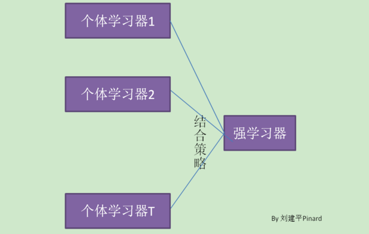
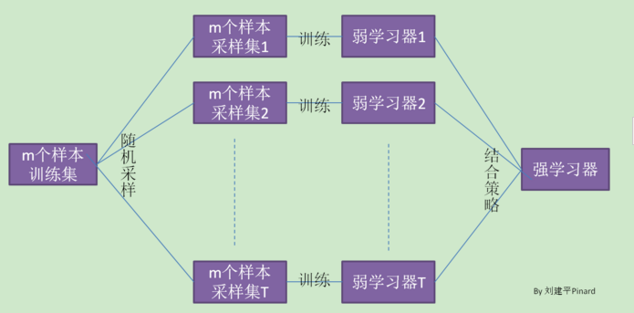
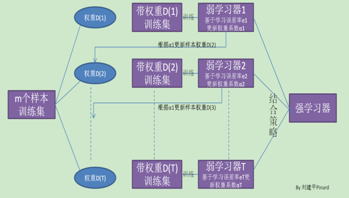

# 集成学习概述

集成学习是非常流行的机器学习方法。它本身不是一个单独的机器学习方法，而是通过构建多个机器学习器来完成以及机器学习任务。

集成学习主要有两个流派，一个是bagging流派，代表方法有random forest。另一个是一个是boosting派系，代表方法有adaboost，gbdt等。


#  random forest

## 随机森林概述

随机森林是通过自助法(boot-strap)重采样技术，从原始训练样本集N中有放回的重复随机抽样K个样本生成新的训练集，然后训练K个决策树组成随机森林。对于分类问题，通常使用简单投票法，得到最多票数的类别或者类别之一为最终的模型输出。对于回归问题，通常使用简单平均法，对K个回归树得到的回归结果进行算术平均得到最终的模型输出。



普通的决策树，我们会在节点上所有的n个样本特征中选择一个最优的特征来做决策树的左右子树划分，但是随机森林通过随机选择节点上的一部分样本特征，这个数字小于n，假设为m，然后在这些随机选择的m个样本特征中，选择一个最优的特征来做决策树的左右子树划分。这样进一步增强了模型的泛化能力。

## 随机森林算法流程

输入为样本集$D=\{(x_1,y_1),(x_2,y_2), ...(x_m,y_m)\}$,弱分类器迭代次数T

输出为最终的强分类器f(x)

　1）对于t=1,2...,T:

　　a)对训练集进行第t次随机采样，共采集m次，得到包含m个样本的采样集Dt
　　
　　　
　　b)用采样集Dt训练第t个决策树模型Gt(x)，在训练决策树模型的节点的时候， 在节点上所有的样本特征中选择一部分样本特征， 在这些随机选择的部分样本特征中选择一个最优的特征来做决策树的左右子树划分

　2) 如果是分类算法预测，则T个弱学习器投出最多票数的类别或者类别之一为最终类别。如果是回归算法，T个弱学习器得到的回归结果进行算术平均得到的值为最终的模型输出


## 随机森林优缺点

　　　　**RF的主要优点有：**

　　　　1） 训练可以高度并行化，对于大数据时代的大样本训练速度有优势。个人觉得这是的最主要的优点。

　　　　2） 由于可以随机选择决策树节点划分特征，这样在样本特征维度很高的时候，仍然能高效的训练模型。

　　　　3） 在训练后，可以给出各个特征对于输出的重要性

　　　　4） 由于采用了随机采样，训练出的模型的方差小，泛化能力强。

　　　　5） 相对于Boosting系列的Adaboost和GBDT， RF实现比较简单。

　　　　6） 对部分特征缺失不敏感。

　　　**　RF的主要缺点有：**

　　　　1）在某些噪音比较大的样本集上，RF模型容易陷入过拟合。

　　　　2) 取值划分比较多的特征容易对RF的决策产生更大的影响，从而影响拟合的模型的效果。

## 随机森林与R语言实战

之前对随机森林做了理论说明，现在从实践的角度来介绍随机森林算法，主要结合R语言中的randomForest包进行说明。

下载和安装的具体命令如下：
```{r, eval=FALSE, include=FALSE}
install.packages('randomForest')
library(randomForest)
```

### 核心函数介绍

主函数为randomForest,具体参数如下

```
randomForest(x, y=NULL,  xtest=NULL, ytest=NULL, ntree=500,
             mtry=if (!is.null(y) && !is.factor(y))
             max(floor(ncol(x)/3), 1) else floor(sqrt(ncol(x))),
             replace=TRUE, classwt=NULL, cutoff, strata,
             sampsize = if (replace) nrow(x) else ceiling(.632*nrow(x)),
             nodesize = if (!is.null(y) && !is.factor(y)) 5 else 1,
             maxnodes = NULL,
             importance=FALSE, localImp=FALSE, nPerm=1,
             proximity, oob.prox=proximity,
             norm.votes=TRUE, do.trace=FALSE,
             keep.forest=!is.null(y) && is.null(xtest), corr.bias=FALSE,
             keep.inbag=FALSE, ...)
```

+ ntree指随机森林中树的个数
+ mtry指决策树每次分支时所选择变量的个数
+ nodesize指随机森林中决策树的最小节点数
+ maxnodes指随机森林中决策树的最大节点数

### 数据集准备
仍然使用上一节中的Bank Marketing数据
```{r}
bank = read.csv('./data/bank/bank.csv',header = T,sep = ';')
head(bank)
summary(bank)
```

###  建模 

划分训练集合测试集，使用70%的数据用作训练，30%的数据用来测试

```{r, message=FALSE, warning=FALSE}
set.seed(123)
N = nrow(bank)
id = sample(1:N,0.3*N)
data_train = bank[-id,]         # 训练集
data_test = bank[id,]           # 测试集
dim(data_trian);dim(data_test)  # 训练集和测试集的维度
```

```{r}
library(randomForest)
bank_rf = randomForest(y~.,data = data_train,ntree = 500,mtry = 8,importance =T)

```

1 结果分析

```{r}
print(bank_rf)
```

+ call展示了模型结构的相关参数设定 
+ Type of random forest 说明了是一个分类模型
+ Number of trees展示了随机森中包含500课决策树
+ No. of variables tried at each split：3，说明了每颗决策树在节点分裂时的候选变量为8个
+  OOB estimate of  error rate:10.02%，说明了基于样本外的测试集误率为10.02%
+ Confusion matrix是混淆矩阵。可以看出


```{r}
#treesize(bank_rf)
hist(treesize(bank_rf,terminal = T))
```

treesize函数输出随机森林中每个数的节点数目，可以看出每个树的节点数据不尽相同。主要集中在170~230之间。


2 特征重要度

importance函数用来提取随机森模型中各个变量重要性的度量结果，主要采用两种变种来度量特征的重要性。

```{r}
importance(bank_rf)
varImpPlot(x = bank_rf, sort=TRUE, n.var = nrow(bank_rf$importance),main="输入变量重要性测度散点图") 
```

## 模型优化

主要结合caret包进行调参。

```{r, message=FALSE, warning=FALSE}
library(caret)
```

默认语法格式如下：

```
train(formula, df, method = "rf", metric= "Accuracy", trControl = trainControl(), tuneGrid = NULL)
argument
- `formula`: Define the formula of the algorithm
- `method`: Define which model to train. Note, at the end of the tutorial, there is a list of all the models that can be trained
- `metric` = "Accuracy": Define how to select the optimal model
- `trControl = trainControl()`: Define the control parameters
- `tuneGrid = NULL`: Return a data frame with all the possible combination

```


```{r}
# Define the control
trControl <- trainControl(method = "cv",
    number = 5,
    search = "grid")
```

```
trainControl(method = "cv", number = n, search ="grid")
arguments
- method = "cv": The method used to resample the dataset. 
- number = n: Number of folders to create
- search = "grid": Use the search grid method. For randomized method, use "grid"

```

```{r}
set.seed(123)
# Run the model
rf_default <- train(y~.,
    data = data_train,
    method = "rf",
    metric = "Accuracy",
    trControl = trControl)
# Print the results
print(rf_default)

```
1)  Search best mtry 

```{r}
set.seed(1234)
tuneGrid <- expand.grid(.mtry = seq(from = 10, to = 30,by = 2))
rf_mtry <- train(y~.,
    data = data_train,
    method = "rf",
    metric = "Accuracy",
    tuneGrid = tuneGrid,
    trControl = trControl,
    importance = TRUE,
    nodesize = 10,
    ntree = 300)
print(rf_mtry)

best_mtry <- rf_mtry$bestTune$mtry 
best_mtry
```
2) Search the best ntrees

```{r}
store_maxtrees <- list()
tuneGrid <- expand.grid(.mtry = best_mtry)
for (ntree in c(50,100,250,300, 350, 400, 450, 500, 550, 600)) {
    set.seed(123)
    rf_maxtrees <- train(y~.,
        data = data_train,
        method = "rf",
        metric = "Accuracy",
        tuneGrid = tuneGrid,
        trControl = trControl,
        importance = TRUE,
        nodesize = 10,
        ntree = ntree)
    key <- toString(ntree)
    store_maxtrees[[key]] <- rf_maxtrees
}
results_tree <- resamples(store_maxtrees)
summary(results_tree)
```

The highest accuracy score is obtained with a value of ntree equals to 400


```{r}
store_maxnode <- list()
tuneGrid <- expand.grid(.mtry = best_mtry)
for (maxnodes in c(10,20,30,40,50,60,70,80)) {
    set.seed(1234)
    rf_maxnode <- train(survived~.,
        data = data_train,
        method = "rf",
        metric = "Accuracy",
        tuneGrid = tuneGrid,
        trControl = trControl,
        importance = TRUE,
        nodesize = 14,
        maxnodes = maxnodes,
        ntree = 400)
    key <- toString(maxnodes)
    store_maxnode[[key]] <- rf_maxnode
}
results_node <- resamples(store_maxnode)
summary(results_node)
```
5) Evaluate the model 


```{r}
fit_rf <- train(y~.,
    data_train,
    method = "rf",
    metric = "Accuracy",
    tuneGrid = tuneGrid,
    trControl = trControl,
    importance = TRUE,
    nodesize = 14,
    ntree = 400,
    maxnodes = 24)
```
```{r}
prediction <-predict(fit_rf, data_test)
```

```{r}
confusionMatrix(prediction, data_test$survived)
```

```{r}
varImpPlot(fit_rf)
```

# AdaBoost

提升（boosting）方法是一种常用的统计学习方法，其中AdaBoost(Adaptive Boosting)是一种典型的Boosting方法。



从图中可以看出，Boosting算法的工作机制是首先从训练集用初始权重训练出一个弱学习器1，根据弱学习的学习误差率表现来更新训练样本的权重，使得之前弱学习器1学习误差率高的训练样本点的权重变高，使得这些误差率高的点在后面的弱学习器2中得到更多的重视。然后基于调整权重后的训练集来训练弱学习器2.，如此重复进行，直到弱学习器数达到事先指定的数目T，最终将这T个弱学习器通过集合策略进行整合，得到最终的强学习器。　

不过有几个具体的问题Boosting算法没有详细说明。

　　　　1）如何计算学习误差率e?

　　　　2) 如何得到弱学习器权重系数$\alpha$?

　　　　3）如何更新样本权重D?

　　　　4) 使用何种结合策略？

只要是boosting大家族的算法，都要解决这4个问题。那么Adaboost是怎么解决的呢？

AdaBoost算法：  
输入：训练数据集$T = \left\{ \left( x_{1}, y_{1} \right), \left( x_{2}, y_{2} \right), \cdots, \left( x_{N}, y_{N} \right) \right\}$，其中$x_{i} \in \mathcal{X} \subseteq R^{n}, y_{i} \in \mathcal{Y} = \left\{ +1, -1 \right\}, i = 1, 2, \cdots, N$；弱学习算法  
输出：分类器$G\left(x\right)$  
1. 初始化训练数据的权值分布
$$\begin{align*}  \\ & D_{1}=\left(w_{11},w_{12},\cdots,w_{1N}\right), \quad w_{1i} = \dfrac{1}{N}, \quad i=1,2,\cdots,N\end{align*}  $$   
2. 对$m=1,2,\cdots,M$  
2.1 使用具有权值分布$D_{m}$的训练数据集学习，得到基本分类器
$$\begin{align*}  \\ & G_{m}\left(x\right): \mathcal{X} \to \left\{ -1, +1\right\} \end{align*}   $$
2.2 计算$G_{m}\left(x\right)$在训练数据集上的分类误差率  
$$\begin{align*} \\& e_{m} = P\left(G_{m}\left(x_{i}\right) \neq y_{i}\right)
\\ & = \sum_{i=1}^{N} w_{mi} I \left(G_{m}\left(x_{i}\right) \neq y_{i} \right) \end{align*}   $$
2.3 计算$G_{m} \left(x\right)$的系数 
$$\begin{align*}  \\ & \alpha_{m} = \dfrac{1}{2} \log \dfrac{1-e_{m}}{e_{m}} \end{align*}$$
2.4 更新训练数据集的权值分布
$$\begin{align*}  \\ &  D_{m+1}=\left(w_{m+1,1},\cdots,w_{m+1,i},\cdots,w_{m+1,N}\right)
\\ & w_{m+1,i} = \dfrac{w_{mi}}{Z_{m}} \exp \left(- \alpha_{m} y_{i} G_{m}\left(x_{i}\right)\right), 
\\ & \quad \quad = \left\{
\begin{aligned} 
\ &  \dfrac{w_{mi}}{Z_{m}} \exp \left(- \alpha_{m} \right), G_{m}\left(x_{i}\right) = y_{i}
\\ & \dfrac{w_{mi}}{Z_{m}} \exp \left( \alpha_{m} \right), G_{m}\left(x_{i}\right) \neq y_{i}
\end{aligned}
\right. \quad i=1,2,\cdots,N \end{align*}$$
其中，$Z_{m}$是规范化因子
$$\begin{align*}  \\ & Z_{m}＝ \sum_{i=1}^{N} w_{mi} \exp \left(- \alpha_{m} y_{i}, G_{m}\left(x_{i}\right)\right)\end{align*}    $$
3. 构建基本分类器的线性组合
$$\begin{align*}  \\ & f \left( x \right) = \sum_{m=1}^{M} \alpha_{m} G_{m} \left( x \right) \end{align*}   $$
得到最终分类器
$$\begin{align*}  \\ & G\left(x\right) = sign\left(f\left(x\right)\right)=sign\left(\sum_{m=1}^{M} \alpha_{m} G_{m} \left( x \right)\right) \end{align*}   　　　　$$

## 前向分步加法模型与Adaboost

AdaBoost算法还有另一个解释，即可以认为AdaBoost算法是模型为加法模型、损失函数为指数函数、学习算法为前向分步算法时的学习方法。

证明：前向分步算法学习的是加法模型，当基函数为基本分类器时，该加法模型等价于AdaBoost的最终分类器。

$$f(x) = \sum_{k=1}^{K} \alpha_k G_k(x) $$
由基本分类器$G_k(x)$及其系数$\alpha_k$组成，$k=1,2,\cdots,K$。前向分步算法逐一学习基函数，这一过程与AdaBoost算法逐一学习基本分类器的过程一致。

证明过程如下：
已知指数损失函数 $L(y, f(x)) = \exp [-y f(x)]$

(1) 假设经过k−1k−1轮迭代，前向分步算法已经得到$f_{k-1}(x)$:

$$\begin{align} f_{k-1} (x) &= f_{k-2}(x) + \alpha_{k-1} G_{k-1}(x) \\ &= \alpha_1 G_1(x) + \cdots + \alpha_{m-1} G_{m-1}(x) \end{align}  $$

(2) 在第k轮迭代得到$\alpha_k, G_k(x)$和$f_{k}(x)$:
$$f_{k} (x) = f_{k-1}(x) + \alpha_{k} G_{k}(x)$$

(3)目标是使前向分步算法得到的αkαk和Gk(x)Gk(x)使fk(x)fk(x)在训练数据集DD上的指数损失最小，即

$$(\alpha_k, G_k(x)) = \arg \min_{\alpha, G} \underbrace{ \sum_{i=1}^{M} \exp [-y^{(i)} (f_{k-1}(x) + \alpha G(x^{(i)}))] }_{指数损失表达式} $$


等价于

$$(\alpha_k, G_k(x)) = \arg \min_{\alpha, G} \sum_{i=1}^{M} \overline{w}_{k,i}  \cdot \exp [-y^{(i)} \alpha G(x^{(i)})] \quad(n.ml.1.6.15)$$
其中，$\overline{w}_{k,i} = \exp [-y^{(i)} f_{k-1} (x^{(i)})]$表示第i样本在之前模型上的指数损失,因为$\overline{w}_{k,i}$既不依赖α也不依赖G，所以与最小化无关。但$\overline{w}_{k,i}$依赖于$f_{k-1}(x)$，随着每一轮迭代而发生变化。

(4) 求解 $\alpha_k^{\ast}$和$G_k^{\ast}$使上式最小。

第一步：求$G_k^{\ast}$. 对于任意α>0,使公式最小的G(x)由下式得到：

$$G_k^{\ast}(x) = \arg \min_{G} \sum_{i=1}^{M} \overline{w}_{k,i} \cdot I(y^{(i)} \not= G(x^{(i)})) \qquad(n.ml.1.6.16)$$

此分类器$G_k^{\ast}$即为AdaBoost算法的基本分类器Gk(x)，因为它是使第kk轮加权训练数据分类误差率最小的基本分类器。


第二步：求$\alpha_k^{\ast}$

$$\begin{align} \sum_{i=1}^{M} \overline{w}_{k,i}  \cdot \exp [-y^{(i)} \alpha G(x^{(i)})] &= \sum_{y^{(i)} = G_k(x^{(i)})} \overline{w}_{k,i} \cdot e^{-\alpha} + \sum_{y^{(i)} \neq G_k(x^{(i)})} \overline{w}_{k,i} \cdot e^{\alpha} \\\ &= (e^{\alpha} - e^{-\alpha}) \sum_{i=1}^{M} \overline{w}_{k,i} I(y^{(i)} \neq G(x^{(i)})) + e^{-\alpha} \sum_{i=1}^{M} \overline{w}_{k,i} \end{align} $$
把已得到的$G_k^{\ast}$带入公式，并对α求导（导数为0），即得到使公式最小的α

$$\alpha_{k}^{\ast} = \frac{1}{2} \log \frac{1-e_k}{e_k}$$
其中，$e_k$为分类误差率,$e_k = \frac{ \sum_{i=1}^{M} \overline{w}_{k,i} I(y^{(i)} \neq G_k(x^{(i)})) } {\sum_{i=1}^{M} \overline{w}_{k,i} } = \sum_{i=1}^{M} w_{k,i} I(y^{(i)} \neq G_k(x^{(i)}))$

最后看一下每一轮样本权值的更新,$f_k(x) = f_{k-1}(x) + \alpha_k G_k(x)$以及

$\overline{w}_{k,i} = \exp[-y^{(i)} f_{k-1}(x^{(i)})]$
可得：
$$\overline{w}_{k+1,i} = \overline{w}_{k,i} \exp[-y^{(i)} \alpha_k G_k(x)]$$

这与Adaboost算法的第2.4步的样本权值的更新，可看出二者是等价的（只相差规范化因子）。


# GBDT

梯度提升树(Gradient Boosting Decison Tree, GBDT)是Boosting家族中最重要的一员，其也有很多简称，有GBT（Gradient Boosting Tree）, GBM（Gradient Boosting Machine）， GBRT（Gradient Boosting Regression Tree）, MART(Multiple Additive Regression Tree)，其实都是指的同一种算法，本文统一简称GBDT。

## GBDT概述 

GBDT也是集成学习Boosting家族的成员，但是却和传统的Adaboost有很大的不同。回顾下Adaboost，我们是利用前一轮迭代弱学习器的误差率来更新训练集的权重，这样一轮轮的迭代下去。GBDT也是迭代，使用了前向分布算法，但是弱学习器限定了只能使用CART回归树模型，同时迭代思路和Adaboost也有所不同。

在GBDT的迭代中，假设我们前一轮迭代得到的强学习器是$f_{t-1}(x)$, 损失函数是$L(y, f_{t-1}(x))$, 我们本轮迭代的目标是找到一个CART回归树模型的弱学习器$h_t(x)$，让本轮的损失$L(y, f_{t}(x) =L(y, f_{t-1}(x)+ h_t(x))$最小。也就是说，本轮迭代找到决策树，要让样本的损失尽量变得更小。算法的关键是利用梯度下降的近似方法，把损失函数的负梯度在当前模型的值作为提升树算法中残差的近似值。

$$-\left[ \frac{\partial L(y^{(i)}, f(x^{(i)}))} {\partial f(x^{(i)})} \right]_{f(x) = f_{k-1}(x)} \approx r_{m,i}$$

## GBDT算法流程

### 回归树 

输入：训练数据集$T = \left\{ \left( x_{1}, y_{1} \right), \left( x_{2}, y_{2} \right), \cdots, \left( x_{N}, y_{N} \right) \right\},x_{i} \in \mathcal{X} \subseteq R^{n}, y_{i} \in \mathcal{Y} \subseteq R, i = 1, 2, \cdots, N$，损失函数$L\left(y,f\left(x\right)\right)$  

输出：回归树$\hat f\left(x\right)$  

过程：

1. 初始化模型
$$\begin{align*}  \\ & f_{0}\left(x\right) = \arg \min_{c} \sum_{i=1}^{N} L \left(y_{i},c\right) \end{align*}    $$   
2. 循环训练M个模型，对$m=1,2,\cdots,M$ 

2.1 计算残差：对每一个样本$i=1,2,\cdots,N$计算

$$\begin{align*}  \\ & r_{mi}=- \left[ \dfrac {\partial L \left(y_{i},f\left(x_{i}\right) \right)}{\partial f \left(x_{i} \right)}\right]_{f\left(x\right)=f_{m-1}\left(x\right)} \end{align*}  
$$

2.2 拟合残差$r_{mi}$学习一个回归树，得到第$m$棵树的叶结点区域$R_{mj},j=1,2,\cdots,J$，$J$表示叶节点的个数。 

2.3 对$j=1,2,\cdots,J$计算
$$\begin{align*}  \\ &  c_{mj}=\arg \min_{c} \sum_{x_{i} \in R_{mj}} L \left( y_{i},f_{m-1} \left(x_{i}\right)+c \right) \end{align*} $$


2.4 更新$f_{m}\left(x\right)= f_{m-1}\left(x\right) + \sum_{j=1}^{J} c_{mj} I \left(x \in R_{mj} \right)$


3. 得到回归树
$$\begin{align*}  \\ &  \hat f \left( x \right) = f_{M} \left( x \right) = \sum_{m=1}^{M} \sum_{j=1}^{J} c_{mj} I \left( x \in R_{mj} \right) \end{align*}    
$$

### GBDT二分类

GBDT的分类算法从思想上和GBDT的回归算法没有区别，但是由于样本输出不是连续的值，而是离散的类别，导致我们无法直接从输出类别去拟合类别输出的误差。

为了解决这个问题，主要有两个方法，一个是用指数损失函数，此时GBDT退化为Adaboost算法。另一种方法是用类似于逻辑回归的对数似然损失函数的方法。也就是说，我们用的是类别的预测概率值和真实概率值的差来拟合损失。


对于二元GBDT，如果用类似于逻辑回归的对数似然损失函数，则损失函数为：

$$L(y, f(x)) = log(1+ exp(-yf(x)))$$

其中$y \in\{-1, +1\}$,则此时的负梯度误差为

$$r_{ti} = -\bigg[\frac{\partial L(y, f(x_i)))}{\partial f(x_i)}\bigg]_{f(x) = f_{t-1}\;\; (x)} = y_i/(1+exp(y_if(x_i)))$$

对于生成的决策树，我们各个叶子节点的最佳残差拟合值为

$$c_{tj} = \underbrace{arg\; min}_{c}\sum\limits_{x_i \in R_{tj}} log(1+exp(-y_i(f_{t-1}(x_i) +c)))$$

由于上式比较难优化，我们一般使用近似值代替

$$c_{tj} = \sum\limits_{x_i \in R_{tj}}r_{ti}\bigg /  \sum\limits_{x_i \in R_{tj}}|r_{ti}|(2-|r_{ti}|)$$

除了负梯度计算和叶子节点的最佳残差拟合的线性搜索，二元GBDT分类和GBDT回归算法过程相同。

### GBDT多分类 


多元GBDT要比二元GBDT复杂一些，对应的是多元逻辑回归和二元逻辑回归的复杂度差别。假设类别数为K，则此时我们的对数似然损失函数为：

$$ L(y, f(x)) = -  \sum\limits_{k=1}^{K}y_klog\;p_k(x)$$

其中如果样本输出类别为k，则yk=1。第k类的概率$p_k(x)$的表达式为：

$$ p_k(x) = exp(f_k(x)) \bigg / \sum\limits_{l=1}^{K} exp(f_l(x))$$
集合上两式，我们可以计算出第t轮的第i个样本对应类别l的负梯度误差为

$$ r_{til} = -\bigg[\frac{\partial L(y_i, f(x_i)))}{\partial f(x_i)}\bigg]_{f_k(x) = f_{l, t-1}\;\; (x)} = y_{il} - p_{l, t-1}(x_i)
$$

观察上式可以看出，其实这里的误差就是样本i对应类别l的真实概率和t−1轮预测概率的差值。

对于生成的决策树，我们各个叶子节点的最佳残差拟合值为

$$
c_{tjl} = \underbrace{arg\; min}_{c_{jl}}\sum\limits_{i=0}^{m}\sum\limits_{k=1}^{K} L(y_k, f_{t-1, l}(x) + \sum\limits_{j=0}^{J}c_{jl} I(x_i \in R_{tj}))
$$
由于上式比较难优化，我们一般使用近似值代替

$$
c_{tjl} =  \frac{K-1}{K} \; \frac{\sum\limits_{x_i \in R_{tjl}}r_{til}}{\sum\limits_{x_i \in R_{til}}|r_{til}|(1-|r_{til}|)}
$$

除了负梯度计算和叶子节点的最佳残差拟合的线性搜索，多元GBDT分类和二元GBDT分类以及GBDT回归算法过程相同。

## boosting 损失函数


名称|损失函数|导数|目标函数|算法
|---|---|---|---|---
平方损失|$\frac{1}{2} (y^{(i)} - f(x^{(i)}))^2$|$y^{(i)} - f(x^{(i)})$|$E[y \vert x^{(i)}]$|L2Boosting|
绝对损失|$\vert y^{(i)} - f(x^{(i)}) \vert$|$sign(y^{(i)} - f(x^{(i)})$|$median(y \vert x^{(i)})$|Gradient Boosting|
指数损失|$\exp(- \tilde {y^{(i)}} f(x^{(i)}))$|$- \tilde {y^{(i)}} exp(-\tilde {y^{(i)}} f(x^{(i)}))$|$\frac{1}{2} \log \frac{\pi_i}{1 - \pi_i}$|AdaBoost|
对数损失|$\log (1+e^{- \tilde{y^{(i)}} f_i})$|$y^{(i)} - \pi_i$|$\frac{1}{2} \log \frac{\pi_i}{1 - \pi_i}$|LogitBoost|

### GBDT与R语言实战 

```{r, message=FALSE, warning=FALSE}
library(adabag)
library(gbm)


```
method = 'gbm'
Type: Regression, Classification
Tuning parameters:
n.trees (# Boosting Iterations)
interaction.depth (Max Tree Depth)
shrinkage (Shrinkage)
n.minobsinnode (Min. Terminal Node Size)
Required packages: gbm, plyr

```{r}

fitControl <- trainControl(method = "cv",
    number = 5,
    search = "grid")

gbmGrid <-  expand.grid(interaction.depth = c(3, 6, 9), 
                        n.trees = (5:20)*50, 
                        shrinkage = 0.1,
                        n.minobsinnode = 20)
                        
nrow(gbmGrid)

set.seed(825)
gbmFit <- train(y ~ ., data = data_train, 
                 method = "gbm", 
                 trControl = fitControl, 
                 verbose = FALSE, 
                 ## Now specify the exact models 
                 ## to evaluate:
                 tuneGrid = gbmGrid)
```

```{r}

# Plotting the Resampling Profile
trellis.par.set(caretTheme())
ggplot(gbmFit)  
```

```{r}
trellis.par.set(caretTheme())
plot(gbmFit, metric = "Kappa", plotType = "level",
     scales = list(x = list(rot = 90)))
```


```{r}
fitControl <- trainControl(method = "cv",
                           number = 5,
                           ## Estimate class probabilities
                           classProbs = TRUE,
                           ## Evaluate performance using 
                           ## the following function
                           summaryFunction = twoClassSummary,
                           allowParallel = TRUE)

set.seed(123)
gbmFit2 <- train(y ~ ., data = data_train, 
                 method = "gbm", 
                 trControl = fitControl, 
                 verbose = FALSE, 
                 tuneGrid = gbmGrid,
                 ## Specify which metric to optimize
                 metric = "ROC")
gbmFit2
```
```{r}
whichTwoPct <- tolerance(gbmFit2$results, metric = "ROC", 
                         tol = 2, maximize = TRUE)  
cat("best model within 2 pct of best:\n")
gbmFit2$results[whichTwoPct,1:6]
```

预测

```{r}
predict(gbmFit3, newdata = head(testing))
```

```{r}
# Bagged AdaBoost 
# method = 'AdaBag'
# mfinal (#Trees)
# maxdepth (Max Tree Depth)
adaGrid =   expand.grid(.maxdepth = 6, 
                        .mfinal = 100)
set.seed(123)
adaFit <- train(y ~ ., data = data_train, 
                 method = "AdaBag", 
                 trControl = fitControl,
                  verbose = FALSE, 
                 tuneGrid  = adaGrid,
                 metric = "ROC")
adaFit   

Ctl<-rpart.control(minsplit=20,maxcompete=4,maxdepth=30,cp=0.01,xval=10)
set.seed(123)
BoostM<-boosting(y~.,data=data_train,boos=TRUE,mfinal=25,coeflearn="Breiman",control=Ctl)
BoostM$importance

```

```{r}
library(fastAdaboost)
model_adaboost = train(y ~ ., data=data_train, method = 'AdaBag', tuneLength = 2, trControl = fitControl)
```


# XGBoost

XGBoost是eXtreme Gradient Boosting的缩写，翻译为极度梯度提升顾名思义，XGBoost 本质上是一个梯度提升方法，但是作用在树上面，极度指的是把提升做到极致。XGBoost是目前在机器学习领域最常用的算法，就像当年的SVM算法一样。


# lightgbm 