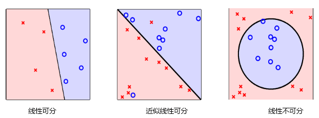

# 感知机

感知机是一种很古老的分类算法，虽然它的泛化能力不强，但是感知机模型是支持向量机和神经网络的基础，理解了感知机的原理，可以为后面的学习打下一定的基础。

## 感知机模型

感知机（perceptron）是二类分类的线性分类模型，其输入为实例的特征向量，输出为实例的类别，取+1和-1二值。感知机对应于输入空间中将实例划分为正负两类的分离超平面，属于判别模型。放到三维空间或者更高维的空间，感知机的模型就是尝试找到一个超平面，能够把所有的二元类别隔离开。

如果我们找不到这么一条直线的话怎么办？找不到的话那就意味着类别线性不可分，也就意味着感知机模型不适合你的数据的分类。使用感知机一个最大的前提，就是数据是线性可分的。这严重限制了感知机的使用场景。它的分类竞争对手在面对不可分的情况时，比如支持向量机可以通过核技巧来让数据在高维可分，神经网络可以通过激活函数和增加隐藏层来让数据可分。

**数学表达**

$$f(x) = sign(w \cdot x + b)$$
<li>输入空间：$R^n$</li>
<li>输出空间：$\lbrace+1, -1 \rbrace$</li>
<li>假设空间：$\lbrace f|f(x) = w \cdot x + b\rbrace$，表示定义在特征空间中的所有线性分类模型或线性分类器</li>
<li>$w \in R^n$，其中$w$表示权值向量，几何意义为<em>超平面的法向量</em></li>
<li>$b \in R$，$b$表示偏置，几何意义为超平面的截距</li>

<em>Note:模型学习的目的在于通过训练集求得模型的参数$w$和$b$</em>

**几何解释**

感知机的几何解释：线性方程$w \cdot x + b = 0$ 对应特征空间$R^n$中的一个超平面$S$,其中$w$是超平面的法向量，$b$是超平面的截距，这个超平面将特征空间划分为两个部分，位于两部分的点（特征向量）分别被分为正、负两类，因此，超平面$S$称为分离超平面。

## 感知机的学习策略

给定数据集

$$\begin{align*} \\& T = \left\{ \left( x_{1}, y_{1} \right), \left( x_{2}, y_{2} \right), \cdots, \left( x_{N}, y_{N} \right) \right\} \end{align*}  $$ 
其中，$x_{i} \in \mathcal{X} = R^{n}, y_{i} \in \mathcal{Y} = \left\{ +1, -1 \right\}, i = 1, 2, \cdots, N$，如果存在某个超平面$S$
\begin{align*} \\& w \cdot x + b ＝ 0  \end{align*}   
能够将数据集的正实例和负实例完全正确地划分到超平面的两侧，即对所有$y_{i}=+1$的实例$x_{i}$，有$w \cdot x_{i} + b > 0$，对所有$y_{i}=-1$的实例$x_{i}$，有$w \cdot x_{i} + b < 0$，则称数据集$T$为线性可分数据集；否则，称数据集$T$线性不可分。

**学习目标**

假设数据集是可分的，感知机的学习目标是求得一个能够将数据集正实例点和负实例点完全分开的超平面。为了找出这样的超平面，需要定义一个学习策略，即定义损失函数并将损失函数最小化。

输入空间$R^{n}$中的任一点$x_{0}$到超平面$S$的距离：
\begin{align*} \\& \dfrac{1}{\| w \|} \left| w \cdot x_{0} + b \right| \end{align*}    
其中$\| w \|$是$w$的$L_{2}$范数。

等价于求参数$w$和$b$，使其为以下损失函数极小化问题的解
\begin{align*} \\& \min_{w,b} L \left( w, b \right) =  -\sum_{x_{i} \in M} y_{i} \left( w \cdot x_{i} + b \right) \end{align*}   
其中，$M$为误分类点的集合。

## 算法流程

感知机算法（原始形式）：  
输入：训练数据集$T = \left\{ \left( x_{1}, y_{1} \right), \left( x_{2}, y_{2} \right), \cdots, \left( x_{N}, y_{N} \right) \right\}$，其中 $x_{i} \in \mathcal{X} = R^{n}, y_{i} \in \mathcal{Y} = \left\{ +1, -1 \right\}, i = 1, 2, \cdots, N$；学习率$\eta \left( 0 < \eta \leq 1 \right)$。               

输出：$w,b$；感知机模型$f \left( x \right) = sign \left( w \cdot x + b \right)$

1. 选取初值$w_{0},b_{0}$ 

2. 在训练集中选取数据$\left( x_{i}, y_{i} \right)$  

3. 如果$y_{i} \left( w \cdot x_{i} + b \right) \leq 0$  
\begin{align*} \\& w \leftarrow w + \eta y_{i} x_{i} 
\\ & b \leftarrow b + \eta y_{i} \end{align*}  

4. 转至2，直至训练集中没有误分类点。

## 实例 

# svm 

