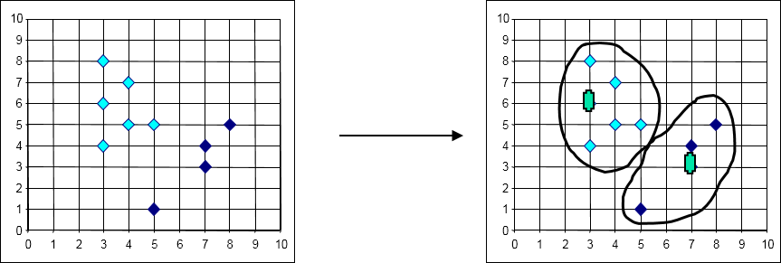
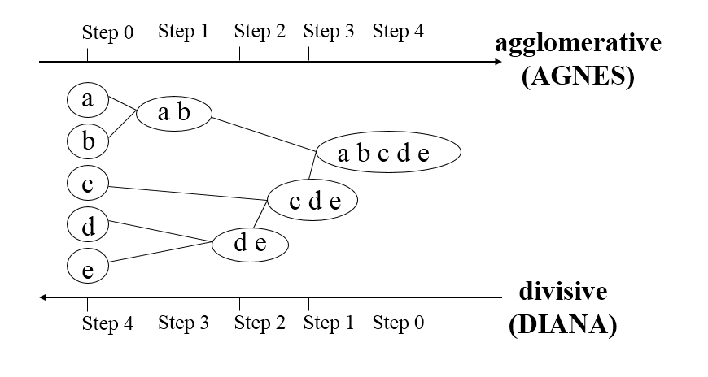
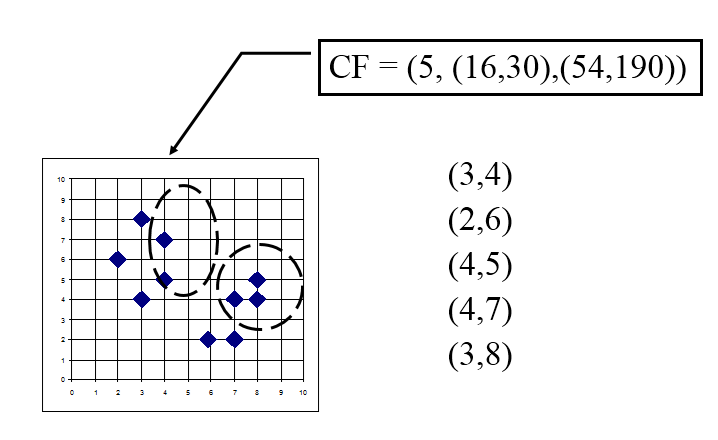
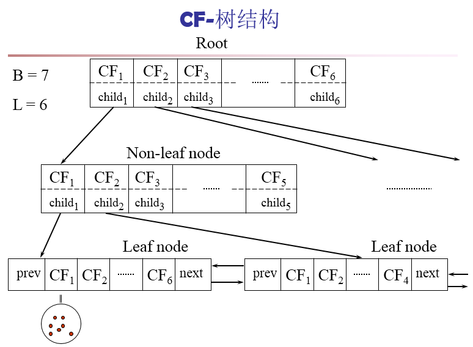
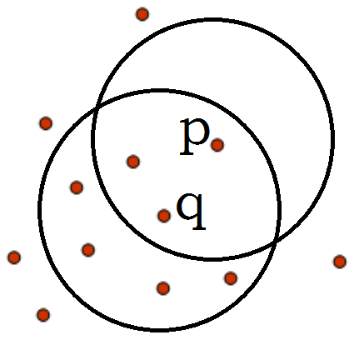
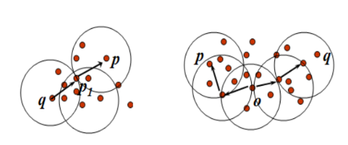
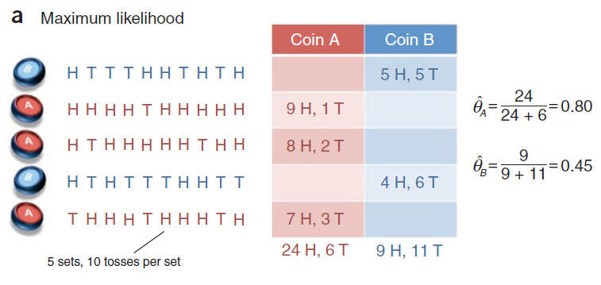
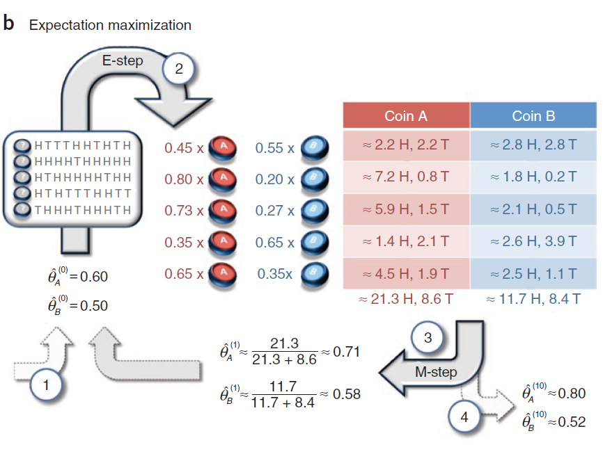
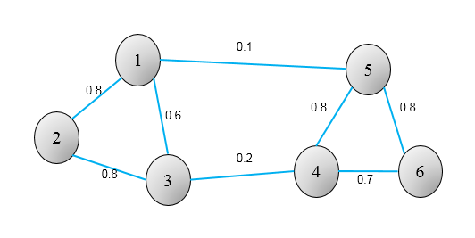
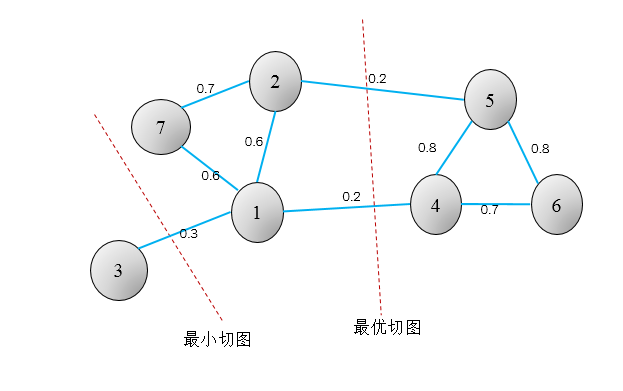

# 聚类基本概念

## 定义 

聚类与我们目前为止已经研究过的分类和回归的任务有所不同。聚类是一种无监督的机器学习任务，它可以自动的将数据划分为不同的类。在聚类之前，我们并不知道每个不同类别的数据是什么样子的，但是通过聚类算法，按照某种标准可以把相似的数据聚成一类，这个过程就是聚类分析。

## 聚类与分类的区别

Clustering (聚类)，简单地说就是把相似的东西分到一组，聚类的时候，我们并不关心某一类是什么，我们需要实现的目标只是把相似的东西聚到一起。因此，一个聚类算法通常只需要知道如何计算相似度就可以开始工作了，因此 clustering 通常并不需要使用训练数据进行学习，这在Machine Learning中被称作unsupervised learning (无监督学习)。Classification (分类)，对于一个classifier，通常需要你告诉它“这个东西被分为某某类”这样一些例子，理想情况下，一个 classifier 会从它得到的训练集中进行“学习”，从而具备对未知数据进行分类的能力，这种提供训练数据的过程通常叫做supervised learning (监督学习)。

##   聚类分析的要求

不同的聚类算法有不同的应用背景，有的适合于大数据集，可以发现任意形状的聚簇；有的算法思想简单，适用于小数据集。总的来说，数据挖掘中针对聚类的典型要求包括：

+ **可伸缩性**：当数据量从几百上升到几百万时，聚类结果的准确度能一致。

+ **处理不同类型属性的能力**：许多算法针对的数值类型的数据。但是，实际应用场景中，会遇到二元类型数据，分类/标称类型数据，序数型数据。

+ **发现任意形状的类簇**：许多聚类算法基于距离（欧式距离或曼哈顿距离）来量化对象之间的相似度。基于这种方式，我们往往只能发现相似尺寸和密度的球状类簇或者凸型类簇。但是，实际中类簇的形状可能是任意的。

+ **初始化参数的需求最小化**：很多算法需要用户提供一定个数的初始参数，比如期望的类簇个数，类簇初始中心点的设定。聚类的结果对这些参数十分敏感，调参数需要大量的人力负担，也非常影响聚类结果的准确性。

+ **处理噪声数据的能力**：噪声数据通常可以理解为影响聚类结果的干扰数据，包含孤立点，错误数据等，一些算法对这些噪声数据非常敏感，会导致低质量的聚类。

+ **增量聚类和对输入次序的不敏感**：一些算法不能将新加入的数据快速插入到已有的聚类结果中，还有一些算法针对不同次序的数据输入，产生的聚类结果差异很大。

+ **高维性**：有些算法只能处理2到3维的低纬度数据，而处理高维数据的能力很弱，高维空间中的数据分布十分稀疏，且高度倾斜。

 + **可解释性和可用性**：我们希望得到的聚类结果都能用特定的语义、知识进行解释，和实际的应用场景相联系。 

# 常用的聚类方法

##   基于划分的聚类 

基于划分的聚类（partitioning methods）：给定包含N个点的数据集，划分法将构造K个分组，每个分组代表一个聚类，这里每个分组至少包含一个数据点，每个数据点属于且仅属于一个分组。对于给定的K值，算法先给出一个初始的分组方法，然后通过反复迭代的方法改变分组，使得每一次改进之后的分组方案较前一次好，这里好的标准在于同一组中的点越近越好，不同组中的点越远越好。代表算法有：K-means，K-medoids。

###  K均值聚类(K-Means)

K均值算法可以说是最常用的算法了，该算法已经被研究几十年了，是许多更加复杂算法技术的基础。K-Means算法的思想很简单，对于给定的样本集，按照样本之间的距离大小，将样本集划分为K个簇。让簇内的点尽量紧密的连在一起，而让簇间的距离尽量的大。

如果用数据表达式表示，假设簇划分为$(C_1,C_2,...C_k)$，则我们的目标是最小化平方误差E：

$$E = \sum\limits_{i=1}^k\sum\limits_{x \in C_i} ||x-\mu_i||_2^2$$
其中$u_{i}$是簇$C_i$的均值向量，有时也称为质心，表达式为：

$$\mu_i = \frac{1}{|C_i|}\sum\limits_{x \in C_i}x $$
如果我们想直接求上式的最小值并不容易，这是一个NP难的问题，因此只能采用启发式的迭代方法。


### K-Means算法流程

K-Means算法要点

1）对于K-Means算法，首先要注意的是k值的选择，一般来说，我们会根据对数据的先验经验选择一个合适的k值，如果没有什么先验知识，则可以通过交叉验证选择一个合适的k值。

2）在确定了k的个数后，我们需要选择k个初始化的质心。由于我们是启发式方法，k个初始化的质心的位置选择对最后的聚类结果和运行时间都有很大的影响，因此需要选择合适的k个质心，最好这些质心不能太近。

<p>　　　　现在我们来总结下传统的K-Means算法流程。　</p>
<p>　　　　输入是样本集$D=\{x_1,x_2,...x_m\}$,聚类的簇树k,最大迭代次数N</p>
<p>　　　　输出是簇划分$C=\{C_1,C_2,...C_k\}$　</p>
<p>　　　　1) 从数据集D中随机选择k个样本作为初始的k个质心向量：&nbsp;$\{\mu_1,\mu_2,...,\mu_k\}$</p>
<p>　　　　2）对于n=1,2,...,N</p>
<p>　　　　　　a) 将簇划分C初始化为$C_t = \varnothing \;\; t =1,2...k$</p>
<p>　　　　　　b) 对于i=1,2...m,计算样本$x_i$和各个质心向量$\mu_j(j=1,2,...k)$的距离：$d_{ij} = ||x_i - \mu_j||_2^2$，将$x_i$标记最小的为$d_{ij}$所对应的类别$\lambda_i$。此时更新$C_{\lambda_i} = C_{\lambda_i} \cup \{x_i\}$</p>
<p>　　　　　　c) 对于j=1,2,...,k,对$C_j$中所有的样本点重新计算新的质心$\mu_j = \frac{1}{|C_j|}\sum\limits_{x \in C_j}x$</p>
<p>　　　　　　e) 如果所有的k个质心向量都没有发生变化，则转到步骤3）</p>
<p>　　　　3） 输出簇划分$C=\{C_1,C_2,...C_k\}$</p>


如下图，K-Means算法迭代过程：


### K-Means算法的优缺点

优点：

+  原理比较简单，实现也是很容易，收敛速度快。
+ 算法的可解释度比较强。


缺点：

+ 只能处理连续值，对于类别的值无法处理

+ K值的选取不好把握

+ 对于不是凸的数据集比较难收敛

+ 如果各隐含类别的数据不平衡，比如各隐含类别的数据量严重失衡，或者各隐含类别的方差不同，则聚类效果不佳。

+ 对噪音和异常点比较的敏感。

### K-Means聚类R语言实战  

本节结合iris数据集上演示k-means聚类的过程。

```{r}
datatable(iris)
iris2 = iris
iris2$Species = NULL
kmean_fit = kmeans(iris2,centers = 3)
print(kmean_fit)
plot(x, col = kmean_fit$cluster)
```

结果显示了3个类别所含的样本数，分别为38，50,62；以及各个类的中心坐标(6.850,3.073684,5.742,2.071),( 5.006000,3.428000,1.462000,0.246000)和(5.901613,2.748387,4.393548,1.433871);组间平方占总平方和的88.4 %，该值可用于与类别数取值不同时的聚类结果进行比较，从而找出最优聚类结果，该百分数越大，表名组间的差别越大，即聚类的效果越好。

```{r}
kmean_fit$totss
kmean_fit$tot.withinss
kmean_fit$betweenss
```

```{r}
table(iris$Species,kmean_fit$cluster)
```

从上面的结果可以看出，setosa类与其他类很容易就分开了，但是versicolor和virginica
类之间有一些混淆。

```{r}
i <- grep("Length", names(iris))
x <- iris[, i]
cl <- kmeans(x, 3, nstart = 10)
plot(x, col = cl$cluster)
```


```{r}
# 随机聚类
set.seed(12)
init <- sample(3, nrow(x), replace = TRUE)
plot(x, col = init)

par(mfrow = c(1, 2))
plot(x, col = init)
centres <- sapply(1:3, function(i) colMeans(x[init == i, ], ))
centres <- t(centres)
points(centres[, 1], centres[, 2], pch = 19, col = 1:3)

tmp <- dist(rbind(centres, x))
tmp <- as.matrix(tmp)[, 1:3]

ki <- apply(tmp, 1, which.min)
ki <- ki[-(1:3)]

plot(x, col = ki)
points(centres[, 1], centres[, 2], pch = 19, col = 1:3)
```

```{r}
# How to determine the number of clusters
ks <- 1:5
tot_within_ss <- sapply(ks, function(k) {
    cl <- kmeans(iris2, k, nstart = 10)
    cl$tot.withinss
})
plot(ks, tot_within_ss, type = "b")

```


### K中心聚类(K-medoids)

K中心聚类与K均值聚类的算法原理十分相近，它是针对K均值算法容易受极值影响这一缺点改进的算法。在原理上的差异在于选择各类别中心点时候不取样本的均值点，而在类别内选择到其余样本距离之和最下的样本为中心。



### K中心聚类优缺点

优点：

+ 对噪声和离群点不敏感。

缺点

+ 当数据量大时，运行效率低。

### K中心聚类R语言实战


## 基于分层的聚类

基于分层的聚类(hierarchical methods)：主要讲给定的数据集进行逐层分解，直到满足某种条件为止。具体可分为“自底向上”和“自顶向下”两种策略分为凝聚层次聚类和分裂层次聚类。在“自底向上”方案中，初始时每个数据点组成一个单独的组，在接下来的迭代中，按一定的距离度量将相互邻近的组合并成一个组，直至所有的记录组成一个分组或者满足某个条件为止。与此相反，“自顶向下”的策略中，一开始所有的对象形成一个簇，迭代的分裂，生成更多的簇。
代表算法有：BIRCH，CURE，CHAMELEON等



### 距离度量 

无论使用凝聚层次聚类还是分裂层次聚类，一个核心的问题就是度量两个簇之间的距离。3个常用的簇间距离度量的方法：

+ 最小距离

+ 最大距离

+ 平均距离

### BIRCH聚类

BIRCH的全称是利用层次方法的平衡迭代规约和聚类（Balanced Iterative Reducing and Clustering Using Hierarchies），是一种典型的层次聚类方法。BIRCH算法比较适合于数据量大，类别数K比较多的情况。

#### BIRCH聚类概述

BIRCH算法利用了一个树结构来帮助我们快速的聚类，这个数结构类似于平衡B+树，一般将它称之为**聚类特征树(Clustering Feature Tree，简称CF Tree)**。这颗树的每一个节点是由若干个**聚类特征(Clustering Feature，简称CF)**组成.

#### CF和CF-树 

簇的**聚类特征**(Cluster Feature,CF)是一个三维向量，汇总了对象簇的信息，定义如下：

$$ CF = (N,LS,SS)$$
其中，
N表示该簇的样本数目;

LS代表了这个CF中拥有的样本点各特征维度的和向量(即$\sum\limits_{i=1}^n x_i$);


SS代表了这个CF中拥有的样本点各特征维度的平方和(即$\sum\limits_{i=1}^n x_i^2$).

例如：样本{(3,4), (2,6), (4,5), (4,7), (3,8)}。则它对应的$N=5,LS=(3+2+4+4+3,4+6+5+7+8)=(16,30),
SS = ((3^2+2^2+4^2 +4^2+3^2) ,(4^2+6^2+5^2 +7^2+8^2)) = (54 ,190)$


即$CF = (5,(16,30),(54,190))$




**CF-树**是一颗高度平衡的树，其结构如下图。树的非叶节点都有后代或者”子女“，非叶节点存储了其子女的CF总和。

对于CF Tree，我们一般有几个重要参数，第一个参数是每个非叶节点的最大CF数B；第二个参数是每个叶子节点的最大CF数L；第三个参数是针对叶子节点中某个CF中的样本点来说的，它是叶节点每个CF的最大样本直径阈值T，也就是说，在这个CF中的所有样本点一定要在半径小于T的一个超球体内。对于上图中的CF Tree，限定了B=7， L=6， 也就是说内部节点最多有7个CF，而叶子节点最多有6个CF。
　


#### BIRCH算法流程 

(1) 从根节点root 开始递归往下，计算当前CF条目与要插入数据点之间的距离，寻找距离最小的那个路径，直到找到与该数据点最接近的叶节点中的条目。
  
(2) 比较计算出的距离是否小于阈值T，如果小于则当前CF条目吸收该数据点，并更新路径上的所有CF三元组；反之，进行第三步。

(3) 判断当前条目所在叶节点的CF条目个数是否小于λ，如果是，则直接将数据点插入作为该数据点的新条目，否则需要分裂该叶节点。分裂的原则是寻找该叶节点中距离最远的两个条目并以这两个条目作为种子CF，其他剩下的CF条目根据距离最小原则分配到这两个条目中，并更新整个CF树。依次向上检查父节点是否也要分裂，如果需要按和叶子节点分裂方式相同。

#### BIRCH算法优缺点

**优点** 

+ 算法只需扫描一遍就可以得到一个好的聚类效果，而且不需事先设定聚类个数。

+ 通过聚类特征树的形式，一定程度上保存了对数据的压缩。

+ 可识别噪声点。建立好CF Tree后把那些包含数据点少的MinCluster当作outlier。       

**缺点**

+  结果依赖于数据点的插入顺序。本属于同一个簇的点可能由于插入顺序相差很远                     而分到不同的簇中，即使同一个点在不同的时刻被插入，也会被分到不同的簇中。

+  对非球状的簇聚类效果不好。这取决于簇直径和簇间距离的计算方法。

+  对高维数据聚类效果不好。

+  由于每个节点只能包含一定数目的子节点，最后得出来的簇可能和自然簇相差很                     大。BIRCH适合于需要产生大量的子簇的场景，但在整个过程中算法一旦中断，                       一切必须从头再来。
 
+  局部性导致了BIRCH的聚类效果欠佳。当一个新数据点要插入时，它只跟很少一                     部分簇进行了相似性（通过计算簇间距离）比较，高效率不一定带来好效果。

#### BIRCH算法R语言实战

```{r, message=FALSE, warning=FALSE}
?hclust

```


##  基于密度的聚类 


基于密度的聚类（density-based methods）：基于密度的方法的特点是不依赖于距离，而是依赖于密度，从而克服基于距离的算法只能发现“球形”聚簇的缺点。其核心思想在于只要一个区域中点的密度大于某个阈值，就把它加到与之相近的聚类中去。代表算法有：DBSCAN，OPTICS，DENCLUE，WaveCluster。

### DBSCAN聚类思想

DBSCAN(Density-Based Spatial Clustering of Applications with Noise，具有噪声的基于密度的聚类方法)是一种很典型的密度聚类算法，和K-Means，BIRCH这些一般只适用于凸样本集的聚类相比，DBSCAN既可以适用于凸样本集，也可以适用于非凸样本集。


### DBSCAN相关概念 


+ $\epsilon$-临域：给定对象在半径$\epsilon$内的区域。

+ 核心对象：如果一个对象的$\epsilon$-临域域至少包含最小数目x个对象，则称该对象为核心对象。

+ 密度直达：给定一个对象集合D，如果p是在q的$\epsilon$-临域内，而q是一个核心对象，我们说对象p从对象q出发是直接密度可达的。如下图：如图$\epsilon = 1,x = 5$，q是一个核心对象，从对象q出发到对象p是直接密度可达的。注意反之不一定成立,即密度直达不具有对称性。


+ 密度可达:于$x_i$和$x_j$,如果存在样本样本序列$p_1, p_2,...,p_T$,满足$p_1 = x_i, p_T = x_j$, 且$p_{t+1}$由$p_{t}$密度直达，则称$x_j$由$x_i$密度可达。也就是说，密度可达满足传递性。此时序列中的传递样本$p_1, p_2,...,p_{T-1}$均为核心对象，因为只有核心对象才能使其他样本密度直达。注意密度可达也不满足对称性，这个可以由密度直达的不对称性得出。

+ 密度相连 : 如果对象集合D中存在一个对象o，使得对象p和q是从o关于ε和x密度可达的，那么对象p和q是关于ε和x密度相连的。




+ 噪声:


### DBSCAN聚类过程
<p>　　　　下面我们对DBSCAN聚类算法的流程做一个总结。</p>
<p>　　　　输入：样本集D=$(x_1,x_2,...,x_m)$，邻域参数$(\epsilon, MinPts)$, 样本距离度量方式</p>
<p>　　　　输出： 簇划分C.　</p>
<p>　　　　1)初始化核心对象集合$\Omega = \emptyset$, 初始化聚类簇数k=0，初始化未访问样本集合$\Gamma$ = D,簇划分C = $\emptyset$</p>
<p>　　　　2) 对于j=1,2,...m, 按下面的步骤找出所有的核心对象：</p>
<p>　　　　　　a) 通过距离度量方式，找到样本$x_j$的$\epsilon$-邻域子样本集$N_{\epsilon}(x_j)$</p>
<p>　　　　　　b) 如果子样本集样本个数满足$|N_{\epsilon}(x_j)| \geq MinPts$， 将样本$x_j$加入核心对象样本集合：$\Omega = \Omega \cup \{x_j\}$</p>
<p>　　　　3)如果核心对象集合$\Omega = \emptyset$，则算法结束，否则转入步骤4.</p>
<p>　　　　4)在核心对象集合$\Omega$中，随机选择一个核心对象$o$，初始化当前簇核心对象队列$\Omega_{cur} = \{o\}$, 初始化类别序号k=k+1，初始化当前簇样本集合$C_k =\{o\}$, 更新未访问样本集合$\Gamma = \Gamma -\{o\}$</p>
<p>　　　　5)如果当前簇核心对象队列$\Omega_{cur} = \emptyset$，则当前聚类簇$C_k$生成完毕, 更新簇划分C=$\{C_1,C_2,...,C_k\}$, 更新核心对象集合$\Omega = \Omega - {C_k}$转入步骤3。</p>

<p>　　　　6)在当前簇核心对象队列$\Omega_{cur}$中取出一个核心对象$o^{'}$,通过邻域距离阈值 $\epsilon$找出所有的$\epsilon$-邻域子样本集 $N_{\epsilon}(o^{'})$，令$\Delta = N_{\epsilon}(o^{'})\cap\Gamma$, 更新当前簇样本集合 $C_k =C_k\cup\Delta$, 更新未访问样本集合$\Gamma = \Gamma - \Delta$,更新$\Omega_{cur} = \Omega_{cur} \cup (N_{\epsilon}(o^{'}) \cap \Omega)$，转入步骤5</p>

<p>　　　　输出结果为簇划分C=$\{C_1,C_2,...,C_k\}$</p>


### DBSCAN优缺点

和传统的K-Means算法相比，DBSCAN最大的不同就是不需要输入类别数k，当然它最大的优势是可以发现任意形状的聚类簇，而不是像K-Means，一般仅仅使用于凸的样本集聚类。同时它在聚类的同时还可以找出异常点，这点和BIRCH算法类似。

**优点**

+  可以对任意形状的稠密数据集进行聚类，相对的，K-Means之类的聚类算法一般只适用于凸数据集。

+ 可以在聚类的同时发现异常点，对数据集中的异常点不敏感。

+  聚类结果没有偏倚，相对的，K-Means之类的聚类算法初始值对聚类结果有很大影响。

**缺点**
+ 如果样本集的密度不均匀、聚类间距差相差很大时，聚类质量较差，这时用DBSCAN聚类一般不适合。

+  如果样本集较大时，聚类收敛时间较长，此时可以对搜索最近邻时建立的KD树或者球树进行规模限制来改进。

+  调参相对于传统的K-Means之类的聚类算法稍复杂，主要需要对距离阈值$\epsilon$，邻域样本数阈值MinPts联合调参，不同的参数组合对最后的聚类效果有较大影响。

 
### DBSCAN算法R语言实战

```{r, message=FALSE, warning=FALSE}
library(fpc)
?dbscan()
```

　
##  基于网格的聚类 


基于网格的聚类（gird-based methods）：这种方法通常将数据空间划分成有限个单元的网格结构，所有的处理都是以单个的单元为对象。这样做起来处理速度很快，因为这与数据点的个数无关，而只与单元个数有关。但这种算法效率的提高是以聚类结果的精确性为代价的。代表算法有：STING，CLIQUE，WaveCluster。基于Clique的聚类过程可直观如下图进行理解。


##  基于模型的聚类 

基于模型的聚类（model-based methods）：基于模型的方法给每一个聚类假定一个模型，然后去寻找能很好的拟合模型的数据集。模型可能是数据点在空间中的密度分布函数或者其它。这样的方法通常包含的潜在假设是：数据集是由一系列的潜在概率分布生成的。通常有两种尝试思路：统计学方法和神经网络方法。其中，统计学方法有COBWEB算法、GMM(Gaussian Mixture Model)，神经网络算法有SOM(Self Organized Maps)算法。下图是GMM过程的一个简单直观地理解.

###  高斯混合模型

从统计学讲，我们可以假定隐藏的类别是数据空间上的一个分布，可以用概率密度函数精确地表示。**高斯混合模型(Gaussian Mixture Mode，GMM)聚类**就是采用概率模型来表达聚类原型，它假定所有的数据样本x是由多个高斯分布混合而成。

对于**多元高斯分布**，n维样本空间X中的随机向量x，概率密度函数为：
$$ p(x|\mu,\Sigma ) = \frac{1}{(2\pi)^{\frac{n}{2}}|\Sigma |^{\frac{1}{2}}}e^{-\frac{1}{2}(x-\mu)^T\Sigma ^{-1}(x-\mu)}$$
其中$\mu$是n维均值向量，$\Sigma$是n×m的协方差矩阵。高斯概率密度函数由$\mu$和$\Sigma$两个参数决定。

那么，**高斯混合分布**为：
$$f(x) = \sum_{i=1}^k\alpha_ip(x|\mu,\Sigma )$$
该分布由k个高斯分布混合而成，$\alpha_i$为混合系数，$\alpha_i>0$且$\sum_{i=1}^k\alpha_i=1$(权重和为1)

那么该怎么求解各个$\alpha_i>0$权重系数以及高斯概率密度函数由$\mu$和$\Sigma$两个参数，常用的方法是EM算法。

### EM算法求解GMM
https://blog.csdn.net/u011974639/article/details/78302024


从硬币问题引入EM算法：


1 如果我们有A和B两个不均匀硬币，选择任意一个硬币抛10次(这里我们知道选择是的哪一个硬币)，共计选择5次。正面记为H，背面记为T。记录实验结果，求A和B再抛正面向上的概率？


使用极大似然估计(Maximum likelihood)：

+ 统计出每次实验，正反面的次数
+ 多次实验结果相加
+ 相除得到结果，P(A)=0.8,P(B)=0.45

2 在实际过程中，我们只知道有两个硬币，不知道每次选择的哪一个硬币，问是否能求出每个硬币抛出正面的概率？这时候只用极大似然估计就无法解决这个问题，需要EM算法。

EM算法直观理解：

+ 假设$\hat{\theta}_A^{(0)}=0.6,\hat{\theta}_B^{(0)}=0.5$

+ 统计每次的实验结果，记录正反面

+ 通过贝叶斯公式，估计每次实验选择的A硬币或是B硬币的概率

+ 依据计算出的选择硬币概率得到该概率下的正反面结果，相加，相除得到$\hat{\theta}_A^{(1)}≈0.71,\hat{\theta}_B^{(1)}≈0.58$

+ 重复上面的过程，例如迭代10次后，得到$\hat{\theta}_A^{(10)}≈0.8,\hat{\theta}_B^{(10)}≈0.52$就是使用EM算法计算出的概率值

计算过程：

A为选用硬币A，E为本次实验。而选择两个硬币的概率是相同的：$P(A)=P(B)=\frac{1}{2}$

有贝叶斯公式可得：

$$\begin{align*}
P(A|E)&= \frac{P(E|A)P(A)}{P(E)}  \\
&= \frac{P(E|A)P(A)}{P(E|A)P(A)+P(E|B)P(B)} \\
&= \frac{(0.6^{5}×0.4^{5})×\frac{1}{2}}{(0.6^{5}×0.4^{5})×\frac{1}{2}+(0.5^{5}×0.5^{5})×\frac{1}{2}}\\
&≈0.45  \\
\end{align*}$$

$P(E|A)=0.6^{5}×0.4^{5}≈0.0008,P(E|B)=0.5^{5}×0.5^{5}≈0.001$


有$0.45×10×\frac{1}{2}≈2.2$，故第一次实验结果平均下来，有2.22.2个A硬币正面的可能。同理可得到多次实验的平均结果。

最后相加相除得到新的A,B抛硬币正面估计值 $\hat{\theta}_A^{(1)}≈0.71,\hat{\theta}_B^{(1)}≈0.58$，这是我们第一次迭代的值(这就是一次学习过程)，照着这个流程迭代多次，得到最后的估测值。



### GMM聚类R语言实战

```{r, message=FALSE, warning=FALSE}
#install.packages('mclust')
library(mclust)
#https://cran.r-project.org/web/packages/mclust/vignettes/mclust.html
#http://tinyheero.github.io/2016/01/03/gmm-em.html
#http://people.duke.edu/~ccc14/sta-663/EMAlgorithm.html
#http://ai.stanford.edu/~chuongdo/papers/em_tutorial.pdf
#https://blog.csdn.net/u011974639/article/details/78302024
# https://www.jianshu.com/p/1ff0f2e5a3ce
#https://cran.r-project.org/web/packages/EMCluster/vignettes/EMCluster-guide.pdf
```

## 基于降维的聚类


### 谱聚类思想

谱聚类(Spectral Clustering)是一种基于图论的聚类方法，通过对样本数据的拉普拉斯矩阵的特征向量进行聚类，从而达到对样本数据聚类的目的。相比较之前的基于划分和基于层次的聚类方法，谱聚类的效果要更好。同时聚类的计算量也小很多，更加难能可贵的是实现起来也不复杂。在处理实际的聚类问题时，谱聚类是应该首先考虑的几种算法之一。


谱聚类主要思想是把所有的数据看做空间中的点，这些点之间可以用边连接起来。距离较远的两个点之间的边权重值较低，而距离较近的两个点之间的边权重值较高，通过对所有数据点组成的图进行切图，让切图后不同的子图间边权重和尽可能的低，而子图内的边权重和尽可能的高，从而达到聚类的目的。


### 谱聚类相关概念

+ **无向权重图** 


对于一个图$G$，我们一般用点的集合$V$和边的集合$E$来表示，即$G(V,E)$.其中$V$即为我们数据集里面所有的点$(v_1, v_2,...v_n)$。我们定义权重$w_{ij}$为点$v_i$和点$v_j$之间的权重。对于无向图，$w_{ij} = w_{ji}$
如下图




+ **邻接矩阵**

图邻接矩阵$W$，它也是一个nxn的矩阵，第i行的第j个值对应我们的权重$w_{ij}$。上图的邻接矩阵W如下。

||1|2|3|4|5|6|
---|---|---|---|---|---|---|
1|0|0.8|0.6|0|0.1|0
2|0.8|0|0.8|0|0|0
3|0.6|0.8|0|0.2|0|0
4|0|0|0.2|0|0.8|0.7
5|0.1|0|0|0.8|0|0.8
6|0|0|0|0.7|0.8|0


+ **度矩阵**

对于图中的任意一个点$v_i$，它的度$d_i$定义为和它相连的所有边的权重之和，即$d_i = \sum\limits_{j=1}^{n}w_{ij}$,那么度矩阵就是由所有的度$d_i$组成的nxn的对角矩阵，对角线的值对应着对应第i行的第i个点的度数，即

$$\mathbf{D} = \left( \begin{array}{ccc} d_1 & \ldots & \ldots \\ \ldots & d_2 & \ldots \\   \vdots & \vdots & \ddots \\   \ldots & \ldots & d_n \end{array} \right)$$
例如，上图的度矩阵如下：


||1|2|3|4|5|6|
---|---|---|---|---|---|---|
1|1.5|0|0|0|0|0
2|0|1.6|0|0|0|0
3|0|0|1.6|0|0|0
4|0|0|0|1.7|0|0
5|0|0|0|0|1.7|0
6|0|0|0|0|0|1.5

+ **拉普拉斯矩阵**


拉普拉斯矩阵$L= D-W$,其中$D$是度矩阵，$W$是邻接矩阵。例上图的拉普拉斯矩阵L为：

||1|2|3|4|5|6|
---|---|---|---|---|---|---|
1|1.5|-0.8|-0.6|0|-0.1|0
2|-0.8|1.6|-0.8|0|0|0
3|-0.6|-0.8|1.6|-0.2|0|0
4|0|0|-0.2|1.7|-0.8|-0.7
5|-0.1|0|0|-0.8|1.7|-0.8
6|0|0|0|-0.7|-0.8|1.5


拉普拉斯矩阵有一些很好的性质如下：

1）拉普拉斯矩阵是对称矩阵，这可以由D和W都是对称矩阵而得。


2）由于拉普拉斯矩阵是对称矩阵，则它的所有的特征值都是实数。


3）对于任意的向量$f$,有

$$f^TLf = \frac{1}{2}\sum\limits_{i,j=1}^{n}w_{ij}(f_i-f_j)^2$$
证明：

$$f^TLf = f^TDf - f^TWf = \sum\limits_{i=1}^{n}d_if_i^2 - \sum\limits_{i,j=1}^{n}w_{ij}f_if_j 
=\frac{1}{2}( \sum\limits_{i=1}^{n}d_if_i^2 - 2 \sum\limits_{i,j=1}^{n}w_{ij}f_if_j + \sum\limits_{j=1}^{n}d_jf_j^2) = \frac{1}{2}\sum\limits_{i,j=1}^{n}w_{ij}(f_i-f_j)^2
$$

4）拉普拉斯矩阵是半正定的，且对应的n个实数特征值都大于等于0，即$0 =\lambda_1 \leq \lambda_2 \leq... \leq \lambda_n$，且最小的特征值为0，这个由性质3很容易得出.


+ 图的划分以及损失函数

###  切图聚类

谱聚类的目的是要找到一种合理的分割图的方法，使得分割后形成若干个子图，连接不同子图的边的权重（相似度）尽可能低，同子图内的边的权重（相似度）尽可能高.至于如何把图的顶点集分割/切割为不相交的子图有多种办法，主要有：Minimum Cut方法、Ratio Cut方法、Normalized Cut方法。

切图的损失函数：划分时子图之间被“截断”的边的权重和，那么对于我们k个子图点的集合：$A_1,A_2,..A_k$ ,损失函数$cut(A_1,A_2,...A_k) = \frac{1}{2}\sum\limits_{i=1}^{k}W(A_i, \overline{A}_i )$


#### Minimum Cut


对于任意两个子图点的集合$A, B \subset V$ ,$A \cap B =  \emptyset$, 我们定义A和B之间的切图权重,即损失函数：

$W(A, B) = \sum\limits_{i \in A, j \in B}w_{ij}$


那么对于我们k个子图点的集合,$A_1,A_2,..A_k$,定义切图cut的损失为：

$$cut(A_1,A_2,...A_k) = \frac{1}{2}\sum\limits_{i=1}^{k}W(A_i, \overline{A}_i )$$
那么如何切图可以让子图内的点权重和高，子图间的点权重和低呢？一个自然的想法就是最小化$cut(A_1,A_2,...A_k)$ 但是可以发现，这种极小化的切图存在问题，如下图,我们选择一个权重最小的边缘的点,这样可以最小化$cut(A_1,A_2,...A_k)$,但是却不是最优的切图.



####  Ratio Cut

RatioCut切图为了避免第五节的最小切图，对每个切图，不光考虑最小化$Cut(A_1,A_2,...A_k)$，它还同时考虑最大化每个子图点的个数，$|A_i|$表示图$|A_i|$中的定点个数。
$$RatioCut(A_1,A_2,...A_k) = \frac{1}{2}\sum\limits_{i=1}^{k}\frac{W(A_i, \overline{A}_i )}{|A_i|}$$

#### Normalized Cut

Normalized Cut切图和Ratio Cut切图很类似，但是把Ratiocut的分母$|A_i|$换成$vol(A_i)$,$vol(A_i)$表示子图$A_i$中每个定点上所有变的权重之和。 由于子图样本的个数多并不一定权重就大，我们切图时基于权重也更合我们的目标，因此一般来说Normalized Cut切图优于RatioCut切图.

$$NCut(A_1,A_2,...A_k) = \frac{1}{2}\sum\limits_{i=1}^{k}\frac{W(A_i, \overline{A}_i )}{vol(A_i)}$$

### 谱聚类算法流程 

下面以Normalized Cut总结谱聚类算法流程。

　　　　输入：样本集$(x_1,x_2,...,x_n)$， 降维度维度$k_1$, 聚类后的维度$k_2$.
　　　　
　　　　
　　　　　　

　　　　输出： $C(c_1,c_2,...c_{k_2})$.　
　　　　
　　　　

　　　　1) 根据输入的相似矩阵的生成方式构建样本的相似矩阵S

　　　　2）根据相似矩阵S构建邻接矩阵W，构建度矩阵D

　　　　3）计算出拉普拉斯矩阵L

　　　　4）构建标准化后的拉普拉斯矩阵$L' = D−1/2LD−1/2D−1/2LD−1/2$


　　　　5）计算$L'$最小的$k$个特征值所各自对应的特征向量$f$


　　　　6) 将各自对应的特征向量f组成的矩阵按行标准化，最终组成$n \times k_1$维的特征矩阵F


　　　　7）对F中的每一行作为一个$k_1$维的样本，共n个样本，用输入的聚类方法进行聚类，聚类维数为$k_2$。


　　　　8）得到簇划分$C(c_1,c_2,...c_{k_2})$.　　

### 谱聚类算法优缺点

谱聚类算法是一个使用起来简单，它需要你有一定的数学基础。如果你掌握了谱聚类，相信你会对矩阵分析，图论有更深入的理解。同时对降维里的主成分分析也会加深理解。


　　　　谱聚类算法的主要优点有：

　　　　1）谱聚类只需要数据之间的相似度矩阵，因此对于处理稀疏数据的聚类很有效。这点传统聚类算法比如K-Means很难做到

　　　　2）由于使用了降维，因此在处理高维数据聚类时的复杂度比传统聚类算法好。

　　　　谱聚类算法的主要缺点有：

　　　　1）如果最终聚类的维度非常高，则由于降维的幅度不够，谱聚类的运行速度和最后的聚类效果均不好。

　　　　2) 聚类效果依赖于相似矩阵，不同的相似矩阵得到的最终聚类效果可能很不同。

 

### 谱聚类R语言实战


```{r}
library(kernlab)
sc <- specc(my.data, centers=2)
plot(my.data, col=sc, pch=4)            # estimated classes (x)
points(my.data, col=obj$classes, pch=5) # true classes (<>)
```
(http://yaroslavvb.com/papers/luxburg-tutorial.pdf)
(https://arxiv.org/pdf/0711.0189.pdf)
(https://wenku.baidu.com/view/36f06d78a32d7375a5178025.html?sxts=1523794556714)

# 聚类的评价指标 

# 参考文献 

数据挖掘概念与技术 Jiawei Han 等著 

R. Agrawal, J. Gehrke, D. Gunopulos, and P. Raghavan. Automatic subspace clustering of high dimensional data for data mining applications. SIGMOD'98

M. R. Anderberg. Cluster Analysis for Applications. Academic Press, 1973.
M. Ankerst, M. Breunig, H.-P. Kriegel, and J. Sander.  Optics: Ordering points to identify the clustering structure, SIGMOD’99.

Beil F., Ester M., Xu X.: "Frequent Term-Based Text Clustering", KDD'02
M. M. Breunig, H.-P. Kriegel, R. Ng, J. Sander. LOF: Identifying Density-Based Local Outliers. SIGMOD 2000.

M. Ester, H.-P. Kriegel, J. Sander, and X. Xu. A density-based algorithm for discovering clusters in large spatial databases. KDD'96.

M. Ester, H.-P. Kriegel, and X. Xu. Knowledge discovery in large spatial databases: Focusing techniques for efficient class identification. SSD'95.
D. Fisher. Knowledge acquisition via incremental conceptual clustering. Machine Learning, 2:139-172, 1987.

D. Gibson, J. Kleinberg, and P. Raghavan. Clustering categorical data: An approach based on dynamic systems. VLDB’98. 

V. Ganti, J. Gehrke, R. Ramakrishan. CACTUS Clustering Categorical Data Using Summaries. KDD'99. 
